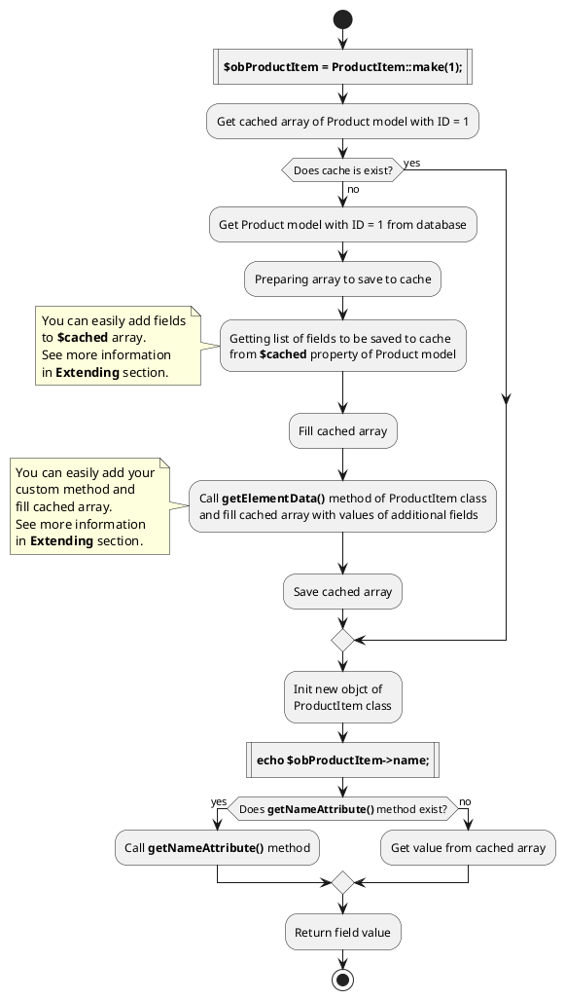

# ElementItem classes {docsify-ignore-all}

Task we want to solve is caching  model data.
If we get model object and try to save it in cache, we get **"Serialization of 'Closure' is not allowed"** error.

You can check this by running next code:
```php
$obProduct = \Lovata\Shopaholic\Models\Product::first();
\Cache::set('product_first', $obProduct, 600);
```

To solve this task, we created ElementItem classes, that **store  model data as array**.
Object of ElementItem class allows you to get cached values from array in  same way you would when getting data from model object.
```php
//Get product name from model object
$obProduct = Product::find(1);
echo $obProduct->name;

//Get product name from item object
$obProductItem = ProductItem::make(1);
echo $obProductItem->name;
```

## Logical diagram

Logical diagram of initialization of new ProductItem object and getting value of "name" field



## Method List

* [make](#makeielementid-obelement-null)
* [makeNoCache](#makenocacheielementid-obelement-null)
* [clearCache](#clearcacheielementid)
* [getObject](#getobject)
* [isEmpty](#isempty)
* [isNotEmpty](#isnotempty)
* [toArray](#toarray)
* [toJSON](#tojson)

### make($iElementID, _[$obElement = null]_)
* iElementID - element ID
* obElement - model object, optional parameter

Static method used to create new object of ElementItem class.
Element's data array will be filled from cache.
```php
$obItem = ElementItem::make(1);
```

### makeNoCache($iElementID, _[$obElement = null]_)
  * iElementID - element ID
  * obElement - model object, optional parameter

Static method used to create new object of ElementItem class.
Element's data array will be filled from  model's object without using cache.
```php
$obItem = ElementItem::makeNoCache(1);
``` 

### clearCache($iElementID)
  * iElementID - element ID

Static method for clearing element's cache.
```php
ElementItem::clearCache(1);
```

### getObject()

Method returns  model's object.
```php
$obItem = ElementItem::make(10);
$obModel = $obItem->getObject();
```

### isEmpty()

Method returns true, if  filling element's data from object or cache was **failed**.
```php
$obItem = ElementItem::make(10);
if($obItem->isEmpty()) {
    return false;
}
```

### isNotEmpty()

Method returns true, if  filling element's data from object or cache was **successfully completed**.
```php
$obItem = ElementItem::make(10);
if($obItem->isNotEmpty()) {
    //to do something
}
```

### toArray()

Method returns array of  elements data.
```php
$obItem = ElementItem::make(10);
return $obItem->toArray();
```

### toJSON()

Method returns JSON string of  elements data array.
```php
$obItem = ElementItem::make(10);
return $obItem->toJSON();
```

## Extending

You can add dynamic methods and properties in item class with using [extending constructors](http://octobercms.com/docs/services/behaviors#constructor-extension).
It is default function of OctoberCMS.

You can add custom fields to **$cached** array of model class.
```php
ElementModel::extend(function($obModel) {
    $obModel->addCachedField(['field_1', 'field_2']);
});

...

$obItem = ElementItem::make(1);
echo $obItem->field_1;
```

You can add custom fields to cached data array with using your custom method.
You need to add dynamic method in ElementItem class and add your method name in **$arExtendResult** array.
```php
ElementItem::extend(function($obItem) {
 
     $obItem->arExtendResult[] = 'addMyProperty';

     $obItem->addDynamicMethod('addMyProperty', function() use ($obItem) {

         $obModel = $obItem->getObject();
         $obItem->setAttribute('my_property', $obModel->my_property);
     });
});
...

$obItem = ElementItem::make(1);
echo $obItem->my_property;
```

### Defining an accessor

To define an accessor, add a getFooAttribute method on your item class where Foo is the "camel" cased name of the field you wish to access.
In this example, we'll define an accessor for the first_name attribute.
The accessor will automatically be called when attempting to retrieve the value of first_name.

```php
ElementItem::extend(function($obItem) {

     $obItem->addDynamicMethod('getFirstNameAttribute', function() use ($obItem) {

         $sValue = $obItem->getAttribute('first_name');
         $sValue .= 'test';
         
         return $sValue;
     });
});
```

## Integration with [Translate](http://octobercms.com/plugin/rainlab-translate) plugin

You can work with translatable fields without addition methods.
Field value will then contain active language value.
```php
echo $obElementItem->name;
```
You can use  **getLangAttribute** method to get field values for non-active language.
```php
echo $obElementItem->getLangAttribute( 'name', 'ru');
```