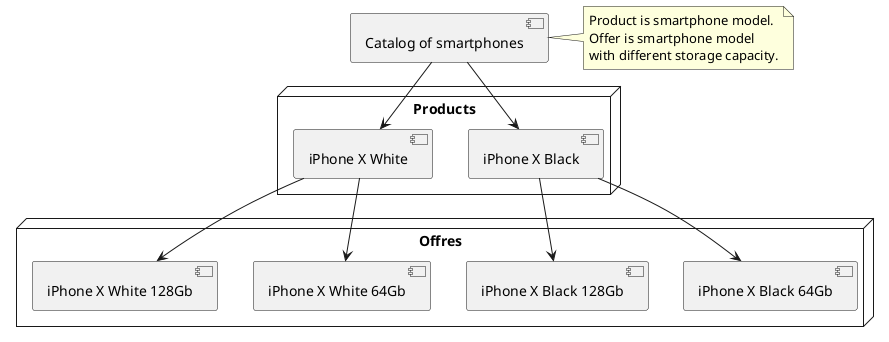
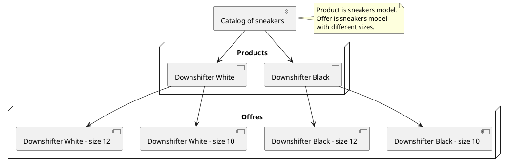
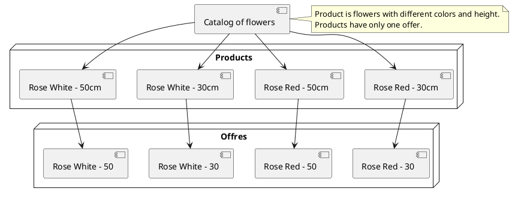
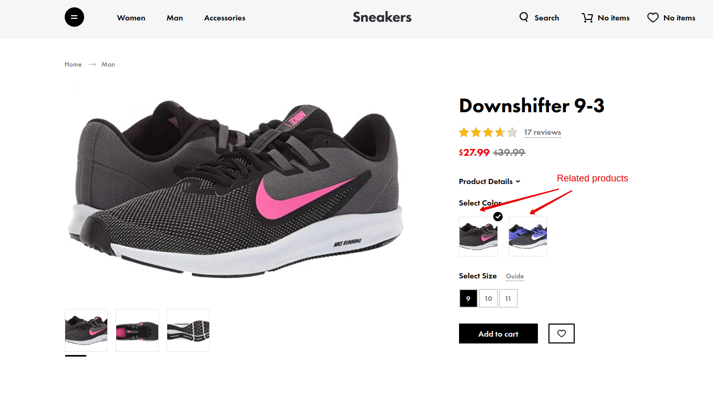
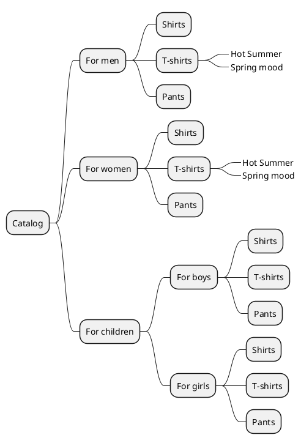
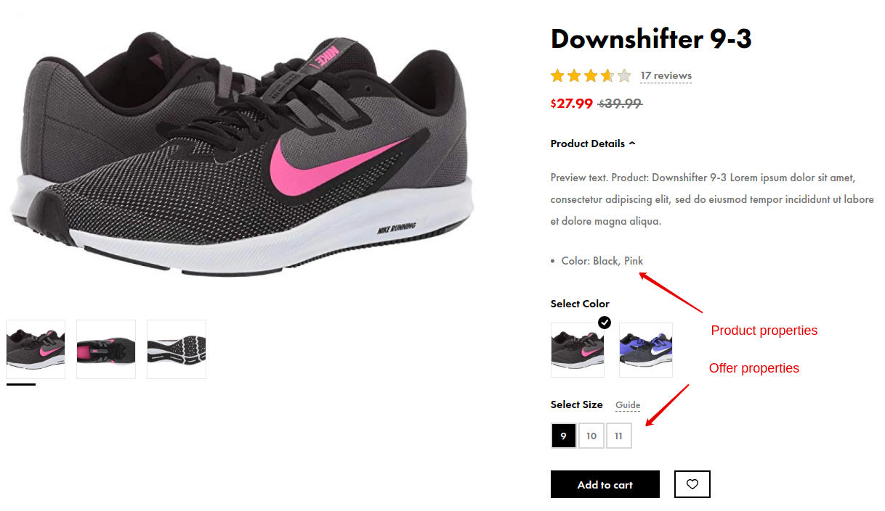

# Designing of catalog structure {docsify-ignore-all}

Designing catalog structure is **very important stage before development** of our project.
It is very important at this stage to determine what will be product and what will be offer in your catalog,
what will be category and what will be tag in your catalog,
what will be product property and what will be offer property in your catalog.

> Site design greatly affects catalog structure.

## Step 1: Products and offers

You need to determine what your project will be products and what will be offers.
This is very important decision. Product can not be bought or put in basket.

Product page design should be contain block with offer list. If product page is no offer choice in your project, then you need to create only one offer for each product.

You need to take into account SEO requirements for your project.

## Step 2: Related products

Perhaps your catalog has similar products, but you need to display them on separate pages. You need to use ["Related products for Shopaholic"](plugins/home.md#related-products-for-shopaholic) plugin to add relation between products.

## Step 3: Category and tags

You need to determine what in your catalog tree will be category and what will be tag.
Tag page is seo page with unique title and description.
Tag page should not be displayed in breadcrumbs on product page.

For example: "Hot Summer" and "Spring mood" are tags.

## Step 4: Product and offer properties

You need to associate properties: with products or offers.

