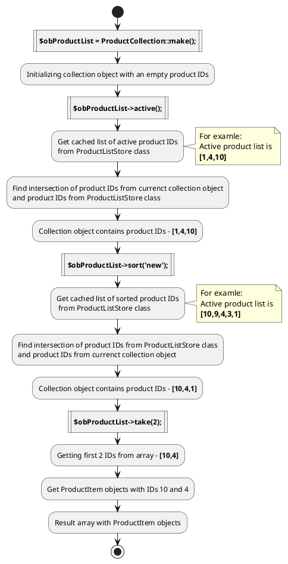

# ElementCollection class {docsify-ignore-all}

The class allow you a flexible tool for working with cached lists of elements.

ElementCollection class
and [Collection](https://octobercms.com/docs/services/collections) class from laravel framework have some methods,
but the logic that they perform within them is different.

!> **Attention!**  The opinion that ElementCollection class
and [Collection](https://octobercms.com/docs/services/collections) class
from laravel framework are the same is wrong.

Object of ElementCollection class processes arrays of element IDs without getting full data of elements.
Object receive ElementItem objects only in methods of getting lists of items
(For example: [take](collection-class/collection-class.md#takeicount-0), [page](collection-class/collection-class.md#pageipage-ielementonpage-10), [random](collection-class/collection-class.md#randomicount), [first](collection-class/collection-class.md#first) and etc.).

Methods of ElementCollection class uses [Store classes](store-class/store-class.md) to get cached lists in element IDs.

## Logical diagram

Logical diagram of initialization of new ProductCollection object and getting first 2 active products, sorted by newness.



## Method List:
### make(_[$arElementIDList = []]_)
  * arElementIDList - array of element ID

Static method. Used to create a new object of the ElementCollection class.
```php
$obList = ElementCollection::make([1, 2, 10, 15]);
```

### all()

Method returns an array of objects ElementItem with all the elements of a collection.
```php
$obList = ElementCollection::make([1, 2, 10, 15]);
return $obList->all();
```

### applySorting($arElementIDList)
 * $arElementIDList - list of element IDs for intersection

Method applies the **array_intersect()** function to the array of element IDs $arElementIDList and the collection.
```php
$obList = ElementCollection::make([1, 2, 10, 15]);

$arElementIDList = [10, 2,14,18];
//result: [10, 2]
$obList->applySorting($arElementIDList);
```

### clear()

Method clears the collection.
```php
$obList = ElementCollection::make([1, 2, 10, 15]);
$obList->clear();
```

### copy()

Method clones the collection object and returns new collection object.
```php
$obList = ElementCollection::make([1, 2, 10, 15]);
$obNewList = $obList->copy();
```

### count()

Method returns the count of elements in a collection.
```php
$obList = ElementCollection::make([1, 2, 10, 15]);
return $obList->count();
```

### debug()

Method allows to set a break point while using xDebug in the case of calling collection methods in Twig templates.
```php
$obList = ElementCollection::make([1, 2, 10, 15]);
$obList->skip(2)->debug()->take(2);
```

### diff($arElementIDList)
 * $arElementIDList - list of element IDs

Method applies **array_diff()** function to the collection and the array of element IDs $arElementIDList.
```php
$obList = ElementCollection::make([1, 2, 10, 15]);

$arElementIDList = [2,14,18];
//result: [1,10,15]
$obList->diff($arElementIDList);
```

### exclude($iElementID)
  * $iElementID - element ID

Method excludes the element with ID = $iElementID from the collection.
```php
$obList = ElementCollection::make([1, 2, 10, 15]);
//result: [1,10,15]
$obList->exclude(2);
```

### find($iElementID)
  * iElementID - element ID

Method returns an object ElementItem with ID = $iElementID.
```php
$obList = ElementCollection::make([1, 2, 10, 15]);
//result: object of ElementItem class with ID = 10
return $obList->find(10);
```

### first()

Method returns the first ElementItem object in a collection.
```php
$obList = ElementCollection::make([1, 2, 10, 15]);
//result: object of ElementItem class with ID = 1
return $obList->first();
```

### getIDList()

Method returns an array of element IDs.
```php
$obList = ElementCollection::make([1, 2, 10, 15]);
//result: [1, 2, 10, 15]
return $obList->getIDList();
```

### getNearestNext($iElementID, $iCount = 1, $bCyclic = false)

Method returns new collection with next nearest elements.
```php
$obList = ElementCollection::make([1, 2, 10, 15]);

//Collection has elements: 10
$obNewList = $obList->getNearestNext(2);

//Collection has elements: 2,10,15
$obNewList = $obList->getNearestNext(1, 3);

//Collection has elements: 10,15
$obNewList = $obList->getNearestNext(2, 3);

//Collection has elements: 10,15,1
$obNewList = $obList->getNearestNext(2, 3, true);
```

### getNearestPrev($iElementID, $iCount = 1, $bCyclic = false)

Method returns new collection with previous nearest elements.
```php
$obList = ElementCollection::make([1, 2, 10, 15]);

//Collection has elements: 1
$obNewList = $obList->getNearestPrev(2);

//Collection has elements: 10,2,1
$obNewList = $obList->getNearestPrev(15, 3);

//Collection has elements: 2,1
$obNewList = $obList->getNearestPrev(10, 3);

//Collection has elements: 2,1,15
$obNewList = $obList->getNearestPrev(10, 3, true);
```

### has($iElementID)
  * iElementID - element ID

Method returns true, if the collection contains the element with ID = $iElementID.
```php
$obList = ElementCollection::make([1, 2, 10, 15]);
if($obList->has(10)) {
    //...
}
```

### implode($sFieldName, $sDelimiter = ', ')

Method returns array of the values for a given field name and applies **implode** function to array.
```php
$obList = ElementCollection::make([1, 2, 10, 15]);
return $obList->implode('name', '-');
```

### intersect($arElementIDList)
 * $arElementIDList - list of element IDs for intersection

Method applies the **array_intersect()** function to the collection and the array of element IDs $arElementIDList.
```php
$obList = ElementCollection::make([1, 2, 10, 15]);

$arElementIDList = [10, 2,14,18];
//result: [2,10]
$obList->intersect($arElementIDList);
```

### isEmpty()

Method returns true, if the element list **is empty**.
```php
$obList = ElementCollection::make([1, 2, 10, 15]);
if($obList->isEmpty()) {
    return false;
}
```

### isNotEmpty()

The method returns true, if the element list **isn't empty**.
```php
$obList = ElementCollection::make([1, 2, 10, 15]);
if($obList->isNotEmpty()) {
    //...
}
```

### last()

Method returns the last ElementItem object in a collection.
```php
$obList = ElementCollection::make([1, 2, 10, 15]);
//result: object of ElementItem class with ID = 15
return $obList->last();
```

### merge($arElementIDList)
 * $arElementIDList - list of element IDs to merge

Method applies **array_merge()** function to the collection and the array of element IDs $arElementIDList.
```php
$obList = ElementCollection::make([1, 2, 10, 15]);

$arElementIDList = [2,14,18];
//result: [1,2,10,15,14,18]
$obList->merge($arElementIDList);
```

### page($iPage, $iElementOnPage = 10)
  * $iPage - current page number
  * $iElementOnPage - count of elements on the page

Method returns an array of ElementItem objects for the $iPage page.
```php
$obList = ElementCollection::make([1, 2, 10, 15]);
return $obList->page(2, 10);
```

### pluck($sFieldName)

Method returns array of the values for a given field name.
```php
$obList = ElementCollection::make([1, 2, 10, 15]);
return $obList->pluck('name');
```

### pop()

Method returns the first ElementItem object in a collection and excludes it from the collection.
```php
$obList = ElementCollection::make([1, 2, 10, 15]);
return $obList->pop();
```

### push($iElementID)

Method adds element to the end of collection
```php
$obList = ElementCollection::make([1, 2, 10, 15]);
$obList->push(4);
```

### random($iCount)
  * $iCount - count of elements generated

Method returns an array of random ElementItem objects.
```php
$obList = ElementCollection::make([1, 2, 10, 15]);
return $obList->random(2);
```

### save($sKey)/saved($sKey)
  * $sKey - collection state key to save

Method saves the state of a collection for it to be obtained later.
```php
$obList = ElementCollection::make([1, 2, 10, 15]);
$obList->save('my_key');

...

$obSavedList = ElementCollection::make()->saved('my_key');

//result: $obSavedList == clone $obList
```

### set($arElementIDList)
  * arElementIDList - array of element ID

Method allow to set list of element IDs in the collection
```php
$obList = ElementCollection::make()->set([1,2]);
```

### skip($iCount)
  * $iCount - count of elements to skip 

Method is used in combination with the take() method to specify the count of elements needed to be skipped.
```php
$obList = ElementCollection::make([1, 2, 10, 15]);
return $obList->skip(2)->take(1);
```

### take($iCount = 0)
  * $iCount - count of elements to be get

Method returns an array of ElementItem objects. Count of elements = $iCount, starting from the position specified in the skip() method.
If you send $iCount = 0, you will obtain all elements, starting from the position specified in the skip() method.
```php
$obList = ElementCollection::make([1, 2, 10, 15]);
return $obList->skip(2)->take(1);
```

### shift()

Method returns the first ElementItem object in a collection and excludes it from the collection
```php
$obList = ElementCollection::make([1, 2, 10, 15]);
return $obList->shift();
```

### unshift($iElementID)

Method adds element to the beginning of collection
```php
$obList = ElementCollection::make([1, 2, 10, 15]);
$obList->unshift(4);
```

## Extending


You can add dynamic methods and properties in collection class with using [extending constructors](http://octobercms.com/docs/services/behaviors#constructor-extension).

**Example**
```php
ElementCollection::extend(function($obCollection) {
    $obCollection->addDynamicMethod('my_method', function($arElementIDList) use ($obCollection) {
        return $obCollection->diff($arElementIDList);
    });
});
```