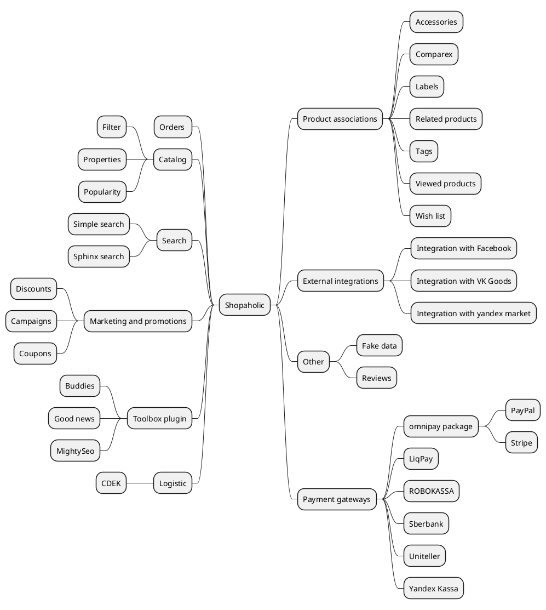

# Introduction {docsify-ignore-all}

The development of Shopaholic’s ecosystem is guided by the similar philosophies of October CMS and Unix like operating systems, where the main focus is to create simple microarchitecture solutions that communicate with each other through smart APIs.

On one hand, this approach allows keeping performance, security, and functionality of the code to a high standard. On the other hand, it provides a clean and smooth back-end UI/UX that isn't over-bloated with the features.

