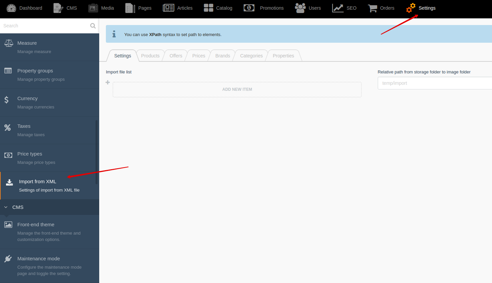
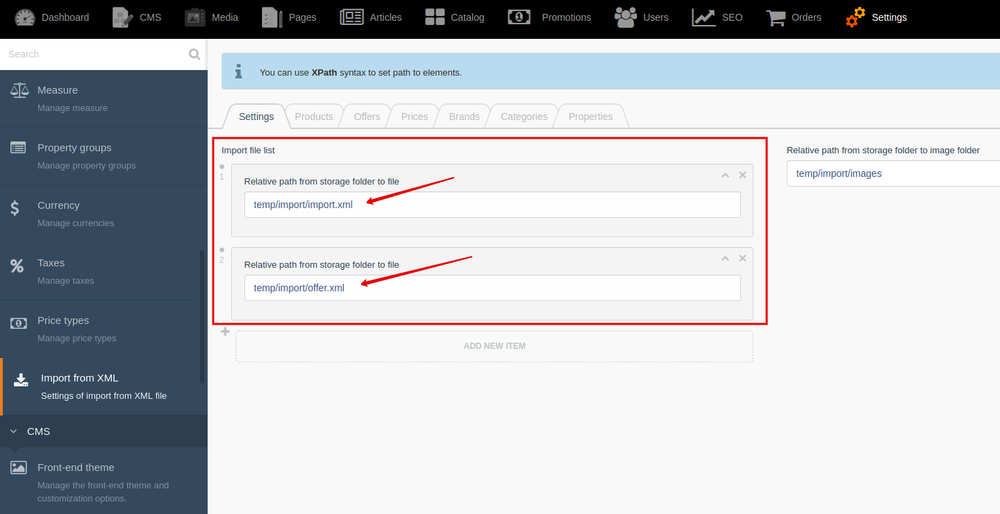
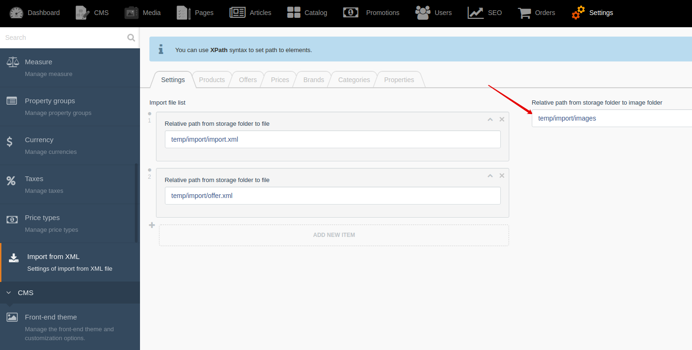
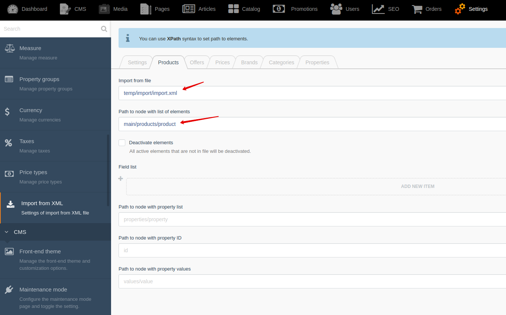
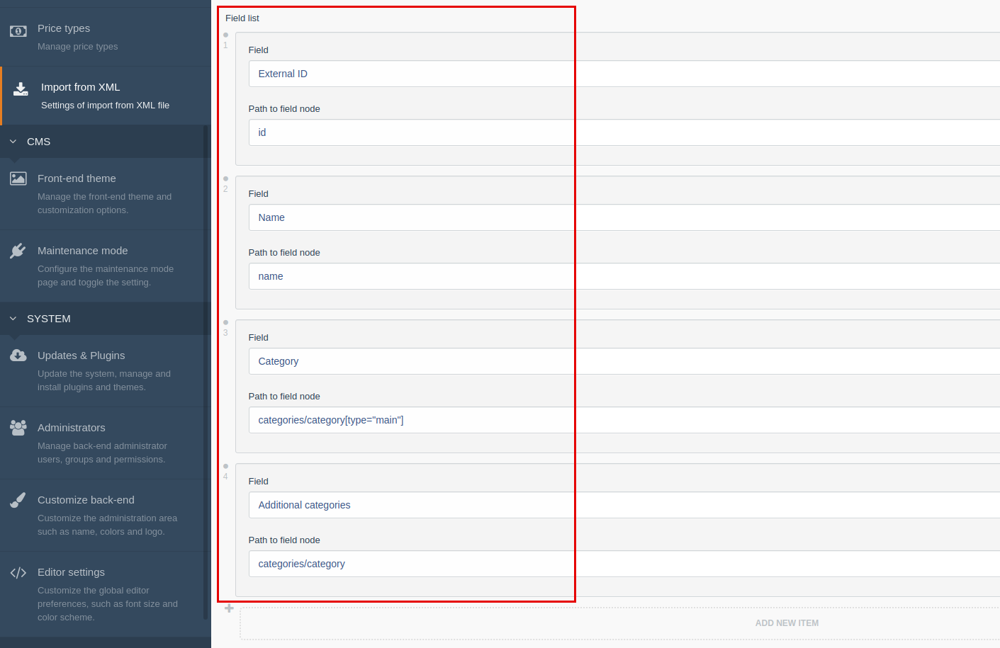
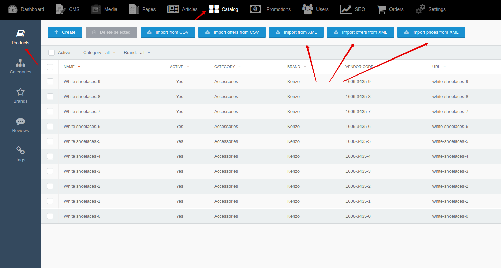
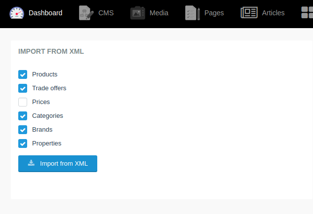

# Import from XML  {docsify-ignore-all}

Plugins allow you to import catalog from xml files.
Import can be **flexibly configured** in settings.
You can set paths to field values using **XPath syntax**.

Go to **Backend -> Settings -> Import from XML**


## Configuration

!> You can use [shopaholic:preconfigure_import_from_xml](artisan-commands/home#shopaholicpreconfigure_import_from_xml) artisan command to fill in import settings with default settings and use them as example.

### Step 1: Set import file list.

You can set import file list in **"Settings"** tab.
You need to set **relative path from storage folder to files**.

**For example:** your import files are in "storage/temp/import" folder.
Then your settings will be such:


### Step 2: Set path to folder with images

You can set path to folder with images in **"Settings"** tab.
You need to set **relative path from storage folder to folder with images**.

**For example:** your images are in "storage/temp/import/images" folder.
Path to image in import file is "5c6/3bb/999/5c63bb99909e9619888796.jpg".
Full path to image file is "storage/temp/import/images/5c6/3bb/999/5c63bb99909e9619888796.jpg".
Then your settings will be such:


### Step 3: Set path to nodes with list of elements and fields

Your xml file is:
```xml
<?xml version="1.0" encoding="UTF-8"?>
<import>
<main>
    <categories>
        <category>
            <id>1</id>
            <name>Category 1</name>
        </category>
        <category>
            <id>2</id>
            <name>Category 2</name>
        </category>
    </categories>
    <products>
        <product>
            <id>1</id>
            <name>Product 1</name>
            <categories>
                <category type="main">1</category>
                <category>2</category>
            </categories>
        </product>
        <product>
            <id>2</id>
            <name>Product 2</name>
            <categories>
                <category type="main">1</category>
            </categories>
        </product>
        <product>
            <id>3</id>
            <name>Product 3</name>
            <categories>
                <category  type="main">2</category>
            </categories>
        </product>
    </products>
</main>
</import>
```

### Step 3.1: Set path to nodes with list of elements

1. You need to select import file in which items will be searched.
2. Path to node with list of products is "main/products/product". Path to node with list of categories is "main/categories/category".


### Step 3.1: Set path to nodes with fields

1. You need to add new item in "Field list"
2. You need to select field and set path to node with field value

!> You must set path to node with field value relative to node with element



## Run import

You can run import from XML files with using 3 ways:

**1. Manual run import using start button.** You can find these buttons on element list page.


**2. Manual run import using widget.** You can add widget on your dashboard in backend.


**3. Manual or automatic execute [shopaholic:import_from_xml](/artisan-commands/home#shopaholicimport_from_xml-import) artisan command**
```bash
php artisan shopaholic:import_from_xml --import=brand,category,property,product,offer,price
```

## Using queues

For big catalog, you can use queues to reduce server load during import.
You can enable queues in **"Application settings"**.

Go to **Backend -> Settings -> Application settings -> "Import" tab**


## Hide import buttons

You can hide import buttons in "Basic settings".

Go to **Backend -> Settings -> Basic settings -> "Import" tab**
