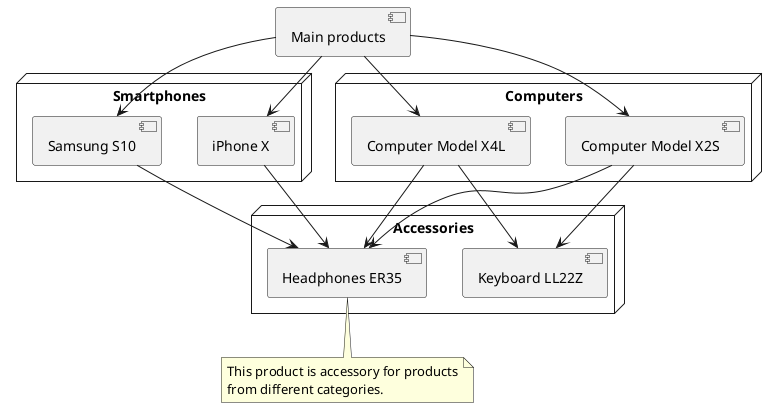

[Back to modules](modules/home.md)

Home
• [Examples](modules/accessory/examples/examples.md)

# Accessory {docsify-ignore-all}

!> **Attention!**  We recommend that you read [Architecture](home.md#architecture), [ElementItem class](item-class/item-class.md),
[ElementCollection class](collection-class/collection-class.md) sections for complete understanding of  project architecture.

> Module available with [Accessories for Shopaholic](plugins/home#accessories-for-shopaholic) plugin.

## Introduction

Accessory block usually looks like list of products on main product page.

> Accessories do not depend on product categories.

## Backend

You can attach products as accessories by going to **Backend -> Catalog -> Products -> Edit product -> "Accessories" tab**

Home
• [Examples](modules/accessory/examples/examples.md)

[Back to modules](modules/home.md)