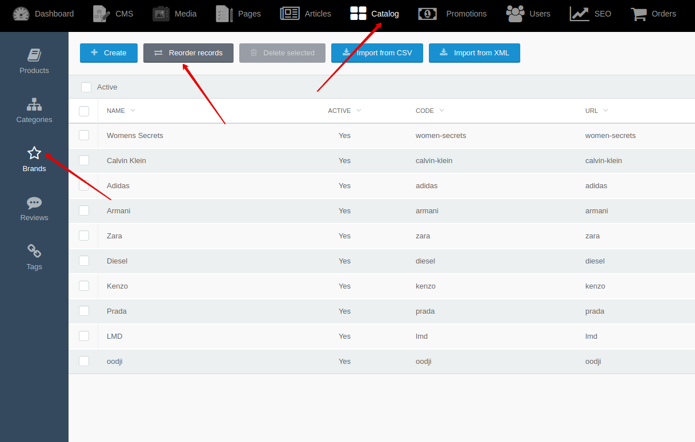

[Back to modules](modules/home.md)

[Home](modules/brand/home.md)
• [Model](modules/brand/model/model.md)
• [Item](modules/brand/item/item.md)
• Collection
• [Components](modules/brand/component/component.md)
• [Events](modules/brand/event/event.md)
• [Examples](modules/brand/examples/examples.md)
• [Extending](modules/brand/extending/extending.md)

# BrandCollection {docsify-ignore-all}

!> **Attention!**  We recommend that you read [Architecture](architecture/architecture), [ElementItem class](architecture/item-class/item-class.md),
[ElementCollection class](architecture/collection-class/collection-class.md) sections for complete understanding of  project architecture.

!> **Attention!** **BrandCollection** extends [ElementCollection class](architecture/collection-class/collection-class.md).
All available methods of ElementCollection class you can find in [section](architecture/collection-class/collection-class.md#method-list) 

## Method list

* [active](#active)
* [category](#categoryicategoryid)
* [search](#searchssearchstring)
* [sort](#sort)

### active()

Method applies filter to field "active" == true for elements of collection.

### category($iCategoryID)
  * $iCategoryID - product category ID

Method applies filter by category ID.
> List is created based on relations of models: Brand -\> Product -\> Category

```php
    $obList = BrandCollection::make()->category(2);
```

### search($sSearchString)
  * $sSearchString - search string

Method search elements by name, preview_text, description, search_synonym, search_content fields.
Method available with [Search for Shopaholic](plugins/home.md#search-for-shopaholic) or [Sphinx for Shopaholic](plugins/home.md#search-for-shopaholic) plugins.
```php
    $obList = ProductCollection::make()->search('test search');
```

### sort()

Method sorts elements of collection by "sort_order" field. You can change sorting of brands by going to **Backend -> Catalog -> Brands -> Reorder records**



[Home](modules/brand/home.md)
• [Model](modules/brand/model/model.md)
• [Item](modules/brand/item/item.md)
• Collection
• [Components](modules/brand/component/component.md)
• [Events](modules/brand/event/event.md)
• [Examples](modules/brand/examples/examples.md)
• [Extending](modules/brand/extending/extending.md)

[Back to modules](modules/home.md)
