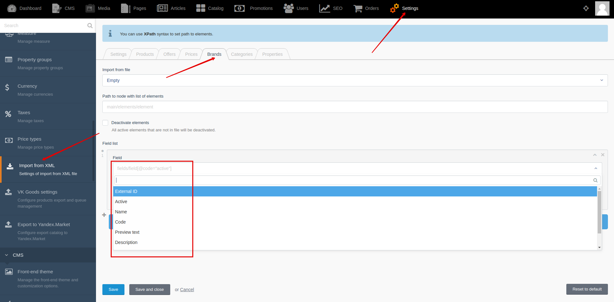

[Back to modules](modules/home.md)

[Home](modules/brand/home.md)
• [Model](modules/brand/model/model.md)
• [Item](modules/brand/item/item.md)
• [Collection](modules/brand/collection/collection.md)
• [Components](modules/brand/component/component.md)
• Events
• [Examples](modules/brand/examples/examples.md)
• [Extending](modules/brand/extending/extending.md)

# Event list: Brand {docsify-ignore-all}

!> **Attention!**  We recommend that you read [Architecture](home.md#architecture), [ElementItem class](item-class/item-class.md),
[ElementCollection class](collection-class/collection-class.md) sections for complete understanding of  project architecture.

## model.afterImport

Event allows you to process import data, after saving model object

```php
$obEvent->listen(ImportBrandModelFromCSV::EVENT_AFTER_IMPORT, function ($obModel, $arImportData) {
    if (!$obModel instanceof Brand::class) {
        return;
    }

    //to do something 
}, 900);
```

## model.beforeImport

Event allows you to change import data, before saving model object

```php
$obEvent->listen(ImportBrandModelFromCSV::EVENT_BEFORE_IMPORT, function ($sModelClass, $arImportData) {
    if ($sModelClass != Brand::class) {
        return null;
    }

    $arImportData['my_field'] = array_get($arImportData, 'my_field') == 'yes' ? true : false;

    return $arImportData;
}, 900);
```

## shopaholic.brand.extend_xml_import_data

Event allows you to extend processing of XML node and change import data

```php
Event::listen(ImportBrandModelFromXML::EXTEND_IMPORT_DATA, function($arImportData, $obParseNode) {
    //Get custom field from node
    $sValue = $obParseNode->...;

    //Process custom field value
    $arImportData['my_field'] = $sValue == 'yes' ? true : false;
    
    return $arImportData;
});
```

## shopaholic.brand.extend_xml_import_fields

Event allows you to extend list of fields that are available for configuring import from XML.

 

```php
Event::listen(ImportBrandModelFromXML::EXTEND_FIELD_LIST, function($arFieldList) {
    $arFieldList['my_field'] = 'My field label';
    
    return $arFieldList;
});
```

## shopaholic.brand.open

Event is triggered when you open brand page. Event triggered with using [BrandPage](modules/brand/component/component#brandpage) component
```php
Event::listen('shopaholic.brand.open', function($obBrand) {
    /** @var \Lovata\Shopaholic\Models\Brand $obBrand */
    //to do something
});
```

[Home](modules/brand/home.md)
• [Model](modules/brand/model/model.md)
• [Item](modules/brand/item/item.md)
• [Collection](modules/brand/collection/collection.md)
• [Components](modules/brand/component/component.md)
• Events
• [Examples](modules/brand/examples/examples.md)
• [Extending](modules/brand/extending/extending.md)

[Back to modules](modules/home.md)
