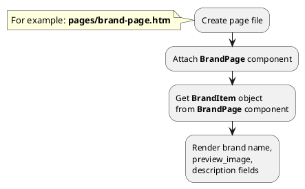
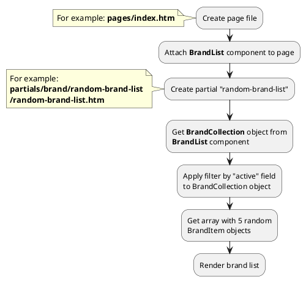
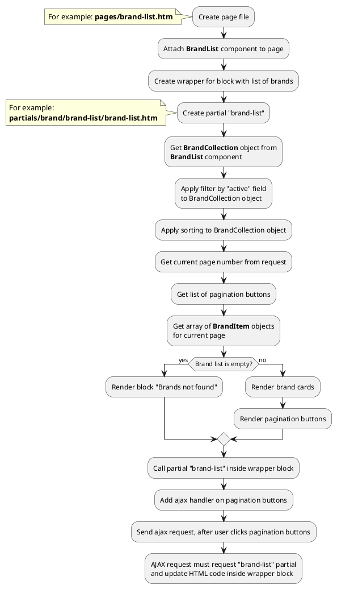
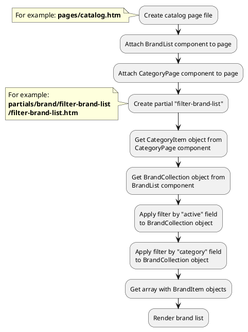




* [Example 1: Brand page](#example-1-brand-page)
* [Example 2: Brand card](#example-2-brand-card)
* [Example 3: Random brand list](#example-3-random-brand-list)
* [Example 4: Brand list with pagination](#example-4-brand-list-with-pagination)
* [Example 5: Filter panel with brands](#example-5-filter-panel-with-brands)

## Example 1: Brand page

### 1.1 Task

Create simple brand page and render brand name, preview image, description.

### 1.2 How can i do it?

> Example uses {{ component.link('brand-page') }} component.
Component method returns {{ item.link() }} class object.
All available fields and methods of **BrandItem** class you can find in {{ item.link('section') }}

### 1.3 Source code
{{ get_module('brand').example('pages/brand-page-1.htm')|raw }}

## Example 2: Brand card

### 2.1 Task

Create simple brand card and render brand name, preview_image, preview_text fields.
Render link on brand page.

> **"obBrand"** is object of {{ item.link() }} class.

### 2.2 Source code

Simple example of brand card.

{{ get_module('brand').example('partials/brand/brand-card/brand-card-1.htm')|raw }}

## Example 3: Random brand list

### 3.1 Task

Create simple block with random 5 brand list on index page.

### 3.2 How can i do it?

> Example uses {{ component.link('brand-list') }} component.
Component method returns {{ collection.link() }} class object.
All available methods of **{{ collection.class }}** class you can find in {{ collection.link('section') }}

### 3.3 Source code

{{ get_module('brand').example('pages/index-1.htm')|raw }}

{{ get_module('brand').example('partials/brand/random-brand-list/random-brand-list-1.htm')|raw }}

{{ get_module('brand').example('partials/brand/brand-card/brand-card-1.htm')|raw }}

## Example 4: Brand list with pagination

### 4.1 Task

Create simple page with brand list.
Brand list must have pagination block.

### 4.2 How can i do it?

> Example uses {{ component.link('brand-list') }} component.
Component method returns {{ collection.link() }} class object.
All available methods of **{{ collection.class }}** class you can find in {{ collection.link('section') }}

> You can find more information about **Pagination** component {{ get_module('pagination').link('here') }}

### 4.3 Source code

{{ get_module('brand').example('pages/brand-list-1.htm')|raw }}

{{ get_module('brand').example('partials/brand/brand-list/brand-list-1.htm')|raw }}

{{ get_module('brand').example('partials/brand/brand-card/brand-card-1.htm')|raw }}

## Example 5: Filter panel with brands

### 5.1 Task

Create simple catalog page with filter panel by brands.
Apply filter by category ID to brand list.  

### 5.2 How can i do it?

> Example uses {{ component.link('brand-list') }} component.
Component method returns {{ collection.link() }} class object.
All available methods of **{{ collection.class }}** class you can find in {{ collection.link('section') }}

### 5.3 Source code

{{ get_module('brand').example('pages/catalog-1.htm')|raw }}

{{ get_module('brand').example('partials/brand/filter-brand-list/filter-brand-list-1.htm')|raw }}

