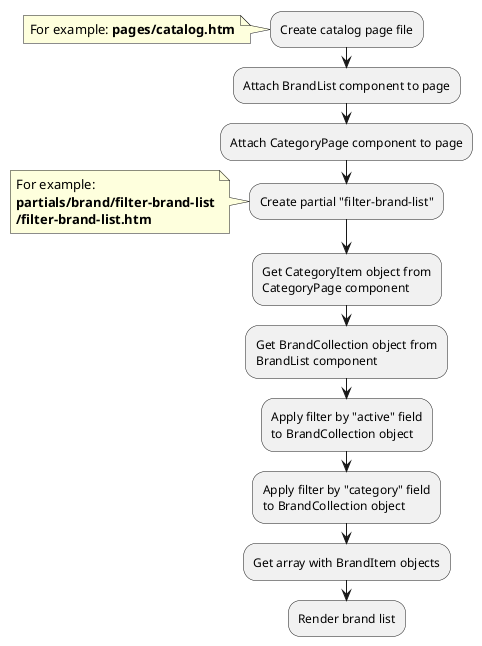

## Example {{ i }}: Filter panel with brands

### {{ i }}.1 Task

Create simple catalog page with filter panel by brands.
Apply filter by category ID to brand list.  

### {{ i }}.2 How can i do it?

> Example uses {{ get_component('brand').link('brand-list') }} component.
Component method returns {{ get_collection('brand').link() }} class object.
All available methods of **{{ get_collection('brand').class }}** class you can find in {{ get_collection('brand').link('section') }}

### {{ i }}.3 Source code

{{ get_module('brand').example('pages/catalog-1.htm')|raw }}

{{ get_module('brand').example('partials/brand/filter-brand-list/filter-brand-list-1.htm')|raw }}
