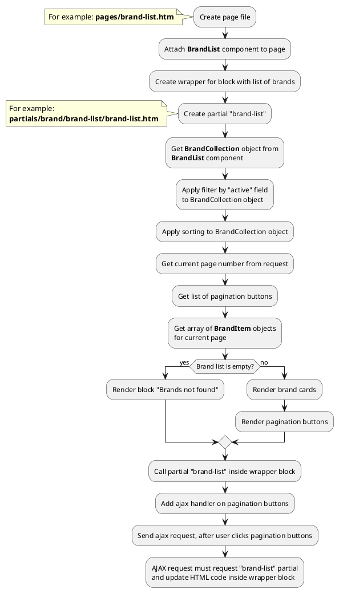

## Example {{ i }}: Brand list with pagination

### {{ i }}.1 Task

Create simple page with brand list.
Brand list must have pagination block.

### {{ i }}.2 How can i do it?

> Example uses {{ component.link('brand-list') }} component.
Component method returns {{ get_collection('brand').link() }} class object.
All available methods of **{{ get_collection('brand').class }}** class you can find in {{ get_collection('brand').link('section') }}

> You can find more information about **Pagination** component {{ get_module('pagination').link('here') }}

### {{ i }}.3 Source code

{{ get_module('brand').example('pages/brand-list-1.htm')|raw }}

{{ get_module('brand').example('partials/brand/brand-list/brand-list-1.htm')|raw }}

{{ get_module('brand').example('partials/brand/brand-card/brand-card-1.htm')|raw }}