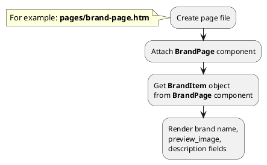

## Example {{ i }}: Brand page

### {{ i }}.1 Task

Create simple brand page and render brand name, preview image, description.

### {{ i }}.2 How can i do it?

> Example uses {{ component.link('brand-page') }} component.
Component method returns {{ item.link() }} class object.
All available fields and methods of **BrandItem** class you can find in {{ item.link('section') }}

### {{ i }}.3 Source code
{{ get_module('brand').example('pages/brand-page-1.htm')|raw }}