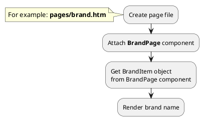
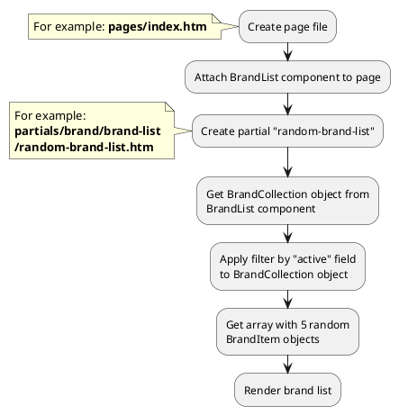
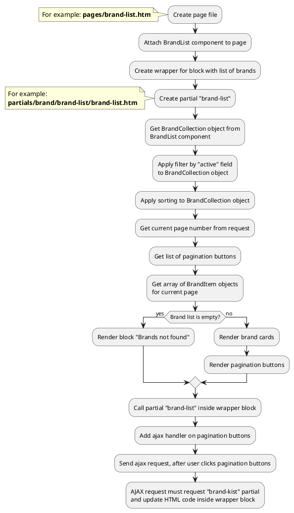

# Examples: Brand

[Back to modules](modules/home.md)

!> **Attention!** We recommend that you read [Architecture](home.md#architecture), [ElementItem class](item-class/item-class.md),
[ElementCollection class](collection-class/collection-class.md) sections for complete understanding of  project architecture.

## Example 1: Brand page

### Task

Create simple brand page and render brand name.

### How can i do it?



### Source code

File: **pages/brand.htm**
```twig
title = "Brand page"
url = "/brands/:slug"
layout = "main"
is_hidden = 0

[BrandPage]
slug = "{{ :slug }}"
slug_required = 1
smart_url_check = 1
==

{# Get brand item #}


<div data-id="{{ obBrand.id }}" itemscope itemtype="http://schema.org/Brand">
    <h1 itemprop="name">{{ obBrand.name }}</h1>
</div>
```

## Example 2: Brand card

### Task

Create simple brand card and render brand name, preview_image, preview_text fields.
Render link on brand page.

### Source code

Simple example of brand card.

File: **partials/brand/brand-card/brand-card.htm**
```twig
<a href="{{ obBrand.getPageUrl('brand') }}">
    <div itemscope itemtype="http://schema.org/Brand">
        
            
        
        <h3 itemprop="name">{{ obBrand.name }}</h3>
        
            <div itemprop="description">
                {{ obBrand.preview_text }}
            </div>
        
    </div>
</a>
```

## Example 3: Random brand list

### Task

Create simple block with random 5 brand list on index page.

### How can i do it?



### Source code

File: **pages/index.htm**
```twig
title = "Index"
url = "/"
layout = "main"
is_hidden = 0

[BrandList]
==
<div class="brand-wrapper">
    
</div>
```

File: **partials/brand/brand-list/random-brand-list.htm**
```twig
{# Get brand collection #}

{# Get array with random brands #}



    {# Render brand list #}
    <ul>
        
            <li></li>
        
    </ul>

```

## Example 4: Brand list with pagination

### Task

Create simple page with brand list.
Brand list must have pagination block.

### How can i do it?



### Source code

File: **pages/brand-list.htm**
```twig
title = "Brand list"
url = "/brands"
layout = "main"
is_hidden = 0

[BrandList]

[Pagination]
count_per_page = 15
pagination_limit = 5
active_class = ""
button_list = "first,first-more,main,last-more,last"
first_button_name = "First"
first_button_limit = 3
first_button_number = 1
first-more_button_name = "..."
first-more_button_limit = 4
prev_button_name = "Prev"
prev_button_limit = 1
prev-more_button_name = "..."
prev-more_button_limit = 1
next-more_button_name = "..."
next-more_button_limit = 1
next_button_name = "Next"
next_button_limit = 1
last-more_button_name = "..."
last-more_button_limit = 4
last_button_name = "Last"
last_button_limit = 3
last_button_number = 1
==
<div class="brand-wrapper">
    
</div>
```

File: **partials/brand/brand-list/brand-list.htm**
```twig
{# Get brand collection #}


{# Get array with pagination buttons #}



{# Apply pagination to brand collection and get array with brand items #}



    {# Render brand list #}
    <ul>
        
            <li></li>
        
    </ul>
    
    {# Render pagination buttons #}
    
        
            <a href="?page={{ arPagination.value }}" class="{{ arPagination.class }}" data-page="{{ arPagination.value }}">{{ arPagination.name }}</a>
        
    

    <div>
        Brands not found
    </div>

```

[Back to modules](modules/home.md)