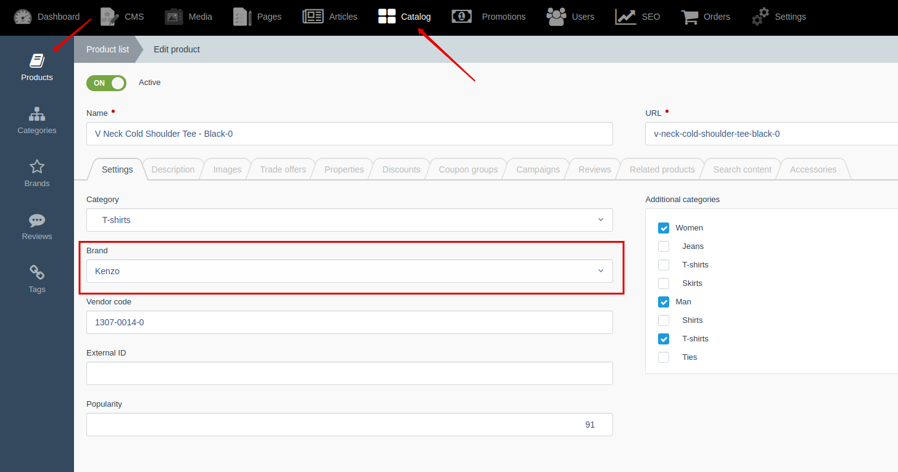
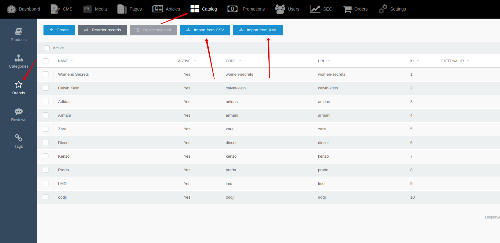




{{ parent() }}

## Backend

You can create and edit brands by going to **Backend -> Catalog -> Brands**

You can change sorting of brands by going to **Backend -> Catalog -> Brands -> Reorder records**

You can attach one brand to product

## Import

You can import brands from XML and CSV files.
You can use [events](modules/brand/event/event#event-list-brand), that allows you to extend import data.
 
> You can learn more about importing from [XML](import/import-from-xml/home.md#import-from-xml) and [CSV](import/import-from-csv/home.md#import-from-csv) files in [section](import/import-from-xml/home.md#import-from-xml).


