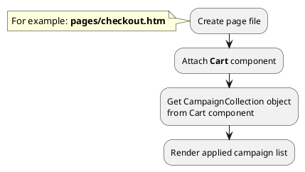

## Example {{ i }}: Render block with applied campaigns on checkout page

### {{ i }}.1 Task

Render block with applied campaigns on checkout page.

### {{ i }}.2 How can i do it?

> Example uses {{ get_component('cart').link('cart') }} component.
Component method returns {{ get_collection('campaign').link() }} class object.
All available fields and methods of **{{ get_collection('campaign').class }}** class you can find in {{ get_collection('campaign').link('section') }}

### {{ i }}.3 Source code

{{ get_module('campaign').example('pages/checkout-1.htm')|raw }}

{{ get_module('campaign').example('partials/cart/checkout/checkout-1.htm')|raw }}

{{ get_module('campaign').example('partials/cart/campaign-item/campaign-item-1.htm')|raw }}