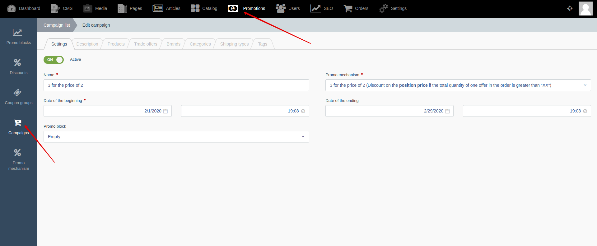




{{ parent() }}

“Campaigns” is module that allows you to automatically apply promo mechanisms to cart and orders according to your schedule.
If campaign is not linked with any product, then the promo mechanism is applied to all products of the catalog.
You can attach products, offers, categories, brands, shipping types, tags to limit the list of products and offers to which the promo mechanism will be applied.

> After you create and configure "campaign", it will automatically begin to apply promo mechanisms to cart and order positions.
No additional code changes are required.

For example:

## Backend

You can create and edit campaigns by going to **Backend -> Promotions -> Campaigns**

