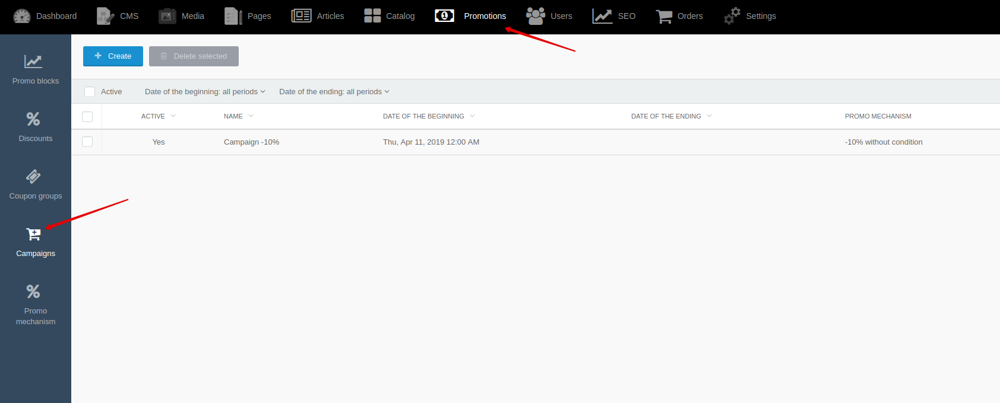

# Campaign {docsify-ignore-all}

[Back to modules](modules/home.md)

!> **Attention!**  We recommend that you read [Architecture](architecture/architecture), [ElementItem class](architecture/item-class/item-class.md),
[ElementCollection class](architecture/collection-class/collection-class.md) sections for complete understanding of  project architecture.

“Campaigns” is module that allows you to apply promo mechanisms on cart/checkout page.

> After you create and configure "campaign", it will automatically begin to apply promo mechanisms to cart and order positions.
No additional code changes are required.

For example:

## Backend

You can create and edit campaigns by going to **Backend -> Promotions -> Campaigns**

[Back to modules](modules/home.md)