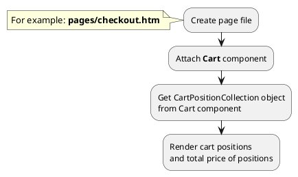

## Example {{ i }}: Render block with cart positions on checkout page

### {{ i }}.1 Task

Render block with cart positions on checkout page.

### {{ i }}.2 How can i do it?

> Example uses {{ get_component('cart').link('cart') }} component.
Component method returns {{ get_collection('cart-position').link() }} class object.
All available fields and methods of **{{ get_collection('cart-position').class }}** class you can find in {{ get_collection('cart-position').link('section') }}

### {{ i }}.3 Source code

{{ get_module('cart-position').example('pages/checkout-1.htm')|raw }}

{{ get_module('cart-position').example('partials/cart/checkout/checkout-1.htm')|raw }}

{{ get_module('cart-position').example('partials/cart/cart-position/cart-position-1.htm')|raw }}
