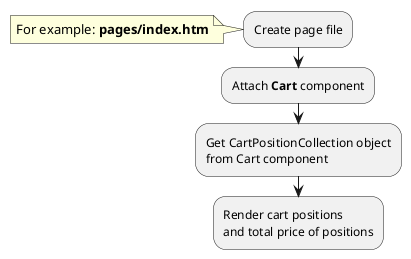
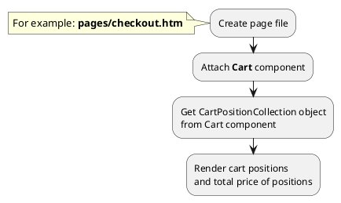

[Back to modules](modules/home.md)

[Home](modules/cart-position/home.md)
• [Model](modules/cart-position/model/model.md)
• [Item](modules/cart-position/item/item.md)
• [Collection](modules/cart-position/collection/collection.md)
• Examples
• [Extending](modules/cart-position/extending/extending.md)

# Examples: CartPosition {docsify-ignore-all}

!> **Attention!** We recommend that you read [Architecture](home.md#architecture), [ElementItem class](item-class/item-class.md),
[ElementCollection class](collection-class/collection-class.md) sections for complete understanding of  project architecture.

* [Example 1: Render block with mini-cart](#example-1-render-block-with-mini-cart)
* [Example 2: Render block with cart positions on checkout page](#example-2-render-block-with-cart-positions-on-checkout-page)

## Example 1: Render block with mini-cart

### 1.1 Task

Render block with mini-cart.

> Block with mini-cart is often located in the header of your site.


### 1.2 How can i do it?

> Example uses [Cart](modules/cart/component/component.md#cart) component.
Component method returns [CartPositionCollection](modules/cart-position/collection/collection.md#cartpositioncollection) class object.
All available fields and methods of **CartPositionCollection** class you can find in [section](modules/cart-position/collection/collection.md#cartpositioncollection)



### 1.3 Source code

```twig
title = "Index page"
url = "/"
layout = "main"
is_hidden = 0


[Cart]
==

{# Get cart positions #}


    <ul>
    
        <li></li>
    
    </ul>
    
    <div>Total price: {{ obCartPositionList.getTotalPrice() }} {{ obCartPositionList.getCurrency() }}</div>

    <div>Cart is empty</div>

```

File: **product/cart-position/cart-position.htm**
```twig



<a href="{{ obProduct.getPageUrl('product') }}">
    <div>
        
            
        
        <h3 itemprop="name">{{ obProduct.name }}</h3>
        
            <div itemprop="description">
                {{ obProduct.preview_text }}
            </div>
        
        <span price="{{ obCartPosition.price_value }}">{{ obCartPosition.price }}</span>
        
            <span price="{{ obCartPosition.old_price_value }}">{{ obCartPosition.old_price }}</span>
        
        <input type="number" name="quantity" value="{{ obCartPosition.value }}" max="{{ obOffer.quantity }}" min="1">
    </div>
</a>
```

## Example 2: Render block with cart positions on checkout page

### 1.1 Task

Render block with cart positions on checkout page.


### 1.2 How can i do it?

> Example uses [Cart](modules/cart/component/component.md#cart) component.
Component method returns [CartPositionCollection](modules/cart-position/collection/collection.md#cartpositioncollection) class object.
All available fields and methods of **CartPositionCollection** class you can find in [section](modules/cart-position/collection/collection.md#cartpositioncollection)



### 1.3 Source code

```twig
title = "Checkout page"
url = "/checkout"
layout = "main"
is_hidden = 0

[Cart]
==

{# Get cart positions #}


    <ul>
    
        <li></li>
    
    </ul>
    
    <div>Total price: {{ obCartPositionList.getTotalPrice() }} {{ obCartPositionList.getCurrency() }}</div>

    <div>Cart is empty</div>

```

File: **product/cart-position/cart-position.htm**
```twig



<a href="{{ obProduct.getPageUrl('product') }}">
    <div>
        
            
        
        <h3 itemprop="name">{{ obProduct.name }}</h3>
        
            <div itemprop="description">
                {{ obProduct.preview_text }}
            </div>
        
        <span price="{{ obCartPosition.price_value }}">{{ obCartPosition.price }}</span>
        
            <span price="{{ obCartPosition.old_price_value }}">{{ obCartPosition.old_price }}</span>
        
        <input type="number" name="quantity" value="{{ obCartPosition.value }}" max="{{ obOffer.quantity }}" min="1">
    </div>
</a>
```


[Home](modules/cart-position/home.md)
• [Model](modules/cart-position/model/model.md)
• [Item](modules/cart-position/item/item.md)
• [Collection](modules/cart-position/collection/collection.md)
• Examples
• [Extending](modules/cart-position/extending/extending.md)

[Back to modules](modules/home.md)
