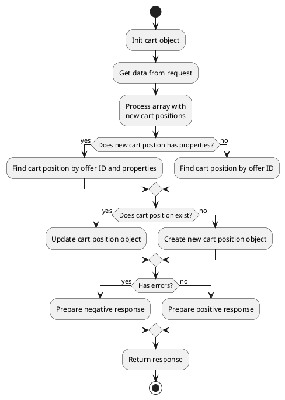
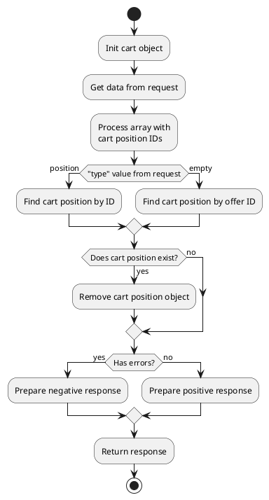
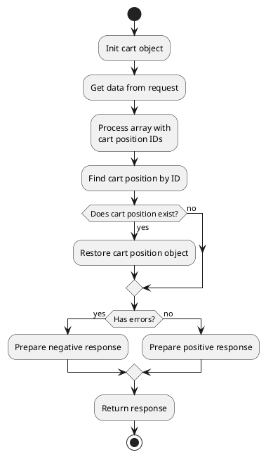
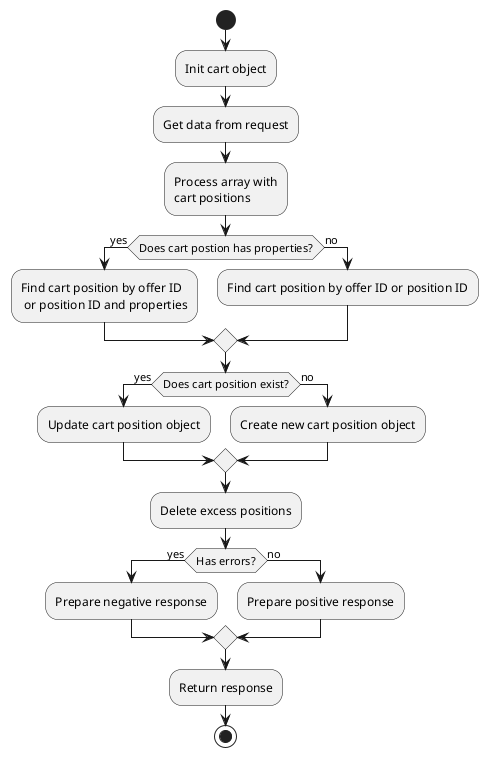
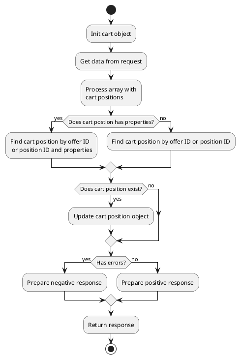





## Cart

* [get](#getobshippingtype-null-obpaymentmethoditem-null)
* [getActiveShippingTypeFromRequest](#getactiveshippingtypefromrequest)
* [getAppliedCampaignList](#getappliedcampaignlist)
* [getAppliedCouponList](#getappliedcouponlist)
* [getCurrency](#getcurrency)
* [getCurrencyCode](#getcurrencycode)
* [getTotalPrice](#gettotalprice)
* [getTotalPriceValue](#gettotalpricevalue)
* [getOldTotalPrice](#getoldtotalprice)
* [getOldTotalPriceValue](#getoldtotalpricevalue)
* [getDiscountTotalPrice](#getdiscounttotalprice)
* [getDiscountTotalPriceValue](#getdiscounttotalpricevalue)
* [getTotalPriceData](#gettotalpricedata)
* [onAdd](#onadd)
* [onAddCoupon](#onaddcoupon)
* [onClear](#onclear)
* [onClearCouponList](#onclearcouponlist)
* [onGetCartData](#ongetcartdata)
* [onGetData](#ongetdata)
* [onRemove](#onremove)
* [onRemoveCoupon](#onremovecoupon)
* [onRestore](#onrestore)
* [onSaveData](#onsavedata)
* [onSetShippingType](#onsetshippingtype)
* [onSync](#onsync)
* [onUpdate](#onupdate)

### get(_[$obShippingType = null]_, _[$obPaymentMethodItem = null]_)

Method returns {{ get_collection('cart-position').link() }} class object.
{{ get_collection('cart-position').link() }} object will contain the position of the user's cart.
You can pass active sipping type object and active payment method object
to method to get total cost with shipping price and discounts applied.
You can uses method to render cart positions and blocks with positions total price.

### getActiveShippingTypeFromRequest()

Method gets from request "shipping_type_id" field and returns {{ get_item('shipping-type').link() }} class object.

### getAppliedCampaignList()

> Method {{ 'campaigns'|available_with|lcfirst }}

Method returns {{ get_collection('campaign').link() }} class object with active applied campaigns.

### getAppliedCouponList()

> Method {{ 'coupons'|available_with|lcfirst }}

Method gets applied coupons and returns array with {{ get_model('coupon').link() }} models.


```twig
[Cart]
==

{# Get active applied coupons #}


    <div>
        <span>Applied coupons</span>
        <ul>
            
                <li>{{ obCoupon.code }}</li>
            
        </ul>
    </div>

```


### getCurrency()

Method returns active currency symbol. For example: **$**

### getCurrencyCode()

Method returns active currency code. For example: **USD**

### getTotalPrice()

Method returns formatted total price string (**"1 450,95"**).
Method returns total price of cart positions + price of active shipping price. 

### getTotalPriceValue()

Method returns float total price value (**1450.95**).
Method returns total price of cart positions + price of active shipping price.

### getOldTotalPrice()

Method returns formatted total price string without discounts (**"1 650,95"**).
Method returns total price without discounts of cart positions + price without discounts of active shipping price.

### getOldTotalPriceValue()

Method returns float total price value without discounts (**1650.95**).
Method returns total price without discounts of cart positions + price without discounts of active shipping price.

### getDiscountTotalPrice()

Method returns formatted discount price string (**"200,00"**).
Method returns total discount price of cart positions + discount price of active shipping price.

### getDiscountTotalPriceValue()

Method returns float discount price value (**200**).
Method returns total discount price of cart positions + discount price of active shipping price.

### getTotalPriceData()

Method returns [TotalPriceContainer](modules/price-container/home.md#TotalPriceContainer) class object.
Object contains all fields of total price. For example: price, old_price, tax_price, discount_price, etc.


```twig
[Cart]
==


<table>
<thead>
    <tr>
        <td>Field</td>
        <td>Price without tax</td>
        <td>Tax price</td>
        <td>Price with tax</td>
    </tr>
</thead>
<tbody>
    <tr>
        <td>Price</td>
        <td>{{ obPriceData.price_without_tax }}</td>
        <td>{{ obPriceData.tax_price }}</td>
        <td>{{ obPriceData.price_with_tax }}</td>
    </tr>
    <tr>
        <td>Discount price</td>
        <td>{{ obPriceData.discount_price_without_tax }}</td>
        <td>{{ obPriceData.tax_discount_price }}</td>
        <td>{{ obPriceData.discount_price_with_tax }}</td>
    </tr>
    <tr>
        <td>Old price</td>
        <td>{{ obPriceData.old_price_without_tax }}</td>
        <td>{{ obPriceData.tax_old_price }}</td>
        <td>{{ obPriceData.old_price_with_tax }}</td>
    </tr>
</tbody>
</table>
```


### onAdd()

Method adds offers to cart. You can send ID of active shipping type in ajax request to get an object in response in which delivery cost will be added to total price.

> Cart positions are searched by offer ID and by an array of properties. The same offer can be added several times to cart if different arrays of properties are in request.

#### How it works?



#### Example 1: Add offers to cart without properties

#### Request

```javascript
//Prepare object with offers
let data = {
    'cart': [
        {'offer_id': 32, 'quantity': 4},
        {'offer_id': 44, 'quantity': 1}
    ],
    'shipping_type_id': 4
};

//Send ajax request and update cart items
$.request('Cart::onAdd', {
    'data': data,
    'update': {'cart-items': '.cart-item-wrapper'}
});
```

#### Response

> Cart component returns a standard positive response and negative response

<details>
<summary>Click to see positive response example</summary>

```json
{
"status": true,
"code": null,
"message": null,
"data": {
  "position": {
    "11": {
      "id": 11,
      "item_id": 32,
      "item_type": "Lovata\\Shopaholic\\Models\\Offer",
      "quantity": 4,
      "max_quantity": 10,
      "property": [],
      
      "price": "480.00",
      "price_value": 480,
      "tax_price": "80.00",
      "tax_price_value": 80,
      "price_without_tax": "400.00",
      "price_without_tax_value": 400,
      "price_with_tax": "480.00",
      "price_with_tax_value": 480,
      
      "old_price": "720.00",
      "old_price_value": 720,
      "tax_old_price": "120.00",
      "tax_old_price_value": 120,
      "old_price_without_tax": "600.00",
      "old_price_without_tax_value": 600,
      "old_price_with_tax": "720.00",
      "old_price_with_tax_value": 720,
      
      "discount_price": "240.00",
      "discount_price_value": 240,
      "tax_discount_price": "40.00",
      "tax_discount_price_value": 40,
      "discount_price_without_tax": "200.00",
      "discount_price_without_tax_value": 200,
      "discount_price_with_tax": "240.00",
      "discount_price_with_tax_value": 240,
      
      "price_per_unit": "120.00",
      "price_per_unit_value": 120,
      "tax_price_per_unit": "20.00",
      "tax_price_per_unit_value": 20,
      "price_per_unit_without_tax": "100.00",
      "price_per_unit_without_tax_value": 100,
      "price_per_unit_with_tax": "120.00",
      "price_per_unit_with_tax_value": 120,
      
      "old_price_per_unit": "180.00",
      "old_price_per_unit_value": 180,
      "tax_old_price_per_unit": "30.00",
      "tax_old_price_per_unit_value": 30,
      "old_price_per_unit_without_tax": "150.00",
      "old_price_per_unit_without_tax_value": 150,
      "old_price_per_unit_with_tax": "180.00",
      "old_price_per_unit_with_tax_value": 180,
      
      "discount_price_per_unit": "60.00",
      "discount_price_per_unit_value": 60,
      "tax_discount_price_per_unit": "10.00",
      "tax_discount_price_per_unit_value": 10,
      "discount_price_per_unit_without_tax": "50.00",
      "discount_price_per_unit_without_tax_value": 50,
      "discount_price_per_unit_with_tax": "60.00",
      "discount_price_per_unit_with_tax_value": 60,
      "log": []
    },
    "12": {
      "id": 12,
      "item_id": 44,
      "item_type": "Lovata\\Shopaholic\\Models\\Offer",
      "quantity": 1,
      "max_quantity": 15,
      "property": [],
      
      "price": "24.00",
      "price_value": 24,
      "tax_price": "4.00",
      "tax_price_value": 4,
      "price_without_tax": "20.00",
      "price_without_tax_value": 20,
      "price_with_tax": "24.00",
      "price_with_tax_value": 24,
      
      "old_price": "0.00",
      "old_price_value": 0,
      "tax_old_price": "0.00",
      "tax_old_price_value": 0,
      "old_price_without_tax": "0.00",
      "old_price_without_tax_value": 0,
      "old_price_with_tax": "0.00",
      "old_price_with_tax_value": 0,
      
      "discount_price": "0.00",
      "discount_price_value": 0,
      "tax_discount_price": "0.00",
      "tax_discount_price_value": 0,
      "discount_price_without_tax": "0.00",
      "discount_price_without_tax_value": 0,
      "discount_price_with_tax": "0.00",
      "discount_price_with_tax_value": 0,
      
      "price_per_unit": "24.00",
      "price_per_unit_value": 24,
      "tax_price_per_unit": "4.00",
      "tax_price_per_unit_value": 4,
      "price_per_unit_without_tax": "20.00",
      "price_per_unit_without_tax_value": 20,
      "price_per_unit_with_tax": "24.00",
      "price_per_unit_with_tax_value": 24,
      
      "old_price_per_unit": "0.00",
      "old_price_per_unit_value": 0,
      "tax_old_price_per_unit": "0.00",
      "tax_old_price_per_unit_value": 0,
      "old_price_per_unit_without_tax": "0.00",
      "old_price_per_unit_without_tax_value": 0,
      "old_price_per_unit_with_tax": "0.00",
      "old_price_per_unit_with_tax_value": 0,
      
      "discount_price_per_unit": "0.00",
      "discount_price_per_unit_value": 0,
      "tax_discount_price_per_unit": "0.00",
      "tax_discount_price_per_unit_value": 0,
      "discount_price_per_unit_without_tax": "0.00",
      "discount_price_per_unit_without_tax_value": 0,
      "discount_price_per_unit_with_tax": "0.00",
      "discount_price_per_unit_with_tax_value": 0,
      "log": []
    }
  },
  "shipping_price": {
    "price": "12.00",
    "price_value": 12,
    "tax_price": "2.00",
    "tax_price_value": 2,
    "price_without_tax": "10.00",
    "price_without_tax_value": 10,
    "price_with_tax": "12.00",
    "price_with_tax_value": 12,
    
    "old_price": "18.00",
    "old_price_value": 18,
    "tax_old_price": "3.00",
    "tax_old_price_value": 3,
    "old_price_without_tax": "15.00",
    "old_price_without_tax_value": 15,
    "old_price_with_tax": "18.00",
    "old_price_with_tax_value": 18,
    
    "discount_price": "6.00",
    "discount_price_value": 6,
    "tax_discount_price": "1.00",
    "tax_discount_price_value": 1,
    "discount_price_without_tax": "5.00",
    "discount_price_without_tax_value": 5,
    "discount_price_with_tax": "6.00",
    "discount_price_with_tax_value": 6,
    "log": []
  },
  "position_total_price": {
    "price": "504.00",
    "price_value": 504,
    "tax_price": "84.00",
    "tax_price_value": 84,
    "price_without_tax": "420.00",
    "price_without_tax_value": 420,
    "price_with_tax": "504.00",
    "price_with_tax_value": 504,
    
    "old_price": "720.00",
    "old_price_value": 720,
    "tax_old_price": "120.00",
    "tax_old_price_value": 120,
    "old_price_without_tax": "600.00",
    "old_price_without_tax_value": 600,
    "old_price_with_tax": "720.00",
    "old_price_with_tax_value": 720,
      
    "discount_price": "240.00",
    "discount_price_value": 240,
    "tax_discount_price": "40.00",
    "tax_discount_price_value": 40,
    "discount_price_without_tax": "200.00",
    "discount_price_without_tax_value": 200,
    "discount_price_with_tax": "240.00",
    "discount_price_with_tax_value": 240,
    "log": []
  },
  "total_price": {
      "price": "516.00",
      "price_value": 516,
      "tax_price": "86.00",
      "tax_price_value": 86,
      "price_without_tax": "430.00",
      "price_without_tax_value": 430,
      "price_with_tax": "516.00",
      "price_with_tax_value": 516,
      
      "old_price": "738.00",
      "old_price_value": 738,
      "tax_old_price": "123.00",
      "tax_old_price_value": 123,
      "old_price_without_tax": "615.00",
      "old_price_without_tax_value": 615,
      "old_price_with_tax": "738.00",
      "old_price_with_tax_value": 738,
      
      "discount_price": "246.00",
      "discount_price_value": 246,
      "tax_discount_price": "41.00",
      "tax_discount_price_value": 41,
      "discount_price_without_tax": "205.00",
      "discount_price_without_tax_value": 205,
      "discount_price_with_tax": "246.00",
      "discount_price_with_tax_value": 246,
    "log": []
  },
  "quantity": 2,
  "total_quantity": 5,
  "payment_method_id": 1,
  "shipping_type_id": 1,
  "user_data": {
    "phone": "+1 11 111-11-11"
  },
  "shipping_address": {
    "address1": "..."
  },
  "billing_address": {
    "address1": "..."
  },
  "property": {
    "comment": "..."
  }
}}
```

</details>

<details>
<summary>Click to see negative response example</summary>

```json
{
"status": false,
"code": "Error code",
"message": "Error message",
"data": {}
}
```

</details>

### Example 2: Add offers to cart with properties

#### Request

```javascript
//Prepare object with offers
let data = {
    'cart': [
        {'offer_id': 32, 'quantity': 4, 'property': {'double_cheese': true}},
        {'offer_id': 44, 'quantity': 1, 'property': {'double_cheese': false}}
    ],
    'shipping_type_id': 4
};

//Send ajax request and update cart items
$.request('Cart::onAdd', {
    'data': data,
    'update': {'cart-items': '.cart-item-wrapper'}
});
```

#### Response

> Cart component returns a standard positive response and negative response

<details>
<summary>Click to see positive response example</summary>

```json
{
"status": true,
"code": null,
"message": null,
"data": {
  "position": {
    "11": {
      "id": 11,
      "item_id": 32,
      "item_type": "Lovata\\Shopaholic\\Models\\Offer",
      "quantity": 4,
      "max_quantity": 10,
      "property": [],
      
      "price": "480.00",
      "price_value": 480,
      "tax_price": "80.00",
      "tax_price_value": 80,
      "price_without_tax": "400.00",
      "price_without_tax_value": 400,
      "price_with_tax": "480.00",
      "price_with_tax_value": 480,
      
      "old_price": "720.00",
      "old_price_value": 720,
      "tax_old_price": "120.00",
      "tax_old_price_value": 120,
      "old_price_without_tax": "600.00",
      "old_price_without_tax_value": 600,
      "old_price_with_tax": "720.00",
      "old_price_with_tax_value": 720,
      
      "discount_price": "240.00",
      "discount_price_value": 240,
      "tax_discount_price": "40.00",
      "tax_discount_price_value": 40,
      "discount_price_without_tax": "200.00",
      "discount_price_without_tax_value": 200,
      "discount_price_with_tax": "240.00",
      "discount_price_with_tax_value": 240,
      
      "price_per_unit": "120.00",
      "price_per_unit_value": 120,
      "tax_price_per_unit": "20.00",
      "tax_price_per_unit_value": 20,
      "price_per_unit_without_tax": "100.00",
      "price_per_unit_without_tax_value": 100,
      "price_per_unit_with_tax": "120.00",
      "price_per_unit_with_tax_value": 120,
      
      "old_price_per_unit": "180.00",
      "old_price_per_unit_value": 180,
      "tax_old_price_per_unit": "30.00",
      "tax_old_price_per_unit_value": 30,
      "old_price_per_unit_without_tax": "150.00",
      "old_price_per_unit_without_tax_value": 150,
      "old_price_per_unit_with_tax": "180.00",
      "old_price_per_unit_with_tax_value": 180,
      
      "discount_price_per_unit": "60.00",
      "discount_price_per_unit_value": 60,
      "tax_discount_price_per_unit": "10.00",
      "tax_discount_price_per_unit_value": 10,
      "discount_price_per_unit_without_tax": "50.00",
      "discount_price_per_unit_without_tax_value": 50,
      "discount_price_per_unit_with_tax": "60.00",
      "discount_price_per_unit_with_tax_value": 60,
      "log": []
    },
    "12": {
      "id": 12,
      "item_id": 44,
      "item_type": "Lovata\\Shopaholic\\Models\\Offer",
      "quantity": 1,
      "max_quantity": 15,
      "property": [],
      
      "price": "24.00",
      "price_value": 24,
      "tax_price": "4.00",
      "tax_price_value": 4,
      "price_without_tax": "20.00",
      "price_without_tax_value": 20,
      "price_with_tax": "24.00",
      "price_with_tax_value": 24,
      
      "old_price": "0.00",
      "old_price_value": 0,
      "tax_old_price": "0.00",
      "tax_old_price_value": 0,
      "old_price_without_tax": "0.00",
      "old_price_without_tax_value": 0,
      "old_price_with_tax": "0.00",
      "old_price_with_tax_value": 0,
      
      "discount_price": "0.00",
      "discount_price_value": 0,
      "tax_discount_price": "0.00",
      "tax_discount_price_value": 0,
      "discount_price_without_tax": "0.00",
      "discount_price_without_tax_value": 0,
      "discount_price_with_tax": "0.00",
      "discount_price_with_tax_value": 0,
      
      "price_per_unit": "24.00",
      "price_per_unit_value": 24,
      "tax_price_per_unit": "4.00",
      "tax_price_per_unit_value": 4,
      "price_per_unit_without_tax": "20.00",
      "price_per_unit_without_tax_value": 20,
      "price_per_unit_with_tax": "24.00",
      "price_per_unit_with_tax_value": 24,
      
      "old_price_per_unit": "0.00",
      "old_price_per_unit_value": 0,
      "tax_old_price_per_unit": "0.00",
      "tax_old_price_per_unit_value": 0,
      "old_price_per_unit_without_tax": "0.00",
      "old_price_per_unit_without_tax_value": 0,
      "old_price_per_unit_with_tax": "0.00",
      "old_price_per_unit_with_tax_value": 0,
      
      "discount_price_per_unit": "0.00",
      "discount_price_per_unit_value": 0,
      "tax_discount_price_per_unit": "0.00",
      "tax_discount_price_per_unit_value": 0,
      "discount_price_per_unit_without_tax": "0.00",
      "discount_price_per_unit_without_tax_value": 0,
      "discount_price_per_unit_with_tax": "0.00",
      "discount_price_per_unit_with_tax_value": 0,
      "log": []
    }
  },
  "shipping_price": {
    "price": "12.00",
    "price_value": 12,
    "tax_price": "2.00",
    "tax_price_value": 2,
    "price_without_tax": "10.00",
    "price_without_tax_value": 10,
    "price_with_tax": "12.00",
    "price_with_tax_value": 12,
    
    "old_price": "18.00",
    "old_price_value": 18,
    "tax_old_price": "3.00",
    "tax_old_price_value": 3,
    "old_price_without_tax": "15.00",
    "old_price_without_tax_value": 15,
    "old_price_with_tax": "18.00",
    "old_price_with_tax_value": 18,
    
    "discount_price": "6.00",
    "discount_price_value": 6,
    "tax_discount_price": "1.00",
    "tax_discount_price_value": 1,
    "discount_price_without_tax": "5.00",
    "discount_price_without_tax_value": 5,
    "discount_price_with_tax": "6.00",
    "discount_price_with_tax_value": 6,
    "log": []
  },
  "position_total_price": {
    "price": "504.00",
    "price_value": 504,
    "tax_price": "84.00",
    "tax_price_value": 84,
    "price_without_tax": "420.00",
    "price_without_tax_value": 420,
    "price_with_tax": "504.00",
    "price_with_tax_value": 504,
    
    "old_price": "720.00",
    "old_price_value": 720,
    "tax_old_price": "120.00",
    "tax_old_price_value": 120,
    "old_price_without_tax": "600.00",
    "old_price_without_tax_value": 600,
    "old_price_with_tax": "720.00",
    "old_price_with_tax_value": 720,
      
    "discount_price": "240.00",
    "discount_price_value": 240,
    "tax_discount_price": "40.00",
    "tax_discount_price_value": 40,
    "discount_price_without_tax": "200.00",
    "discount_price_without_tax_value": 200,
    "discount_price_with_tax": "240.00",
    "discount_price_with_tax_value": 240,
    "log": []
  },
  "total_price": {
      "price": "516.00",
      "price_value": 516,
      "tax_price": "86.00",
      "tax_price_value": 86,
      "price_without_tax": "430.00",
      "price_without_tax_value": 430,
      "price_with_tax": "516.00",
      "price_with_tax_value": 516,
      
      "old_price": "738.00",
      "old_price_value": 738,
      "tax_old_price": "123.00",
      "tax_old_price_value": 123,
      "old_price_without_tax": "615.00",
      "old_price_without_tax_value": 615,
      "old_price_with_tax": "738.00",
      "old_price_with_tax_value": 738,
      
      "discount_price": "246.00",
      "discount_price_value": 246,
      "tax_discount_price": "41.00",
      "tax_discount_price_value": 41,
      "discount_price_without_tax": "205.00",
      "discount_price_without_tax_value": 205,
      "discount_price_with_tax": "246.00",
      "discount_price_with_tax_value": 246,
    "log": []
  },
  "quantity": 2,
  "total_quantity": 5,
  "payment_method_id": 1,
  "shipping_type_id": 1,
  "user_data": {
    "phone": "+1 11 111-11-11"
  },
  "shipping_address": {
    "address1": "..."
  },
  "billing_address": {
    "address1": "..."
  },
  "property": {
    "comment": "..."
  }
}}
```

</details>

<details>
<summary>Click to see negative response example</summary>

```json
{
"status": false,
"code": "Error code",
"message": "Error message",
"data": {}
}
```

</details>

### onAddCoupon()

> Method {{ 'coupons'|available_with|lcfirst }}

Method attach coupon to cart. You can send ID of active shipping type in ajax request to get an object in response in which delivery cost will be added to total price.

#### Request

```javascript
$.request('Cart::onAddCoupon', {
    'data': {'coupon': 'XXYY-XXZZ-YYZZ'},
    'shipping_type_id': 4
});
```

#### Response

> Cart component returns a standard positive response and negative response

<details>
<summary>Click to see positive response example</summary>

```json
{
"status": true,
"code": null,
"message": null,
"data": {
  "position": {
    "11": {
      "id": 11,
      "item_id": 32,
      "item_type": "Lovata\\Shopaholic\\Models\\Offer",
      "quantity": 4,
      "max_quantity": 10,
      "property": [],
      
      "price": "480.00",
      "price_value": 480,
      "tax_price": "80.00",
      "tax_price_value": 80,
      "price_without_tax": "400.00",
      "price_without_tax_value": 400,
      "price_with_tax": "480.00",
      "price_with_tax_value": 480,
      
      "old_price": "720.00",
      "old_price_value": 720,
      "tax_old_price": "120.00",
      "tax_old_price_value": 120,
      "old_price_without_tax": "600.00",
      "old_price_without_tax_value": 600,
      "old_price_with_tax": "720.00",
      "old_price_with_tax_value": 720,
      
      "discount_price": "240.00",
      "discount_price_value": 240,
      "tax_discount_price": "40.00",
      "tax_discount_price_value": 40,
      "discount_price_without_tax": "200.00",
      "discount_price_without_tax_value": 200,
      "discount_price_with_tax": "240.00",
      "discount_price_with_tax_value": 240,
      
      "price_per_unit": "120.00",
      "price_per_unit_value": 120,
      "tax_price_per_unit": "20.00",
      "tax_price_per_unit_value": 20,
      "price_per_unit_without_tax": "100.00",
      "price_per_unit_without_tax_value": 100,
      "price_per_unit_with_tax": "120.00",
      "price_per_unit_with_tax_value": 120,
      
      "old_price_per_unit": "180.00",
      "old_price_per_unit_value": 180,
      "tax_old_price_per_unit": "30.00",
      "tax_old_price_per_unit_value": 30,
      "old_price_per_unit_without_tax": "150.00",
      "old_price_per_unit_without_tax_value": 150,
      "old_price_per_unit_with_tax": "180.00",
      "old_price_per_unit_with_tax_value": 180,
      
      "discount_price_per_unit": "60.00",
      "discount_price_per_unit_value": 60,
      "tax_discount_price_per_unit": "10.00",
      "tax_discount_price_per_unit_value": 10,
      "discount_price_per_unit_without_tax": "50.00",
      "discount_price_per_unit_without_tax_value": 50,
      "discount_price_per_unit_with_tax": "60.00",
      "discount_price_per_unit_with_tax_value": 60,
      "log": []
    },
    "12": {
      "id": 12,
      "item_id": 44,
      "item_type": "Lovata\\Shopaholic\\Models\\Offer",
      "quantity": 1,
      "max_quantity": 15,
      "property": [],
      
      "price": "24.00",
      "price_value": 24,
      "tax_price": "4.00",
      "tax_price_value": 4,
      "price_without_tax": "20.00",
      "price_without_tax_value": 20,
      "price_with_tax": "24.00",
      "price_with_tax_value": 24,
      
      "old_price": "0.00",
      "old_price_value": 0,
      "tax_old_price": "0.00",
      "tax_old_price_value": 0,
      "old_price_without_tax": "0.00",
      "old_price_without_tax_value": 0,
      "old_price_with_tax": "0.00",
      "old_price_with_tax_value": 0,
      
      "discount_price": "0.00",
      "discount_price_value": 0,
      "tax_discount_price": "0.00",
      "tax_discount_price_value": 0,
      "discount_price_without_tax": "0.00",
      "discount_price_without_tax_value": 0,
      "discount_price_with_tax": "0.00",
      "discount_price_with_tax_value": 0,
      
      "price_per_unit": "24.00",
      "price_per_unit_value": 24,
      "tax_price_per_unit": "4.00",
      "tax_price_per_unit_value": 4,
      "price_per_unit_without_tax": "20.00",
      "price_per_unit_without_tax_value": 20,
      "price_per_unit_with_tax": "24.00",
      "price_per_unit_with_tax_value": 24,
      
      "old_price_per_unit": "0.00",
      "old_price_per_unit_value": 0,
      "tax_old_price_per_unit": "0.00",
      "tax_old_price_per_unit_value": 0,
      "old_price_per_unit_without_tax": "0.00",
      "old_price_per_unit_without_tax_value": 0,
      "old_price_per_unit_with_tax": "0.00",
      "old_price_per_unit_with_tax_value": 0,
      
      "discount_price_per_unit": "0.00",
      "discount_price_per_unit_value": 0,
      "tax_discount_price_per_unit": "0.00",
      "tax_discount_price_per_unit_value": 0,
      "discount_price_per_unit_without_tax": "0.00",
      "discount_price_per_unit_without_tax_value": 0,
      "discount_price_per_unit_with_tax": "0.00",
      "discount_price_per_unit_with_tax_value": 0,
      "log": []
    }
  },
  "shipping_price": {
    "price": "12.00",
    "price_value": 12,
    "tax_price": "2.00",
    "tax_price_value": 2,
    "price_without_tax": "10.00",
    "price_without_tax_value": 10,
    "price_with_tax": "12.00",
    "price_with_tax_value": 12,
    
    "old_price": "18.00",
    "old_price_value": 18,
    "tax_old_price": "3.00",
    "tax_old_price_value": 3,
    "old_price_without_tax": "15.00",
    "old_price_without_tax_value": 15,
    "old_price_with_tax": "18.00",
    "old_price_with_tax_value": 18,
    
    "discount_price": "6.00",
    "discount_price_value": 6,
    "tax_discount_price": "1.00",
    "tax_discount_price_value": 1,
    "discount_price_without_tax": "5.00",
    "discount_price_without_tax_value": 5,
    "discount_price_with_tax": "6.00",
    "discount_price_with_tax_value": 6,
    "log": []
  },
  "position_total_price": {
    "price": "504.00",
    "price_value": 504,
    "tax_price": "84.00",
    "tax_price_value": 84,
    "price_without_tax": "420.00",
    "price_without_tax_value": 420,
    "price_with_tax": "504.00",
    "price_with_tax_value": 504,
    
    "old_price": "720.00",
    "old_price_value": 720,
    "tax_old_price": "120.00",
    "tax_old_price_value": 120,
    "old_price_without_tax": "600.00",
    "old_price_without_tax_value": 600,
    "old_price_with_tax": "720.00",
    "old_price_with_tax_value": 720,
      
    "discount_price": "240.00",
    "discount_price_value": 240,
    "tax_discount_price": "40.00",
    "tax_discount_price_value": 40,
    "discount_price_without_tax": "200.00",
    "discount_price_without_tax_value": 200,
    "discount_price_with_tax": "240.00",
    "discount_price_with_tax_value": 240,
    "log": []
  },
  "total_price": {
      "price": "516.00",
      "price_value": 516,
      "tax_price": "86.00",
      "tax_price_value": 86,
      "price_without_tax": "430.00",
      "price_without_tax_value": 430,
      "price_with_tax": "516.00",
      "price_with_tax_value": 516,
      
      "old_price": "738.00",
      "old_price_value": 738,
      "tax_old_price": "123.00",
      "tax_old_price_value": 123,
      "old_price_without_tax": "615.00",
      "old_price_without_tax_value": 615,
      "old_price_with_tax": "738.00",
      "old_price_with_tax_value": 738,
      
      "discount_price": "246.00",
      "discount_price_value": 246,
      "tax_discount_price": "41.00",
      "tax_discount_price_value": 41,
      "discount_price_without_tax": "205.00",
      "discount_price_without_tax_value": 205,
      "discount_price_with_tax": "246.00",
      "discount_price_with_tax_value": 246,
    "log": []
  },
  "quantity": 2,
  "total_quantity": 5,
  "payment_method_id": 1,
  "shipping_type_id": 1,
  "user_data": {
    "phone": "+1 11 111-11-11"
  },
  "shipping_address": {
    "address1": "..."
  },
  "billing_address": {
    "address1": "..."
  },
  "property": {
    "comment": "..."
  }
}}
```

</details>

<details>
<summary>Click to see negative response example</summary>

```json
{
"status": false,
"code": "Error code",
"message": "Error message",
"data": {}
}
```

</details>

### onClear()

Method removes all positions from cart.

#### Request

```javascript
//Send ajax request and update cart items
$.request('Cart::onClear', {
  'update': {'cart-items': '.cart-item-wrapper'} 
});
```

### onClearCouponList()

> Method {{ 'coupons'|available_with|lcfirst }}

Method remove all attached coupons from cart. You can send ID of active shipping type in ajax request to get an object in response in which delivery cost will be added to total price.

#### Request

```javascript
$.request('Cart::onClearCouponList', {
  'update': {'cart-items': '.cart-item-wrapper'},
  'shipping_type_id': 4
});
```

#### Response

> Cart component returns a standard positive response and negative response

<details>
<summary>Click to see positive response example</summary>

```json
{
"status": true,
"code": null,
"message": null,
"data": {
  "position": {
    "11": {
      "id": 11,
      "item_id": 32,
      "item_type": "Lovata\\Shopaholic\\Models\\Offer",
      "quantity": 4,
      "max_quantity": 10,
      "property": [],
      
      "price": "480.00",
      "price_value": 480,
      "tax_price": "80.00",
      "tax_price_value": 80,
      "price_without_tax": "400.00",
      "price_without_tax_value": 400,
      "price_with_tax": "480.00",
      "price_with_tax_value": 480,
      
      "old_price": "720.00",
      "old_price_value": 720,
      "tax_old_price": "120.00",
      "tax_old_price_value": 120,
      "old_price_without_tax": "600.00",
      "old_price_without_tax_value": 600,
      "old_price_with_tax": "720.00",
      "old_price_with_tax_value": 720,
      
      "discount_price": "240.00",
      "discount_price_value": 240,
      "tax_discount_price": "40.00",
      "tax_discount_price_value": 40,
      "discount_price_without_tax": "200.00",
      "discount_price_without_tax_value": 200,
      "discount_price_with_tax": "240.00",
      "discount_price_with_tax_value": 240,
      
      "price_per_unit": "120.00",
      "price_per_unit_value": 120,
      "tax_price_per_unit": "20.00",
      "tax_price_per_unit_value": 20,
      "price_per_unit_without_tax": "100.00",
      "price_per_unit_without_tax_value": 100,
      "price_per_unit_with_tax": "120.00",
      "price_per_unit_with_tax_value": 120,
      
      "old_price_per_unit": "180.00",
      "old_price_per_unit_value": 180,
      "tax_old_price_per_unit": "30.00",
      "tax_old_price_per_unit_value": 30,
      "old_price_per_unit_without_tax": "150.00",
      "old_price_per_unit_without_tax_value": 150,
      "old_price_per_unit_with_tax": "180.00",
      "old_price_per_unit_with_tax_value": 180,
      
      "discount_price_per_unit": "60.00",
      "discount_price_per_unit_value": 60,
      "tax_discount_price_per_unit": "10.00",
      "tax_discount_price_per_unit_value": 10,
      "discount_price_per_unit_without_tax": "50.00",
      "discount_price_per_unit_without_tax_value": 50,
      "discount_price_per_unit_with_tax": "60.00",
      "discount_price_per_unit_with_tax_value": 60,
      "log": []
    },
    "12": {
      "id": 12,
      "item_id": 44,
      "item_type": "Lovata\\Shopaholic\\Models\\Offer",
      "quantity": 1,
      "max_quantity": 15,
      "property": [],
      
      "price": "24.00",
      "price_value": 24,
      "tax_price": "4.00",
      "tax_price_value": 4,
      "price_without_tax": "20.00",
      "price_without_tax_value": 20,
      "price_with_tax": "24.00",
      "price_with_tax_value": 24,
      
      "old_price": "0.00",
      "old_price_value": 0,
      "tax_old_price": "0.00",
      "tax_old_price_value": 0,
      "old_price_without_tax": "0.00",
      "old_price_without_tax_value": 0,
      "old_price_with_tax": "0.00",
      "old_price_with_tax_value": 0,
      
      "discount_price": "0.00",
      "discount_price_value": 0,
      "tax_discount_price": "0.00",
      "tax_discount_price_value": 0,
      "discount_price_without_tax": "0.00",
      "discount_price_without_tax_value": 0,
      "discount_price_with_tax": "0.00",
      "discount_price_with_tax_value": 0,
      
      "price_per_unit": "24.00",
      "price_per_unit_value": 24,
      "tax_price_per_unit": "4.00",
      "tax_price_per_unit_value": 4,
      "price_per_unit_without_tax": "20.00",
      "price_per_unit_without_tax_value": 20,
      "price_per_unit_with_tax": "24.00",
      "price_per_unit_with_tax_value": 24,
      
      "old_price_per_unit": "0.00",
      "old_price_per_unit_value": 0,
      "tax_old_price_per_unit": "0.00",
      "tax_old_price_per_unit_value": 0,
      "old_price_per_unit_without_tax": "0.00",
      "old_price_per_unit_without_tax_value": 0,
      "old_price_per_unit_with_tax": "0.00",
      "old_price_per_unit_with_tax_value": 0,
      
      "discount_price_per_unit": "0.00",
      "discount_price_per_unit_value": 0,
      "tax_discount_price_per_unit": "0.00",
      "tax_discount_price_per_unit_value": 0,
      "discount_price_per_unit_without_tax": "0.00",
      "discount_price_per_unit_without_tax_value": 0,
      "discount_price_per_unit_with_tax": "0.00",
      "discount_price_per_unit_with_tax_value": 0,
      "log": []
    }
  },
  "shipping_price": {
    "price": "12.00",
    "price_value": 12,
    "tax_price": "2.00",
    "tax_price_value": 2,
    "price_without_tax": "10.00",
    "price_without_tax_value": 10,
    "price_with_tax": "12.00",
    "price_with_tax_value": 12,
    
    "old_price": "18.00",
    "old_price_value": 18,
    "tax_old_price": "3.00",
    "tax_old_price_value": 3,
    "old_price_without_tax": "15.00",
    "old_price_without_tax_value": 15,
    "old_price_with_tax": "18.00",
    "old_price_with_tax_value": 18,
    
    "discount_price": "6.00",
    "discount_price_value": 6,
    "tax_discount_price": "1.00",
    "tax_discount_price_value": 1,
    "discount_price_without_tax": "5.00",
    "discount_price_without_tax_value": 5,
    "discount_price_with_tax": "6.00",
    "discount_price_with_tax_value": 6,
    "log": []
  },
  "position_total_price": {
    "price": "504.00",
    "price_value": 504,
    "tax_price": "84.00",
    "tax_price_value": 84,
    "price_without_tax": "420.00",
    "price_without_tax_value": 420,
    "price_with_tax": "504.00",
    "price_with_tax_value": 504,
    
    "old_price": "720.00",
    "old_price_value": 720,
    "tax_old_price": "120.00",
    "tax_old_price_value": 120,
    "old_price_without_tax": "600.00",
    "old_price_without_tax_value": 600,
    "old_price_with_tax": "720.00",
    "old_price_with_tax_value": 720,
      
    "discount_price": "240.00",
    "discount_price_value": 240,
    "tax_discount_price": "40.00",
    "tax_discount_price_value": 40,
    "discount_price_without_tax": "200.00",
    "discount_price_without_tax_value": 200,
    "discount_price_with_tax": "240.00",
    "discount_price_with_tax_value": 240,
    "log": []
  },
  "total_price": {
      "price": "516.00",
      "price_value": 516,
      "tax_price": "86.00",
      "tax_price_value": 86,
      "price_without_tax": "430.00",
      "price_without_tax_value": 430,
      "price_with_tax": "516.00",
      "price_with_tax_value": 516,
      
      "old_price": "738.00",
      "old_price_value": 738,
      "tax_old_price": "123.00",
      "tax_old_price_value": 123,
      "old_price_without_tax": "615.00",
      "old_price_without_tax_value": 615,
      "old_price_with_tax": "738.00",
      "old_price_with_tax_value": 738,
      
      "discount_price": "246.00",
      "discount_price_value": 246,
      "tax_discount_price": "41.00",
      "tax_discount_price_value": 41,
      "discount_price_without_tax": "205.00",
      "discount_price_without_tax_value": 205,
      "discount_price_with_tax": "246.00",
      "discount_price_with_tax_value": 246,
    "log": []
  },
  "quantity": 2,
  "total_quantity": 5,
  "payment_method_id": 1,
  "shipping_type_id": 1,
  "user_data": {
    "phone": "+1 11 111-11-11"
  },
  "shipping_address": {
    "address1": "..."
  },
  "billing_address": {
    "address1": "..."
  },
  "property": {
    "comment": "..."
  }
}}
```

</details>

<details>
<summary>Click to see negative response example</summary>

```json
{
"status": false,
"code": "Error code",
"message": "Error message",
"data": {}
}
```

</details>

### onGetCartData()

Method returns a standard positive response

<details>
<summary>Click to see positive response example</summary>

```json
{
"status": true,
"code": null,
"message": null,
"data": {
  "position": {
    "11": {
      "id": 11,
      "item_id": 32,
      "item_type": "Lovata\\Shopaholic\\Models\\Offer",
      "quantity": 4,
      "max_quantity": 10,
      "property": [],
      
      "price": "480.00",
      "price_value": 480,
      "tax_price": "80.00",
      "tax_price_value": 80,
      "price_without_tax": "400.00",
      "price_without_tax_value": 400,
      "price_with_tax": "480.00",
      "price_with_tax_value": 480,
      
      "old_price": "720.00",
      "old_price_value": 720,
      "tax_old_price": "120.00",
      "tax_old_price_value": 120,
      "old_price_without_tax": "600.00",
      "old_price_without_tax_value": 600,
      "old_price_with_tax": "720.00",
      "old_price_with_tax_value": 720,
      
      "discount_price": "240.00",
      "discount_price_value": 240,
      "tax_discount_price": "40.00",
      "tax_discount_price_value": 40,
      "discount_price_without_tax": "200.00",
      "discount_price_without_tax_value": 200,
      "discount_price_with_tax": "240.00",
      "discount_price_with_tax_value": 240,
      
      "price_per_unit": "120.00",
      "price_per_unit_value": 120,
      "tax_price_per_unit": "20.00",
      "tax_price_per_unit_value": 20,
      "price_per_unit_without_tax": "100.00",
      "price_per_unit_without_tax_value": 100,
      "price_per_unit_with_tax": "120.00",
      "price_per_unit_with_tax_value": 120,
      
      "old_price_per_unit": "180.00",
      "old_price_per_unit_value": 180,
      "tax_old_price_per_unit": "30.00",
      "tax_old_price_per_unit_value": 30,
      "old_price_per_unit_without_tax": "150.00",
      "old_price_per_unit_without_tax_value": 150,
      "old_price_per_unit_with_tax": "180.00",
      "old_price_per_unit_with_tax_value": 180,
      
      "discount_price_per_unit": "60.00",
      "discount_price_per_unit_value": 60,
      "tax_discount_price_per_unit": "10.00",
      "tax_discount_price_per_unit_value": 10,
      "discount_price_per_unit_without_tax": "50.00",
      "discount_price_per_unit_without_tax_value": 50,
      "discount_price_per_unit_with_tax": "60.00",
      "discount_price_per_unit_with_tax_value": 60,
      "log": []
    },
    "12": {
      "id": 12,
      "item_id": 44,
      "item_type": "Lovata\\Shopaholic\\Models\\Offer",
      "quantity": 1,
      "max_quantity": 15,
      "property": [],
      
      "price": "24.00",
      "price_value": 24,
      "tax_price": "4.00",
      "tax_price_value": 4,
      "price_without_tax": "20.00",
      "price_without_tax_value": 20,
      "price_with_tax": "24.00",
      "price_with_tax_value": 24,
      
      "old_price": "0.00",
      "old_price_value": 0,
      "tax_old_price": "0.00",
      "tax_old_price_value": 0,
      "old_price_without_tax": "0.00",
      "old_price_without_tax_value": 0,
      "old_price_with_tax": "0.00",
      "old_price_with_tax_value": 0,
      
      "discount_price": "0.00",
      "discount_price_value": 0,
      "tax_discount_price": "0.00",
      "tax_discount_price_value": 0,
      "discount_price_without_tax": "0.00",
      "discount_price_without_tax_value": 0,
      "discount_price_with_tax": "0.00",
      "discount_price_with_tax_value": 0,
      
      "price_per_unit": "24.00",
      "price_per_unit_value": 24,
      "tax_price_per_unit": "4.00",
      "tax_price_per_unit_value": 4,
      "price_per_unit_without_tax": "20.00",
      "price_per_unit_without_tax_value": 20,
      "price_per_unit_with_tax": "24.00",
      "price_per_unit_with_tax_value": 24,
      
      "old_price_per_unit": "0.00",
      "old_price_per_unit_value": 0,
      "tax_old_price_per_unit": "0.00",
      "tax_old_price_per_unit_value": 0,
      "old_price_per_unit_without_tax": "0.00",
      "old_price_per_unit_without_tax_value": 0,
      "old_price_per_unit_with_tax": "0.00",
      "old_price_per_unit_with_tax_value": 0,
      
      "discount_price_per_unit": "0.00",
      "discount_price_per_unit_value": 0,
      "tax_discount_price_per_unit": "0.00",
      "tax_discount_price_per_unit_value": 0,
      "discount_price_per_unit_without_tax": "0.00",
      "discount_price_per_unit_without_tax_value": 0,
      "discount_price_per_unit_with_tax": "0.00",
      "discount_price_per_unit_with_tax_value": 0,
      "log": []
    }
  },
  "shipping_price": {
    "price": "12.00",
    "price_value": 12,
    "tax_price": "2.00",
    "tax_price_value": 2,
    "price_without_tax": "10.00",
    "price_without_tax_value": 10,
    "price_with_tax": "12.00",
    "price_with_tax_value": 12,
    
    "old_price": "18.00",
    "old_price_value": 18,
    "tax_old_price": "3.00",
    "tax_old_price_value": 3,
    "old_price_without_tax": "15.00",
    "old_price_without_tax_value": 15,
    "old_price_with_tax": "18.00",
    "old_price_with_tax_value": 18,
    
    "discount_price": "6.00",
    "discount_price_value": 6,
    "tax_discount_price": "1.00",
    "tax_discount_price_value": 1,
    "discount_price_without_tax": "5.00",
    "discount_price_without_tax_value": 5,
    "discount_price_with_tax": "6.00",
    "discount_price_with_tax_value": 6,
    "log": []
  },
  "position_total_price": {
    "price": "504.00",
    "price_value": 504,
    "tax_price": "84.00",
    "tax_price_value": 84,
    "price_without_tax": "420.00",
    "price_without_tax_value": 420,
    "price_with_tax": "504.00",
    "price_with_tax_value": 504,
    
    "old_price": "720.00",
    "old_price_value": 720,
    "tax_old_price": "120.00",
    "tax_old_price_value": 120,
    "old_price_without_tax": "600.00",
    "old_price_without_tax_value": 600,
    "old_price_with_tax": "720.00",
    "old_price_with_tax_value": 720,
      
    "discount_price": "240.00",
    "discount_price_value": 240,
    "tax_discount_price": "40.00",
    "tax_discount_price_value": 40,
    "discount_price_without_tax": "200.00",
    "discount_price_without_tax_value": 200,
    "discount_price_with_tax": "240.00",
    "discount_price_with_tax_value": 240,
    "log": []
  },
  "total_price": {
      "price": "516.00",
      "price_value": 516,
      "tax_price": "86.00",
      "tax_price_value": 86,
      "price_without_tax": "430.00",
      "price_without_tax_value": 430,
      "price_with_tax": "516.00",
      "price_with_tax_value": 516,
      
      "old_price": "738.00",
      "old_price_value": 738,
      "tax_old_price": "123.00",
      "tax_old_price_value": 123,
      "old_price_without_tax": "615.00",
      "old_price_without_tax_value": 615,
      "old_price_with_tax": "738.00",
      "old_price_with_tax_value": 738,
      
      "discount_price": "246.00",
      "discount_price_value": 246,
      "tax_discount_price": "41.00",
      "tax_discount_price_value": 41,
      "discount_price_without_tax": "205.00",
      "discount_price_without_tax_value": 205,
      "discount_price_with_tax": "246.00",
      "discount_price_with_tax_value": 246,
    "log": []
  },
  "quantity": 2,
  "total_quantity": 5,
  "payment_method_id": 1,
  "shipping_type_id": 1,
  "user_data": {
    "phone": "+1 11 111-11-11"
  },
  "shipping_address": {
    "address1": "..."
  },
  "billing_address": {
    "address1": "..."
  },
  "property": {
    "comment": "..."
  }
}}
```

</details>

### onGetData()

Method returns a standard response with cart info

<details>
<summary>Click to see response example</summary>

```json
{
  "position": {
    "11": {
      "id": 11,
      "item_id": 32,
      "item_type": "Lovata\\Shopaholic\\Models\\Offer",
      "quantity": 4,
      "max_quantity": 10,
      "property": [],
      
      "price": "480.00",
      "price_value": 480,
      "tax_price": "80.00",
      "tax_price_value": 80,
      "price_without_tax": "400.00",
      "price_without_tax_value": 400,
      "price_with_tax": "480.00",
      "price_with_tax_value": 480,
      
      "old_price": "720.00",
      "old_price_value": 720,
      "tax_old_price": "120.00",
      "tax_old_price_value": 120,
      "old_price_without_tax": "600.00",
      "old_price_without_tax_value": 600,
      "old_price_with_tax": "720.00",
      "old_price_with_tax_value": 720,
      
      "discount_price": "240.00",
      "discount_price_value": 240,
      "tax_discount_price": "40.00",
      "tax_discount_price_value": 40,
      "discount_price_without_tax": "200.00",
      "discount_price_without_tax_value": 200,
      "discount_price_with_tax": "240.00",
      "discount_price_with_tax_value": 240,
      
      "price_per_unit": "120.00",
      "price_per_unit_value": 120,
      "tax_price_per_unit": "20.00",
      "tax_price_per_unit_value": 20,
      "price_per_unit_without_tax": "100.00",
      "price_per_unit_without_tax_value": 100,
      "price_per_unit_with_tax": "120.00",
      "price_per_unit_with_tax_value": 120,
      
      "old_price_per_unit": "180.00",
      "old_price_per_unit_value": 180,
      "tax_old_price_per_unit": "30.00",
      "tax_old_price_per_unit_value": 30,
      "old_price_per_unit_without_tax": "150.00",
      "old_price_per_unit_without_tax_value": 150,
      "old_price_per_unit_with_tax": "180.00",
      "old_price_per_unit_with_tax_value": 180,
      
      "discount_price_per_unit": "60.00",
      "discount_price_per_unit_value": 60,
      "tax_discount_price_per_unit": "10.00",
      "tax_discount_price_per_unit_value": 10,
      "discount_price_per_unit_without_tax": "50.00",
      "discount_price_per_unit_without_tax_value": 50,
      "discount_price_per_unit_with_tax": "60.00",
      "discount_price_per_unit_with_tax_value": 60,
      "log": []
    },
    "12": {
      "id": 12,
      "item_id": 44,
      "item_type": "Lovata\\Shopaholic\\Models\\Offer",
      "quantity": 1,
      "max_quantity": 15,
      "property": [],
      
      "price": "24.00",
      "price_value": 24,
      "tax_price": "4.00",
      "tax_price_value": 4,
      "price_without_tax": "20.00",
      "price_without_tax_value": 20,
      "price_with_tax": "24.00",
      "price_with_tax_value": 24,
      
      "old_price": "0.00",
      "old_price_value": 0,
      "tax_old_price": "0.00",
      "tax_old_price_value": 0,
      "old_price_without_tax": "0.00",
      "old_price_without_tax_value": 0,
      "old_price_with_tax": "0.00",
      "old_price_with_tax_value": 0,
      
      "discount_price": "0.00",
      "discount_price_value": 0,
      "tax_discount_price": "0.00",
      "tax_discount_price_value": 0,
      "discount_price_without_tax": "0.00",
      "discount_price_without_tax_value": 0,
      "discount_price_with_tax": "0.00",
      "discount_price_with_tax_value": 0,
      
      "price_per_unit": "24.00",
      "price_per_unit_value": 24,
      "tax_price_per_unit": "4.00",
      "tax_price_per_unit_value": 4,
      "price_per_unit_without_tax": "20.00",
      "price_per_unit_without_tax_value": 20,
      "price_per_unit_with_tax": "24.00",
      "price_per_unit_with_tax_value": 24,
      
      "old_price_per_unit": "0.00",
      "old_price_per_unit_value": 0,
      "tax_old_price_per_unit": "0.00",
      "tax_old_price_per_unit_value": 0,
      "old_price_per_unit_without_tax": "0.00",
      "old_price_per_unit_without_tax_value": 0,
      "old_price_per_unit_with_tax": "0.00",
      "old_price_per_unit_with_tax_value": 0,
      
      "discount_price_per_unit": "0.00",
      "discount_price_per_unit_value": 0,
      "tax_discount_price_per_unit": "0.00",
      "tax_discount_price_per_unit_value": 0,
      "discount_price_per_unit_without_tax": "0.00",
      "discount_price_per_unit_without_tax_value": 0,
      "discount_price_per_unit_with_tax": "0.00",
      "discount_price_per_unit_with_tax_value": 0,
      "log": []
    }
  },
  "shipping_price": {
    "price": "12.00",
    "price_value": 12,
    "tax_price": "2.00",
    "tax_price_value": 2,
    "price_without_tax": "10.00",
    "price_without_tax_value": 10,
    "price_with_tax": "12.00",
    "price_with_tax_value": 12,
    
    "old_price": "18.00",
    "old_price_value": 18,
    "tax_old_price": "3.00",
    "tax_old_price_value": 3,
    "old_price_without_tax": "15.00",
    "old_price_without_tax_value": 15,
    "old_price_with_tax": "18.00",
    "old_price_with_tax_value": 18,
    
    "discount_price": "6.00",
    "discount_price_value": 6,
    "tax_discount_price": "1.00",
    "tax_discount_price_value": 1,
    "discount_price_without_tax": "5.00",
    "discount_price_without_tax_value": 5,
    "discount_price_with_tax": "6.00",
    "discount_price_with_tax_value": 6,
    "log": []
  },
  "position_total_price": {
    "price": "504.00",
    "price_value": 504,
    "tax_price": "84.00",
    "tax_price_value": 84,
    "price_without_tax": "420.00",
    "price_without_tax_value": 420,
    "price_with_tax": "504.00",
    "price_with_tax_value": 504,
    
    "old_price": "720.00",
    "old_price_value": 720,
    "tax_old_price": "120.00",
    "tax_old_price_value": 120,
    "old_price_without_tax": "600.00",
    "old_price_without_tax_value": 600,
    "old_price_with_tax": "720.00",
    "old_price_with_tax_value": 720,
      
    "discount_price": "240.00",
    "discount_price_value": 240,
    "tax_discount_price": "40.00",
    "tax_discount_price_value": 40,
    "discount_price_without_tax": "200.00",
    "discount_price_without_tax_value": 200,
    "discount_price_with_tax": "240.00",
    "discount_price_with_tax_value": 240,
    "log": []
  },
  "total_price": {
      "price": "516.00",
      "price_value": 516,
      "tax_price": "86.00",
      "tax_price_value": 86,
      "price_without_tax": "430.00",
      "price_without_tax_value": 430,
      "price_with_tax": "516.00",
      "price_with_tax_value": 516,
      
      "old_price": "738.00",
      "old_price_value": 738,
      "tax_old_price": "123.00",
      "tax_old_price_value": 123,
      "old_price_without_tax": "615.00",
      "old_price_without_tax_value": 615,
      "old_price_with_tax": "738.00",
      "old_price_with_tax_value": 738,
      
      "discount_price": "246.00",
      "discount_price_value": 246,
      "tax_discount_price": "41.00",
      "tax_discount_price_value": 41,
      "discount_price_without_tax": "205.00",
      "discount_price_without_tax_value": 205,
      "discount_price_with_tax": "246.00",
      "discount_price_with_tax_value": 246,
    "log": []
  },
  "quantity": 2,
  "total_quantity": 5,
  "payment_method_id": 1,
  "shipping_type_id": 1,
  "user_data": {
    "phone": "+1 11 111-11-11"
  },
  "shipping_address": {
    "address1": "..."
  },
  "billing_address": {
    "address1": "..."
  },
  "property": {
    "comment": "..."
  }
}
```

</details>

### onRemove()

Method removes positions from cart by offer ID or cart position ID.
You can send ID of active shipping type in ajax request to get an object in response in which delivery cost will be added to total price.

#### How it works?



#### Example 1: Remove cart positions by offer ID

```javascript
//Prepare array with offers ID
let data = {
    'cart': [2,10],
    'shipping_type_id': 4
};

//Send ajax request and update cart items
$.request('Cart::onRemove', {
    'data': data,
    'update': {'cart-items': '.cart-item-wrapper'}
});
```

#### Response

> Cart component returns a standard positive response and negative response

<details>
<summary>Click to see positive response example</summary>

```json
{
"status": true,
"code": null,
"message": null,
"data": {
  "position": {
    "11": {
      "id": 11,
      "item_id": 32,
      "item_type": "Lovata\\Shopaholic\\Models\\Offer",
      "quantity": 4,
      "max_quantity": 10,
      "property": [],
      
      "price": "480.00",
      "price_value": 480,
      "tax_price": "80.00",
      "tax_price_value": 80,
      "price_without_tax": "400.00",
      "price_without_tax_value": 400,
      "price_with_tax": "480.00",
      "price_with_tax_value": 480,
      
      "old_price": "720.00",
      "old_price_value": 720,
      "tax_old_price": "120.00",
      "tax_old_price_value": 120,
      "old_price_without_tax": "600.00",
      "old_price_without_tax_value": 600,
      "old_price_with_tax": "720.00",
      "old_price_with_tax_value": 720,
      
      "discount_price": "240.00",
      "discount_price_value": 240,
      "tax_discount_price": "40.00",
      "tax_discount_price_value": 40,
      "discount_price_without_tax": "200.00",
      "discount_price_without_tax_value": 200,
      "discount_price_with_tax": "240.00",
      "discount_price_with_tax_value": 240,
      
      "price_per_unit": "120.00",
      "price_per_unit_value": 120,
      "tax_price_per_unit": "20.00",
      "tax_price_per_unit_value": 20,
      "price_per_unit_without_tax": "100.00",
      "price_per_unit_without_tax_value": 100,
      "price_per_unit_with_tax": "120.00",
      "price_per_unit_with_tax_value": 120,
      
      "old_price_per_unit": "180.00",
      "old_price_per_unit_value": 180,
      "tax_old_price_per_unit": "30.00",
      "tax_old_price_per_unit_value": 30,
      "old_price_per_unit_without_tax": "150.00",
      "old_price_per_unit_without_tax_value": 150,
      "old_price_per_unit_with_tax": "180.00",
      "old_price_per_unit_with_tax_value": 180,
      
      "discount_price_per_unit": "60.00",
      "discount_price_per_unit_value": 60,
      "tax_discount_price_per_unit": "10.00",
      "tax_discount_price_per_unit_value": 10,
      "discount_price_per_unit_without_tax": "50.00",
      "discount_price_per_unit_without_tax_value": 50,
      "discount_price_per_unit_with_tax": "60.00",
      "discount_price_per_unit_with_tax_value": 60,
      "log": []
    },
    "12": {
      "id": 12,
      "item_id": 44,
      "item_type": "Lovata\\Shopaholic\\Models\\Offer",
      "quantity": 1,
      "max_quantity": 15,
      "property": [],
      
      "price": "24.00",
      "price_value": 24,
      "tax_price": "4.00",
      "tax_price_value": 4,
      "price_without_tax": "20.00",
      "price_without_tax_value": 20,
      "price_with_tax": "24.00",
      "price_with_tax_value": 24,
      
      "old_price": "0.00",
      "old_price_value": 0,
      "tax_old_price": "0.00",
      "tax_old_price_value": 0,
      "old_price_without_tax": "0.00",
      "old_price_without_tax_value": 0,
      "old_price_with_tax": "0.00",
      "old_price_with_tax_value": 0,
      
      "discount_price": "0.00",
      "discount_price_value": 0,
      "tax_discount_price": "0.00",
      "tax_discount_price_value": 0,
      "discount_price_without_tax": "0.00",
      "discount_price_without_tax_value": 0,
      "discount_price_with_tax": "0.00",
      "discount_price_with_tax_value": 0,
      
      "price_per_unit": "24.00",
      "price_per_unit_value": 24,
      "tax_price_per_unit": "4.00",
      "tax_price_per_unit_value": 4,
      "price_per_unit_without_tax": "20.00",
      "price_per_unit_without_tax_value": 20,
      "price_per_unit_with_tax": "24.00",
      "price_per_unit_with_tax_value": 24,
      
      "old_price_per_unit": "0.00",
      "old_price_per_unit_value": 0,
      "tax_old_price_per_unit": "0.00",
      "tax_old_price_per_unit_value": 0,
      "old_price_per_unit_without_tax": "0.00",
      "old_price_per_unit_without_tax_value": 0,
      "old_price_per_unit_with_tax": "0.00",
      "old_price_per_unit_with_tax_value": 0,
      
      "discount_price_per_unit": "0.00",
      "discount_price_per_unit_value": 0,
      "tax_discount_price_per_unit": "0.00",
      "tax_discount_price_per_unit_value": 0,
      "discount_price_per_unit_without_tax": "0.00",
      "discount_price_per_unit_without_tax_value": 0,
      "discount_price_per_unit_with_tax": "0.00",
      "discount_price_per_unit_with_tax_value": 0,
      "log": []
    }
  },
  "shipping_price": {
    "price": "12.00",
    "price_value": 12,
    "tax_price": "2.00",
    "tax_price_value": 2,
    "price_without_tax": "10.00",
    "price_without_tax_value": 10,
    "price_with_tax": "12.00",
    "price_with_tax_value": 12,
    
    "old_price": "18.00",
    "old_price_value": 18,
    "tax_old_price": "3.00",
    "tax_old_price_value": 3,
    "old_price_without_tax": "15.00",
    "old_price_without_tax_value": 15,
    "old_price_with_tax": "18.00",
    "old_price_with_tax_value": 18,
    
    "discount_price": "6.00",
    "discount_price_value": 6,
    "tax_discount_price": "1.00",
    "tax_discount_price_value": 1,
    "discount_price_without_tax": "5.00",
    "discount_price_without_tax_value": 5,
    "discount_price_with_tax": "6.00",
    "discount_price_with_tax_value": 6,
    "log": []
  },
  "position_total_price": {
    "price": "504.00",
    "price_value": 504,
    "tax_price": "84.00",
    "tax_price_value": 84,
    "price_without_tax": "420.00",
    "price_without_tax_value": 420,
    "price_with_tax": "504.00",
    "price_with_tax_value": 504,
    
    "old_price": "720.00",
    "old_price_value": 720,
    "tax_old_price": "120.00",
    "tax_old_price_value": 120,
    "old_price_without_tax": "600.00",
    "old_price_without_tax_value": 600,
    "old_price_with_tax": "720.00",
    "old_price_with_tax_value": 720,
      
    "discount_price": "240.00",
    "discount_price_value": 240,
    "tax_discount_price": "40.00",
    "tax_discount_price_value": 40,
    "discount_price_without_tax": "200.00",
    "discount_price_without_tax_value": 200,
    "discount_price_with_tax": "240.00",
    "discount_price_with_tax_value": 240,
    "log": []
  },
  "total_price": {
      "price": "516.00",
      "price_value": 516,
      "tax_price": "86.00",
      "tax_price_value": 86,
      "price_without_tax": "430.00",
      "price_without_tax_value": 430,
      "price_with_tax": "516.00",
      "price_with_tax_value": 516,
      
      "old_price": "738.00",
      "old_price_value": 738,
      "tax_old_price": "123.00",
      "tax_old_price_value": 123,
      "old_price_without_tax": "615.00",
      "old_price_without_tax_value": 615,
      "old_price_with_tax": "738.00",
      "old_price_with_tax_value": 738,
      
      "discount_price": "246.00",
      "discount_price_value": 246,
      "tax_discount_price": "41.00",
      "tax_discount_price_value": 41,
      "discount_price_without_tax": "205.00",
      "discount_price_without_tax_value": 205,
      "discount_price_with_tax": "246.00",
      "discount_price_with_tax_value": 246,
    "log": []
  },
  "quantity": 2,
  "total_quantity": 5,
  "payment_method_id": 1,
  "shipping_type_id": 1,
  "user_data": {
    "phone": "+1 11 111-11-11"
  },
  "shipping_address": {
    "address1": "..."
  },
  "billing_address": {
    "address1": "..."
  },
  "property": {
    "comment": "..."
  }
}}
```

</details>

<details>
<summary>Click to see negative response example</summary>

```json
{
"status": false,
"code": "Error code",
"message": "Error message",
"data": {}
}
```

</details>

#### Example 2: Remove cart positions by position ID

```javascript
//Prepare array with cart position IDs
let data = {
    'cart': [2,10],
    'type': 'position',
    'shipping_type_id': 4
};

//Send ajax request and update cart items
$.request('Cart::onRemove', {
    'data': data,
    'update': {'cart-items': '.cart-item-wrapper'}
});
```

#### Response

> Cart component returns a standard positive response and negative response

<details>
<summary>Click to see positive response example</summary>

```json
{
"status": true,
"code": null,
"message": null,
"data": {
  "position": {
    "11": {
      "id": 11,
      "item_id": 32,
      "item_type": "Lovata\\Shopaholic\\Models\\Offer",
      "quantity": 4,
      "max_quantity": 10,
      "property": [],
      
      "price": "480.00",
      "price_value": 480,
      "tax_price": "80.00",
      "tax_price_value": 80,
      "price_without_tax": "400.00",
      "price_without_tax_value": 400,
      "price_with_tax": "480.00",
      "price_with_tax_value": 480,
      
      "old_price": "720.00",
      "old_price_value": 720,
      "tax_old_price": "120.00",
      "tax_old_price_value": 120,
      "old_price_without_tax": "600.00",
      "old_price_without_tax_value": 600,
      "old_price_with_tax": "720.00",
      "old_price_with_tax_value": 720,
      
      "discount_price": "240.00",
      "discount_price_value": 240,
      "tax_discount_price": "40.00",
      "tax_discount_price_value": 40,
      "discount_price_without_tax": "200.00",
      "discount_price_without_tax_value": 200,
      "discount_price_with_tax": "240.00",
      "discount_price_with_tax_value": 240,
      
      "price_per_unit": "120.00",
      "price_per_unit_value": 120,
      "tax_price_per_unit": "20.00",
      "tax_price_per_unit_value": 20,
      "price_per_unit_without_tax": "100.00",
      "price_per_unit_without_tax_value": 100,
      "price_per_unit_with_tax": "120.00",
      "price_per_unit_with_tax_value": 120,
      
      "old_price_per_unit": "180.00",
      "old_price_per_unit_value": 180,
      "tax_old_price_per_unit": "30.00",
      "tax_old_price_per_unit_value": 30,
      "old_price_per_unit_without_tax": "150.00",
      "old_price_per_unit_without_tax_value": 150,
      "old_price_per_unit_with_tax": "180.00",
      "old_price_per_unit_with_tax_value": 180,
      
      "discount_price_per_unit": "60.00",
      "discount_price_per_unit_value": 60,
      "tax_discount_price_per_unit": "10.00",
      "tax_discount_price_per_unit_value": 10,
      "discount_price_per_unit_without_tax": "50.00",
      "discount_price_per_unit_without_tax_value": 50,
      "discount_price_per_unit_with_tax": "60.00",
      "discount_price_per_unit_with_tax_value": 60,
      "log": []
    },
    "12": {
      "id": 12,
      "item_id": 44,
      "item_type": "Lovata\\Shopaholic\\Models\\Offer",
      "quantity": 1,
      "max_quantity": 15,
      "property": [],
      
      "price": "24.00",
      "price_value": 24,
      "tax_price": "4.00",
      "tax_price_value": 4,
      "price_without_tax": "20.00",
      "price_without_tax_value": 20,
      "price_with_tax": "24.00",
      "price_with_tax_value": 24,
      
      "old_price": "0.00",
      "old_price_value": 0,
      "tax_old_price": "0.00",
      "tax_old_price_value": 0,
      "old_price_without_tax": "0.00",
      "old_price_without_tax_value": 0,
      "old_price_with_tax": "0.00",
      "old_price_with_tax_value": 0,
      
      "discount_price": "0.00",
      "discount_price_value": 0,
      "tax_discount_price": "0.00",
      "tax_discount_price_value": 0,
      "discount_price_without_tax": "0.00",
      "discount_price_without_tax_value": 0,
      "discount_price_with_tax": "0.00",
      "discount_price_with_tax_value": 0,
      
      "price_per_unit": "24.00",
      "price_per_unit_value": 24,
      "tax_price_per_unit": "4.00",
      "tax_price_per_unit_value": 4,
      "price_per_unit_without_tax": "20.00",
      "price_per_unit_without_tax_value": 20,
      "price_per_unit_with_tax": "24.00",
      "price_per_unit_with_tax_value": 24,
      
      "old_price_per_unit": "0.00",
      "old_price_per_unit_value": 0,
      "tax_old_price_per_unit": "0.00",
      "tax_old_price_per_unit_value": 0,
      "old_price_per_unit_without_tax": "0.00",
      "old_price_per_unit_without_tax_value": 0,
      "old_price_per_unit_with_tax": "0.00",
      "old_price_per_unit_with_tax_value": 0,
      
      "discount_price_per_unit": "0.00",
      "discount_price_per_unit_value": 0,
      "tax_discount_price_per_unit": "0.00",
      "tax_discount_price_per_unit_value": 0,
      "discount_price_per_unit_without_tax": "0.00",
      "discount_price_per_unit_without_tax_value": 0,
      "discount_price_per_unit_with_tax": "0.00",
      "discount_price_per_unit_with_tax_value": 0,
      "log": []
    }
  },
  "shipping_price": {
    "price": "12.00",
    "price_value": 12,
    "tax_price": "2.00",
    "tax_price_value": 2,
    "price_without_tax": "10.00",
    "price_without_tax_value": 10,
    "price_with_tax": "12.00",
    "price_with_tax_value": 12,
    
    "old_price": "18.00",
    "old_price_value": 18,
    "tax_old_price": "3.00",
    "tax_old_price_value": 3,
    "old_price_without_tax": "15.00",
    "old_price_without_tax_value": 15,
    "old_price_with_tax": "18.00",
    "old_price_with_tax_value": 18,
    
    "discount_price": "6.00",
    "discount_price_value": 6,
    "tax_discount_price": "1.00",
    "tax_discount_price_value": 1,
    "discount_price_without_tax": "5.00",
    "discount_price_without_tax_value": 5,
    "discount_price_with_tax": "6.00",
    "discount_price_with_tax_value": 6,
    "log": []
  },
  "position_total_price": {
    "price": "504.00",
    "price_value": 504,
    "tax_price": "84.00",
    "tax_price_value": 84,
    "price_without_tax": "420.00",
    "price_without_tax_value": 420,
    "price_with_tax": "504.00",
    "price_with_tax_value": 504,
    
    "old_price": "720.00",
    "old_price_value": 720,
    "tax_old_price": "120.00",
    "tax_old_price_value": 120,
    "old_price_without_tax": "600.00",
    "old_price_without_tax_value": 600,
    "old_price_with_tax": "720.00",
    "old_price_with_tax_value": 720,
      
    "discount_price": "240.00",
    "discount_price_value": 240,
    "tax_discount_price": "40.00",
    "tax_discount_price_value": 40,
    "discount_price_without_tax": "200.00",
    "discount_price_without_tax_value": 200,
    "discount_price_with_tax": "240.00",
    "discount_price_with_tax_value": 240,
    "log": []
  },
  "total_price": {
      "price": "516.00",
      "price_value": 516,
      "tax_price": "86.00",
      "tax_price_value": 86,
      "price_without_tax": "430.00",
      "price_without_tax_value": 430,
      "price_with_tax": "516.00",
      "price_with_tax_value": 516,
      
      "old_price": "738.00",
      "old_price_value": 738,
      "tax_old_price": "123.00",
      "tax_old_price_value": 123,
      "old_price_without_tax": "615.00",
      "old_price_without_tax_value": 615,
      "old_price_with_tax": "738.00",
      "old_price_with_tax_value": 738,
      
      "discount_price": "246.00",
      "discount_price_value": 246,
      "tax_discount_price": "41.00",
      "tax_discount_price_value": 41,
      "discount_price_without_tax": "205.00",
      "discount_price_without_tax_value": 205,
      "discount_price_with_tax": "246.00",
      "discount_price_with_tax_value": 246,
    "log": []
  },
  "quantity": 2,
  "total_quantity": 5,
  "payment_method_id": 1,
  "shipping_type_id": 1,
  "user_data": {
    "phone": "+1 11 111-11-11"
  },
  "shipping_address": {
    "address1": "..."
  },
  "billing_address": {
    "address1": "..."
  },
  "property": {
    "comment": "..."
  }
}}
```

</details>

<details>
<summary>Click to see negative response example</summary>

```json
{
"status": false,
"code": "Error code",
"message": "Error message",
"data": {}
}
```

</details>

### onRemoveCoupon()

> Method {{ 'coupons'|available_with|lcfirst }}

Method detach coupon from cart.
You can send ID of active shipping type in ajax request to get an object in response in which delivery cost will be added to total price.

```javascript
$.request('Cart::onRemoveCoupon', {
    'data': {'coupon': 'XXYY-XXZZ-YYZZ'},
    'shipping_type_id': 4
});
```

#### Response

> Cart component returns a standard positive response and negative response

<details>
<summary>Click to see positive response example</summary>

```json
{
"status": true,
"code": null,
"message": null,
"data": {
  "position": {
    "11": {
      "id": 11,
      "item_id": 32,
      "item_type": "Lovata\\Shopaholic\\Models\\Offer",
      "quantity": 4,
      "max_quantity": 10,
      "property": [],
      
      "price": "480.00",
      "price_value": 480,
      "tax_price": "80.00",
      "tax_price_value": 80,
      "price_without_tax": "400.00",
      "price_without_tax_value": 400,
      "price_with_tax": "480.00",
      "price_with_tax_value": 480,
      
      "old_price": "720.00",
      "old_price_value": 720,
      "tax_old_price": "120.00",
      "tax_old_price_value": 120,
      "old_price_without_tax": "600.00",
      "old_price_without_tax_value": 600,
      "old_price_with_tax": "720.00",
      "old_price_with_tax_value": 720,
      
      "discount_price": "240.00",
      "discount_price_value": 240,
      "tax_discount_price": "40.00",
      "tax_discount_price_value": 40,
      "discount_price_without_tax": "200.00",
      "discount_price_without_tax_value": 200,
      "discount_price_with_tax": "240.00",
      "discount_price_with_tax_value": 240,
      
      "price_per_unit": "120.00",
      "price_per_unit_value": 120,
      "tax_price_per_unit": "20.00",
      "tax_price_per_unit_value": 20,
      "price_per_unit_without_tax": "100.00",
      "price_per_unit_without_tax_value": 100,
      "price_per_unit_with_tax": "120.00",
      "price_per_unit_with_tax_value": 120,
      
      "old_price_per_unit": "180.00",
      "old_price_per_unit_value": 180,
      "tax_old_price_per_unit": "30.00",
      "tax_old_price_per_unit_value": 30,
      "old_price_per_unit_without_tax": "150.00",
      "old_price_per_unit_without_tax_value": 150,
      "old_price_per_unit_with_tax": "180.00",
      "old_price_per_unit_with_tax_value": 180,
      
      "discount_price_per_unit": "60.00",
      "discount_price_per_unit_value": 60,
      "tax_discount_price_per_unit": "10.00",
      "tax_discount_price_per_unit_value": 10,
      "discount_price_per_unit_without_tax": "50.00",
      "discount_price_per_unit_without_tax_value": 50,
      "discount_price_per_unit_with_tax": "60.00",
      "discount_price_per_unit_with_tax_value": 60,
      "log": []
    },
    "12": {
      "id": 12,
      "item_id": 44,
      "item_type": "Lovata\\Shopaholic\\Models\\Offer",
      "quantity": 1,
      "max_quantity": 15,
      "property": [],
      
      "price": "24.00",
      "price_value": 24,
      "tax_price": "4.00",
      "tax_price_value": 4,
      "price_without_tax": "20.00",
      "price_without_tax_value": 20,
      "price_with_tax": "24.00",
      "price_with_tax_value": 24,
      
      "old_price": "0.00",
      "old_price_value": 0,
      "tax_old_price": "0.00",
      "tax_old_price_value": 0,
      "old_price_without_tax": "0.00",
      "old_price_without_tax_value": 0,
      "old_price_with_tax": "0.00",
      "old_price_with_tax_value": 0,
      
      "discount_price": "0.00",
      "discount_price_value": 0,
      "tax_discount_price": "0.00",
      "tax_discount_price_value": 0,
      "discount_price_without_tax": "0.00",
      "discount_price_without_tax_value": 0,
      "discount_price_with_tax": "0.00",
      "discount_price_with_tax_value": 0,
      
      "price_per_unit": "24.00",
      "price_per_unit_value": 24,
      "tax_price_per_unit": "4.00",
      "tax_price_per_unit_value": 4,
      "price_per_unit_without_tax": "20.00",
      "price_per_unit_without_tax_value": 20,
      "price_per_unit_with_tax": "24.00",
      "price_per_unit_with_tax_value": 24,
      
      "old_price_per_unit": "0.00",
      "old_price_per_unit_value": 0,
      "tax_old_price_per_unit": "0.00",
      "tax_old_price_per_unit_value": 0,
      "old_price_per_unit_without_tax": "0.00",
      "old_price_per_unit_without_tax_value": 0,
      "old_price_per_unit_with_tax": "0.00",
      "old_price_per_unit_with_tax_value": 0,
      
      "discount_price_per_unit": "0.00",
      "discount_price_per_unit_value": 0,
      "tax_discount_price_per_unit": "0.00",
      "tax_discount_price_per_unit_value": 0,
      "discount_price_per_unit_without_tax": "0.00",
      "discount_price_per_unit_without_tax_value": 0,
      "discount_price_per_unit_with_tax": "0.00",
      "discount_price_per_unit_with_tax_value": 0,
      "log": []
    }
  },
  "shipping_price": {
    "price": "12.00",
    "price_value": 12,
    "tax_price": "2.00",
    "tax_price_value": 2,
    "price_without_tax": "10.00",
    "price_without_tax_value": 10,
    "price_with_tax": "12.00",
    "price_with_tax_value": 12,
    
    "old_price": "18.00",
    "old_price_value": 18,
    "tax_old_price": "3.00",
    "tax_old_price_value": 3,
    "old_price_without_tax": "15.00",
    "old_price_without_tax_value": 15,
    "old_price_with_tax": "18.00",
    "old_price_with_tax_value": 18,
    
    "discount_price": "6.00",
    "discount_price_value": 6,
    "tax_discount_price": "1.00",
    "tax_discount_price_value": 1,
    "discount_price_without_tax": "5.00",
    "discount_price_without_tax_value": 5,
    "discount_price_with_tax": "6.00",
    "discount_price_with_tax_value": 6,
    "log": []
  },
  "position_total_price": {
    "price": "504.00",
    "price_value": 504,
    "tax_price": "84.00",
    "tax_price_value": 84,
    "price_without_tax": "420.00",
    "price_without_tax_value": 420,
    "price_with_tax": "504.00",
    "price_with_tax_value": 504,
    
    "old_price": "720.00",
    "old_price_value": 720,
    "tax_old_price": "120.00",
    "tax_old_price_value": 120,
    "old_price_without_tax": "600.00",
    "old_price_without_tax_value": 600,
    "old_price_with_tax": "720.00",
    "old_price_with_tax_value": 720,
      
    "discount_price": "240.00",
    "discount_price_value": 240,
    "tax_discount_price": "40.00",
    "tax_discount_price_value": 40,
    "discount_price_without_tax": "200.00",
    "discount_price_without_tax_value": 200,
    "discount_price_with_tax": "240.00",
    "discount_price_with_tax_value": 240,
    "log": []
  },
  "total_price": {
      "price": "516.00",
      "price_value": 516,
      "tax_price": "86.00",
      "tax_price_value": 86,
      "price_without_tax": "430.00",
      "price_without_tax_value": 430,
      "price_with_tax": "516.00",
      "price_with_tax_value": 516,
      
      "old_price": "738.00",
      "old_price_value": 738,
      "tax_old_price": "123.00",
      "tax_old_price_value": 123,
      "old_price_without_tax": "615.00",
      "old_price_without_tax_value": 615,
      "old_price_with_tax": "738.00",
      "old_price_with_tax_value": 738,
      
      "discount_price": "246.00",
      "discount_price_value": 246,
      "tax_discount_price": "41.00",
      "tax_discount_price_value": 41,
      "discount_price_without_tax": "205.00",
      "discount_price_without_tax_value": 205,
      "discount_price_with_tax": "246.00",
      "discount_price_with_tax_value": 246,
    "log": []
  },
  "quantity": 2,
  "total_quantity": 5,
  "payment_method_id": 1,
  "shipping_type_id": 1,
  "user_data": {
    "phone": "+1 11 111-11-11"
  },
  "shipping_address": {
    "address1": "..."
  },
  "billing_address": {
    "address1": "..."
  },
  "property": {
    "comment": "..."
  }
}}
```

</details>

<details>
<summary>Click to see negative response example</summary>

```json
{
"status": false,
"code": "Error code",
"message": "Error message",
"data": {}
}
```

</details>

### onRestore()

Method restores cart positions by ID.
You can send ID of active shipping type in ajax request to get an object in response in which delivery cost will be added to total price.

> Cart positions are searched by offer ID and by an array of properties. The same offer can be added several times to cart if different arrays of properties are in request.

#### How it works?



```javascript
//Prepare array with cart position IDs
let data = {
    'cart': [11, 12],
    'shipping_type_id': 4
};

//Send ajax request and update cart items
$.request('Cart::onRestore', {
    'data': data,
    'update': {'cart-items': '.cart-item-wrapper'}
});
```

#### Response

> Cart component returns a standard positive response and negative response

<details>
<summary>Click to see positive response example</summary>

```json
{
"status": true,
"code": null,
"message": null,
"data": {
  "position": {
    "11": {
      "id": 11,
      "item_id": 32,
      "item_type": "Lovata\\Shopaholic\\Models\\Offer",
      "quantity": 4,
      "max_quantity": 10,
      "property": [],
      
      "price": "480.00",
      "price_value": 480,
      "tax_price": "80.00",
      "tax_price_value": 80,
      "price_without_tax": "400.00",
      "price_without_tax_value": 400,
      "price_with_tax": "480.00",
      "price_with_tax_value": 480,
      
      "old_price": "720.00",
      "old_price_value": 720,
      "tax_old_price": "120.00",
      "tax_old_price_value": 120,
      "old_price_without_tax": "600.00",
      "old_price_without_tax_value": 600,
      "old_price_with_tax": "720.00",
      "old_price_with_tax_value": 720,
      
      "discount_price": "240.00",
      "discount_price_value": 240,
      "tax_discount_price": "40.00",
      "tax_discount_price_value": 40,
      "discount_price_without_tax": "200.00",
      "discount_price_without_tax_value": 200,
      "discount_price_with_tax": "240.00",
      "discount_price_with_tax_value": 240,
      
      "price_per_unit": "120.00",
      "price_per_unit_value": 120,
      "tax_price_per_unit": "20.00",
      "tax_price_per_unit_value": 20,
      "price_per_unit_without_tax": "100.00",
      "price_per_unit_without_tax_value": 100,
      "price_per_unit_with_tax": "120.00",
      "price_per_unit_with_tax_value": 120,
      
      "old_price_per_unit": "180.00",
      "old_price_per_unit_value": 180,
      "tax_old_price_per_unit": "30.00",
      "tax_old_price_per_unit_value": 30,
      "old_price_per_unit_without_tax": "150.00",
      "old_price_per_unit_without_tax_value": 150,
      "old_price_per_unit_with_tax": "180.00",
      "old_price_per_unit_with_tax_value": 180,
      
      "discount_price_per_unit": "60.00",
      "discount_price_per_unit_value": 60,
      "tax_discount_price_per_unit": "10.00",
      "tax_discount_price_per_unit_value": 10,
      "discount_price_per_unit_without_tax": "50.00",
      "discount_price_per_unit_without_tax_value": 50,
      "discount_price_per_unit_with_tax": "60.00",
      "discount_price_per_unit_with_tax_value": 60,
      "log": []
    },
    "12": {
      "id": 12,
      "item_id": 44,
      "item_type": "Lovata\\Shopaholic\\Models\\Offer",
      "quantity": 1,
      "max_quantity": 15,
      "property": [],
      
      "price": "24.00",
      "price_value": 24,
      "tax_price": "4.00",
      "tax_price_value": 4,
      "price_without_tax": "20.00",
      "price_without_tax_value": 20,
      "price_with_tax": "24.00",
      "price_with_tax_value": 24,
      
      "old_price": "0.00",
      "old_price_value": 0,
      "tax_old_price": "0.00",
      "tax_old_price_value": 0,
      "old_price_without_tax": "0.00",
      "old_price_without_tax_value": 0,
      "old_price_with_tax": "0.00",
      "old_price_with_tax_value": 0,
      
      "discount_price": "0.00",
      "discount_price_value": 0,
      "tax_discount_price": "0.00",
      "tax_discount_price_value": 0,
      "discount_price_without_tax": "0.00",
      "discount_price_without_tax_value": 0,
      "discount_price_with_tax": "0.00",
      "discount_price_with_tax_value": 0,
      
      "price_per_unit": "24.00",
      "price_per_unit_value": 24,
      "tax_price_per_unit": "4.00",
      "tax_price_per_unit_value": 4,
      "price_per_unit_without_tax": "20.00",
      "price_per_unit_without_tax_value": 20,
      "price_per_unit_with_tax": "24.00",
      "price_per_unit_with_tax_value": 24,
      
      "old_price_per_unit": "0.00",
      "old_price_per_unit_value": 0,
      "tax_old_price_per_unit": "0.00",
      "tax_old_price_per_unit_value": 0,
      "old_price_per_unit_without_tax": "0.00",
      "old_price_per_unit_without_tax_value": 0,
      "old_price_per_unit_with_tax": "0.00",
      "old_price_per_unit_with_tax_value": 0,
      
      "discount_price_per_unit": "0.00",
      "discount_price_per_unit_value": 0,
      "tax_discount_price_per_unit": "0.00",
      "tax_discount_price_per_unit_value": 0,
      "discount_price_per_unit_without_tax": "0.00",
      "discount_price_per_unit_without_tax_value": 0,
      "discount_price_per_unit_with_tax": "0.00",
      "discount_price_per_unit_with_tax_value": 0,
      "log": []
    }
  },
  "shipping_price": {
    "price": "12.00",
    "price_value": 12,
    "tax_price": "2.00",
    "tax_price_value": 2,
    "price_without_tax": "10.00",
    "price_without_tax_value": 10,
    "price_with_tax": "12.00",
    "price_with_tax_value": 12,
    
    "old_price": "18.00",
    "old_price_value": 18,
    "tax_old_price": "3.00",
    "tax_old_price_value": 3,
    "old_price_without_tax": "15.00",
    "old_price_without_tax_value": 15,
    "old_price_with_tax": "18.00",
    "old_price_with_tax_value": 18,
    
    "discount_price": "6.00",
    "discount_price_value": 6,
    "tax_discount_price": "1.00",
    "tax_discount_price_value": 1,
    "discount_price_without_tax": "5.00",
    "discount_price_without_tax_value": 5,
    "discount_price_with_tax": "6.00",
    "discount_price_with_tax_value": 6,
    "log": []
  },
  "position_total_price": {
    "price": "504.00",
    "price_value": 504,
    "tax_price": "84.00",
    "tax_price_value": 84,
    "price_without_tax": "420.00",
    "price_without_tax_value": 420,
    "price_with_tax": "504.00",
    "price_with_tax_value": 504,
    
    "old_price": "720.00",
    "old_price_value": 720,
    "tax_old_price": "120.00",
    "tax_old_price_value": 120,
    "old_price_without_tax": "600.00",
    "old_price_without_tax_value": 600,
    "old_price_with_tax": "720.00",
    "old_price_with_tax_value": 720,
      
    "discount_price": "240.00",
    "discount_price_value": 240,
    "tax_discount_price": "40.00",
    "tax_discount_price_value": 40,
    "discount_price_without_tax": "200.00",
    "discount_price_without_tax_value": 200,
    "discount_price_with_tax": "240.00",
    "discount_price_with_tax_value": 240,
    "log": []
  },
  "total_price": {
      "price": "516.00",
      "price_value": 516,
      "tax_price": "86.00",
      "tax_price_value": 86,
      "price_without_tax": "430.00",
      "price_without_tax_value": 430,
      "price_with_tax": "516.00",
      "price_with_tax_value": 516,
      
      "old_price": "738.00",
      "old_price_value": 738,
      "tax_old_price": "123.00",
      "tax_old_price_value": 123,
      "old_price_without_tax": "615.00",
      "old_price_without_tax_value": 615,
      "old_price_with_tax": "738.00",
      "old_price_with_tax_value": 738,
      
      "discount_price": "246.00",
      "discount_price_value": 246,
      "tax_discount_price": "41.00",
      "tax_discount_price_value": 41,
      "discount_price_without_tax": "205.00",
      "discount_price_without_tax_value": 205,
      "discount_price_with_tax": "246.00",
      "discount_price_with_tax_value": 246,
    "log": []
  },
  "quantity": 2,
  "total_quantity": 5,
  "payment_method_id": 1,
  "shipping_type_id": 1,
  "user_data": {
    "phone": "+1 11 111-11-11"
  },
  "shipping_address": {
    "address1": "..."
  },
  "billing_address": {
    "address1": "..."
  },
  "property": {
    "comment": "..."
  }
}}
```

</details>

<details>
<summary>Click to see negative response example</summary>

```json
{
"status": false,
"code": "Error code",
"message": "Error message",
"data": {}
}
```

</details>

### onSaveData()

Method save data in cart object. For example: checkout page, divided into steps.
Saved values ​​will be automatically saved in the order.

```javascript

//Prepare array with position ID
let data = {
    'user': {'email': 'test@test.com'},
    'property': {'comment': 'User comment ...'},
    'billing_address': {...},
    'shipping_address': {...},
    'shipping_type_id': 2,
    'payment_method_id': 3
};

//Send ajax request and update cart items
$.request('Cart::onSaveData', {
    'data': data
});
```

#### Response

<details>
<summary>Click to see positive response example</summary>

```json
{
"status": true,
"code": null,
"message": null,
"data": {}
}
```

</details>

<details>
<summary>Click to see negative response example</summary>

```json
{
"status": false,
"code": "Error code",
"message": "Error message",
"data": {}
}
```

</details>

### onSetShippingType()

Method allows you to send ajax request with ID of active shipping type and get updated cart data
with total price.

```javascript
//Send ajax request and update cart data
$.request('Cart::onSetShippingType', {
    'data': {'shipping_type_id': 1},
    success: function(response) {
        updateCartInfo(response);
    }
});
```

#### Response

> Cart component returns a standard positive response and negative response

<details>
<summary>Click to see positive response example</summary>

```json
{
"status": true,
"code": null,
"message": null,
"data": {
  "position": {
    "11": {
      "id": 11,
      "item_id": 32,
      "item_type": "Lovata\\Shopaholic\\Models\\Offer",
      "quantity": 4,
      "max_quantity": 10,
      "property": [],
      
      "price": "480.00",
      "price_value": 480,
      "tax_price": "80.00",
      "tax_price_value": 80,
      "price_without_tax": "400.00",
      "price_without_tax_value": 400,
      "price_with_tax": "480.00",
      "price_with_tax_value": 480,
      
      "old_price": "720.00",
      "old_price_value": 720,
      "tax_old_price": "120.00",
      "tax_old_price_value": 120,
      "old_price_without_tax": "600.00",
      "old_price_without_tax_value": 600,
      "old_price_with_tax": "720.00",
      "old_price_with_tax_value": 720,
      
      "discount_price": "240.00",
      "discount_price_value": 240,
      "tax_discount_price": "40.00",
      "tax_discount_price_value": 40,
      "discount_price_without_tax": "200.00",
      "discount_price_without_tax_value": 200,
      "discount_price_with_tax": "240.00",
      "discount_price_with_tax_value": 240,
      
      "price_per_unit": "120.00",
      "price_per_unit_value": 120,
      "tax_price_per_unit": "20.00",
      "tax_price_per_unit_value": 20,
      "price_per_unit_without_tax": "100.00",
      "price_per_unit_without_tax_value": 100,
      "price_per_unit_with_tax": "120.00",
      "price_per_unit_with_tax_value": 120,
      
      "old_price_per_unit": "180.00",
      "old_price_per_unit_value": 180,
      "tax_old_price_per_unit": "30.00",
      "tax_old_price_per_unit_value": 30,
      "old_price_per_unit_without_tax": "150.00",
      "old_price_per_unit_without_tax_value": 150,
      "old_price_per_unit_with_tax": "180.00",
      "old_price_per_unit_with_tax_value": 180,
      
      "discount_price_per_unit": "60.00",
      "discount_price_per_unit_value": 60,
      "tax_discount_price_per_unit": "10.00",
      "tax_discount_price_per_unit_value": 10,
      "discount_price_per_unit_without_tax": "50.00",
      "discount_price_per_unit_without_tax_value": 50,
      "discount_price_per_unit_with_tax": "60.00",
      "discount_price_per_unit_with_tax_value": 60,
      "log": []
    },
    "12": {
      "id": 12,
      "item_id": 44,
      "item_type": "Lovata\\Shopaholic\\Models\\Offer",
      "quantity": 1,
      "max_quantity": 15,
      "property": [],
      
      "price": "24.00",
      "price_value": 24,
      "tax_price": "4.00",
      "tax_price_value": 4,
      "price_without_tax": "20.00",
      "price_without_tax_value": 20,
      "price_with_tax": "24.00",
      "price_with_tax_value": 24,
      
      "old_price": "0.00",
      "old_price_value": 0,
      "tax_old_price": "0.00",
      "tax_old_price_value": 0,
      "old_price_without_tax": "0.00",
      "old_price_without_tax_value": 0,
      "old_price_with_tax": "0.00",
      "old_price_with_tax_value": 0,
      
      "discount_price": "0.00",
      "discount_price_value": 0,
      "tax_discount_price": "0.00",
      "tax_discount_price_value": 0,
      "discount_price_without_tax": "0.00",
      "discount_price_without_tax_value": 0,
      "discount_price_with_tax": "0.00",
      "discount_price_with_tax_value": 0,
      
      "price_per_unit": "24.00",
      "price_per_unit_value": 24,
      "tax_price_per_unit": "4.00",
      "tax_price_per_unit_value": 4,
      "price_per_unit_without_tax": "20.00",
      "price_per_unit_without_tax_value": 20,
      "price_per_unit_with_tax": "24.00",
      "price_per_unit_with_tax_value": 24,
      
      "old_price_per_unit": "0.00",
      "old_price_per_unit_value": 0,
      "tax_old_price_per_unit": "0.00",
      "tax_old_price_per_unit_value": 0,
      "old_price_per_unit_without_tax": "0.00",
      "old_price_per_unit_without_tax_value": 0,
      "old_price_per_unit_with_tax": "0.00",
      "old_price_per_unit_with_tax_value": 0,
      
      "discount_price_per_unit": "0.00",
      "discount_price_per_unit_value": 0,
      "tax_discount_price_per_unit": "0.00",
      "tax_discount_price_per_unit_value": 0,
      "discount_price_per_unit_without_tax": "0.00",
      "discount_price_per_unit_without_tax_value": 0,
      "discount_price_per_unit_with_tax": "0.00",
      "discount_price_per_unit_with_tax_value": 0,
      "log": []
    }
  },
  "shipping_price": {
    "price": "12.00",
    "price_value": 12,
    "tax_price": "2.00",
    "tax_price_value": 2,
    "price_without_tax": "10.00",
    "price_without_tax_value": 10,
    "price_with_tax": "12.00",
    "price_with_tax_value": 12,
    
    "old_price": "18.00",
    "old_price_value": 18,
    "tax_old_price": "3.00",
    "tax_old_price_value": 3,
    "old_price_without_tax": "15.00",
    "old_price_without_tax_value": 15,
    "old_price_with_tax": "18.00",
    "old_price_with_tax_value": 18,
    
    "discount_price": "6.00",
    "discount_price_value": 6,
    "tax_discount_price": "1.00",
    "tax_discount_price_value": 1,
    "discount_price_without_tax": "5.00",
    "discount_price_without_tax_value": 5,
    "discount_price_with_tax": "6.00",
    "discount_price_with_tax_value": 6,
    "log": []
  },
  "position_total_price": {
    "price": "504.00",
    "price_value": 504,
    "tax_price": "84.00",
    "tax_price_value": 84,
    "price_without_tax": "420.00",
    "price_without_tax_value": 420,
    "price_with_tax": "504.00",
    "price_with_tax_value": 504,
    
    "old_price": "720.00",
    "old_price_value": 720,
    "tax_old_price": "120.00",
    "tax_old_price_value": 120,
    "old_price_without_tax": "600.00",
    "old_price_without_tax_value": 600,
    "old_price_with_tax": "720.00",
    "old_price_with_tax_value": 720,
      
    "discount_price": "240.00",
    "discount_price_value": 240,
    "tax_discount_price": "40.00",
    "tax_discount_price_value": 40,
    "discount_price_without_tax": "200.00",
    "discount_price_without_tax_value": 200,
    "discount_price_with_tax": "240.00",
    "discount_price_with_tax_value": 240,
    "log": []
  },
  "total_price": {
      "price": "516.00",
      "price_value": 516,
      "tax_price": "86.00",
      "tax_price_value": 86,
      "price_without_tax": "430.00",
      "price_without_tax_value": 430,
      "price_with_tax": "516.00",
      "price_with_tax_value": 516,
      
      "old_price": "738.00",
      "old_price_value": 738,
      "tax_old_price": "123.00",
      "tax_old_price_value": 123,
      "old_price_without_tax": "615.00",
      "old_price_without_tax_value": 615,
      "old_price_with_tax": "738.00",
      "old_price_with_tax_value": 738,
      
      "discount_price": "246.00",
      "discount_price_value": 246,
      "tax_discount_price": "41.00",
      "tax_discount_price_value": 41,
      "discount_price_without_tax": "205.00",
      "discount_price_without_tax_value": 205,
      "discount_price_with_tax": "246.00",
      "discount_price_with_tax_value": 246,
    "log": []
  },
  "quantity": 2,
  "total_quantity": 5,
  "payment_method_id": 1,
  "shipping_type_id": 1,
  "user_data": {
    "phone": "+1 11 111-11-11"
  },
  "shipping_address": {
    "address1": "..."
  },
  "billing_address": {
    "address1": "..."
  },
  "property": {
    "comment": "..."
  }
}}
```

</details>

<details>
<summary>Click to see negative response example</summary>

```json
{
"status": false,
"code": "Error code",
"message": "Error message",
"data": {}
}
```

</details>

### onSync()

Method sync cart positions.
You can send full state of cart positions in ajax request. The method will create new positions, update existing positions, delete excess positions.
You can send ID of active shipping type in ajax request to get an object in response in which delivery cost will be added to total price.

> Cart positions are searched by offer ID and by an array of properties. The same offer can be added several times to cart if different arrays of properties are in request.

#### How it works?



#### Example 1: Sync cart positions without properties

```javascript
//Prepare object with offers
let data = {
    'cart': [
        {'offer_id': 32, 'quantity': 4},
        {'offer_id': 44, 'quantity': 1}
    ],
    'shipping_type_id': 4
};

//Send ajax request and sync cart positions
$.request('Cart::onSync', {
    'data': data,
    'update': {'cart-items': '.cart-item-wrapper'}
});
```

#### Response

> Cart component returns a standard positive response and negative response

<details>
<summary>Click to see positive response example</summary>

```json
{
"status": true,
"code": null,
"message": null,
"data": {
  "position": {
    "11": {
      "id": 11,
      "item_id": 32,
      "item_type": "Lovata\\Shopaholic\\Models\\Offer",
      "quantity": 4,
      "max_quantity": 10,
      "property": [],
      
      "price": "480.00",
      "price_value": 480,
      "tax_price": "80.00",
      "tax_price_value": 80,
      "price_without_tax": "400.00",
      "price_without_tax_value": 400,
      "price_with_tax": "480.00",
      "price_with_tax_value": 480,
      
      "old_price": "720.00",
      "old_price_value": 720,
      "tax_old_price": "120.00",
      "tax_old_price_value": 120,
      "old_price_without_tax": "600.00",
      "old_price_without_tax_value": 600,
      "old_price_with_tax": "720.00",
      "old_price_with_tax_value": 720,
      
      "discount_price": "240.00",
      "discount_price_value": 240,
      "tax_discount_price": "40.00",
      "tax_discount_price_value": 40,
      "discount_price_without_tax": "200.00",
      "discount_price_without_tax_value": 200,
      "discount_price_with_tax": "240.00",
      "discount_price_with_tax_value": 240,
      
      "price_per_unit": "120.00",
      "price_per_unit_value": 120,
      "tax_price_per_unit": "20.00",
      "tax_price_per_unit_value": 20,
      "price_per_unit_without_tax": "100.00",
      "price_per_unit_without_tax_value": 100,
      "price_per_unit_with_tax": "120.00",
      "price_per_unit_with_tax_value": 120,
      
      "old_price_per_unit": "180.00",
      "old_price_per_unit_value": 180,
      "tax_old_price_per_unit": "30.00",
      "tax_old_price_per_unit_value": 30,
      "old_price_per_unit_without_tax": "150.00",
      "old_price_per_unit_without_tax_value": 150,
      "old_price_per_unit_with_tax": "180.00",
      "old_price_per_unit_with_tax_value": 180,
      
      "discount_price_per_unit": "60.00",
      "discount_price_per_unit_value": 60,
      "tax_discount_price_per_unit": "10.00",
      "tax_discount_price_per_unit_value": 10,
      "discount_price_per_unit_without_tax": "50.00",
      "discount_price_per_unit_without_tax_value": 50,
      "discount_price_per_unit_with_tax": "60.00",
      "discount_price_per_unit_with_tax_value": 60,
      "log": []
    },
    "12": {
      "id": 12,
      "item_id": 44,
      "item_type": "Lovata\\Shopaholic\\Models\\Offer",
      "quantity": 1,
      "max_quantity": 15,
      "property": [],
      
      "price": "24.00",
      "price_value": 24,
      "tax_price": "4.00",
      "tax_price_value": 4,
      "price_without_tax": "20.00",
      "price_without_tax_value": 20,
      "price_with_tax": "24.00",
      "price_with_tax_value": 24,
      
      "old_price": "0.00",
      "old_price_value": 0,
      "tax_old_price": "0.00",
      "tax_old_price_value": 0,
      "old_price_without_tax": "0.00",
      "old_price_without_tax_value": 0,
      "old_price_with_tax": "0.00",
      "old_price_with_tax_value": 0,
      
      "discount_price": "0.00",
      "discount_price_value": 0,
      "tax_discount_price": "0.00",
      "tax_discount_price_value": 0,
      "discount_price_without_tax": "0.00",
      "discount_price_without_tax_value": 0,
      "discount_price_with_tax": "0.00",
      "discount_price_with_tax_value": 0,
      
      "price_per_unit": "24.00",
      "price_per_unit_value": 24,
      "tax_price_per_unit": "4.00",
      "tax_price_per_unit_value": 4,
      "price_per_unit_without_tax": "20.00",
      "price_per_unit_without_tax_value": 20,
      "price_per_unit_with_tax": "24.00",
      "price_per_unit_with_tax_value": 24,
      
      "old_price_per_unit": "0.00",
      "old_price_per_unit_value": 0,
      "tax_old_price_per_unit": "0.00",
      "tax_old_price_per_unit_value": 0,
      "old_price_per_unit_without_tax": "0.00",
      "old_price_per_unit_without_tax_value": 0,
      "old_price_per_unit_with_tax": "0.00",
      "old_price_per_unit_with_tax_value": 0,
      
      "discount_price_per_unit": "0.00",
      "discount_price_per_unit_value": 0,
      "tax_discount_price_per_unit": "0.00",
      "tax_discount_price_per_unit_value": 0,
      "discount_price_per_unit_without_tax": "0.00",
      "discount_price_per_unit_without_tax_value": 0,
      "discount_price_per_unit_with_tax": "0.00",
      "discount_price_per_unit_with_tax_value": 0,
      "log": []
    }
  },
  "shipping_price": {
    "price": "12.00",
    "price_value": 12,
    "tax_price": "2.00",
    "tax_price_value": 2,
    "price_without_tax": "10.00",
    "price_without_tax_value": 10,
    "price_with_tax": "12.00",
    "price_with_tax_value": 12,
    
    "old_price": "18.00",
    "old_price_value": 18,
    "tax_old_price": "3.00",
    "tax_old_price_value": 3,
    "old_price_without_tax": "15.00",
    "old_price_without_tax_value": 15,
    "old_price_with_tax": "18.00",
    "old_price_with_tax_value": 18,
    
    "discount_price": "6.00",
    "discount_price_value": 6,
    "tax_discount_price": "1.00",
    "tax_discount_price_value": 1,
    "discount_price_without_tax": "5.00",
    "discount_price_without_tax_value": 5,
    "discount_price_with_tax": "6.00",
    "discount_price_with_tax_value": 6,
    "log": []
  },
  "position_total_price": {
    "price": "504.00",
    "price_value": 504,
    "tax_price": "84.00",
    "tax_price_value": 84,
    "price_without_tax": "420.00",
    "price_without_tax_value": 420,
    "price_with_tax": "504.00",
    "price_with_tax_value": 504,
    
    "old_price": "720.00",
    "old_price_value": 720,
    "tax_old_price": "120.00",
    "tax_old_price_value": 120,
    "old_price_without_tax": "600.00",
    "old_price_without_tax_value": 600,
    "old_price_with_tax": "720.00",
    "old_price_with_tax_value": 720,
      
    "discount_price": "240.00",
    "discount_price_value": 240,
    "tax_discount_price": "40.00",
    "tax_discount_price_value": 40,
    "discount_price_without_tax": "200.00",
    "discount_price_without_tax_value": 200,
    "discount_price_with_tax": "240.00",
    "discount_price_with_tax_value": 240,
    "log": []
  },
  "total_price": {
      "price": "516.00",
      "price_value": 516,
      "tax_price": "86.00",
      "tax_price_value": 86,
      "price_without_tax": "430.00",
      "price_without_tax_value": 430,
      "price_with_tax": "516.00",
      "price_with_tax_value": 516,
      
      "old_price": "738.00",
      "old_price_value": 738,
      "tax_old_price": "123.00",
      "tax_old_price_value": 123,
      "old_price_without_tax": "615.00",
      "old_price_without_tax_value": 615,
      "old_price_with_tax": "738.00",
      "old_price_with_tax_value": 738,
      
      "discount_price": "246.00",
      "discount_price_value": 246,
      "tax_discount_price": "41.00",
      "tax_discount_price_value": 41,
      "discount_price_without_tax": "205.00",
      "discount_price_without_tax_value": 205,
      "discount_price_with_tax": "246.00",
      "discount_price_with_tax_value": 246,
    "log": []
  },
  "quantity": 2,
  "total_quantity": 5,
  "payment_method_id": 1,
  "shipping_type_id": 1,
  "user_data": {
    "phone": "+1 11 111-11-11"
  },
  "shipping_address": {
    "address1": "..."
  },
  "billing_address": {
    "address1": "..."
  },
  "property": {
    "comment": "..."
  }
}}
```

</details>

<details>
<summary>Click to see negative response example</summary>

```json
{
"status": false,
"code": "Error code",
"message": "Error message",
"data": {}
}
```

</details>

#### Example 2: Sync cart positions with properties

```javascript
//Prepare object with offers
let data = {
    'cart': [
        {'offer_id': 32, 'quantity': 4, 'property': {'double_cheese': true}},
        {'offer_id': 44, 'quantity': 1, 'property': {'double_cheese': false}}
    ],
    'shipping_type_id': 4
};

//Send ajax request and sync cart positions
$.request('Cart::onSync', {
    'data': data,
    'update': {'cart-items': '.cart-item-wrapper'}
});
```

#### Response

> Cart component returns a standard positive response and negative response

<details>
<summary>Click to see positive response example</summary>

```json
{
"status": true,
"code": null,
"message": null,
"data": {
  "position": {
    "11": {
      "id": 11,
      "item_id": 32,
      "item_type": "Lovata\\Shopaholic\\Models\\Offer",
      "quantity": 4,
      "max_quantity": 10,
      "property": [],
      
      "price": "480.00",
      "price_value": 480,
      "tax_price": "80.00",
      "tax_price_value": 80,
      "price_without_tax": "400.00",
      "price_without_tax_value": 400,
      "price_with_tax": "480.00",
      "price_with_tax_value": 480,
      
      "old_price": "720.00",
      "old_price_value": 720,
      "tax_old_price": "120.00",
      "tax_old_price_value": 120,
      "old_price_without_tax": "600.00",
      "old_price_without_tax_value": 600,
      "old_price_with_tax": "720.00",
      "old_price_with_tax_value": 720,
      
      "discount_price": "240.00",
      "discount_price_value": 240,
      "tax_discount_price": "40.00",
      "tax_discount_price_value": 40,
      "discount_price_without_tax": "200.00",
      "discount_price_without_tax_value": 200,
      "discount_price_with_tax": "240.00",
      "discount_price_with_tax_value": 240,
      
      "price_per_unit": "120.00",
      "price_per_unit_value": 120,
      "tax_price_per_unit": "20.00",
      "tax_price_per_unit_value": 20,
      "price_per_unit_without_tax": "100.00",
      "price_per_unit_without_tax_value": 100,
      "price_per_unit_with_tax": "120.00",
      "price_per_unit_with_tax_value": 120,
      
      "old_price_per_unit": "180.00",
      "old_price_per_unit_value": 180,
      "tax_old_price_per_unit": "30.00",
      "tax_old_price_per_unit_value": 30,
      "old_price_per_unit_without_tax": "150.00",
      "old_price_per_unit_without_tax_value": 150,
      "old_price_per_unit_with_tax": "180.00",
      "old_price_per_unit_with_tax_value": 180,
      
      "discount_price_per_unit": "60.00",
      "discount_price_per_unit_value": 60,
      "tax_discount_price_per_unit": "10.00",
      "tax_discount_price_per_unit_value": 10,
      "discount_price_per_unit_without_tax": "50.00",
      "discount_price_per_unit_without_tax_value": 50,
      "discount_price_per_unit_with_tax": "60.00",
      "discount_price_per_unit_with_tax_value": 60,
      "log": []
    },
    "12": {
      "id": 12,
      "item_id": 44,
      "item_type": "Lovata\\Shopaholic\\Models\\Offer",
      "quantity": 1,
      "max_quantity": 15,
      "property": [],
      
      "price": "24.00",
      "price_value": 24,
      "tax_price": "4.00",
      "tax_price_value": 4,
      "price_without_tax": "20.00",
      "price_without_tax_value": 20,
      "price_with_tax": "24.00",
      "price_with_tax_value": 24,
      
      "old_price": "0.00",
      "old_price_value": 0,
      "tax_old_price": "0.00",
      "tax_old_price_value": 0,
      "old_price_without_tax": "0.00",
      "old_price_without_tax_value": 0,
      "old_price_with_tax": "0.00",
      "old_price_with_tax_value": 0,
      
      "discount_price": "0.00",
      "discount_price_value": 0,
      "tax_discount_price": "0.00",
      "tax_discount_price_value": 0,
      "discount_price_without_tax": "0.00",
      "discount_price_without_tax_value": 0,
      "discount_price_with_tax": "0.00",
      "discount_price_with_tax_value": 0,
      
      "price_per_unit": "24.00",
      "price_per_unit_value": 24,
      "tax_price_per_unit": "4.00",
      "tax_price_per_unit_value": 4,
      "price_per_unit_without_tax": "20.00",
      "price_per_unit_without_tax_value": 20,
      "price_per_unit_with_tax": "24.00",
      "price_per_unit_with_tax_value": 24,
      
      "old_price_per_unit": "0.00",
      "old_price_per_unit_value": 0,
      "tax_old_price_per_unit": "0.00",
      "tax_old_price_per_unit_value": 0,
      "old_price_per_unit_without_tax": "0.00",
      "old_price_per_unit_without_tax_value": 0,
      "old_price_per_unit_with_tax": "0.00",
      "old_price_per_unit_with_tax_value": 0,
      
      "discount_price_per_unit": "0.00",
      "discount_price_per_unit_value": 0,
      "tax_discount_price_per_unit": "0.00",
      "tax_discount_price_per_unit_value": 0,
      "discount_price_per_unit_without_tax": "0.00",
      "discount_price_per_unit_without_tax_value": 0,
      "discount_price_per_unit_with_tax": "0.00",
      "discount_price_per_unit_with_tax_value": 0,
      "log": []
    }
  },
  "shipping_price": {
    "price": "12.00",
    "price_value": 12,
    "tax_price": "2.00",
    "tax_price_value": 2,
    "price_without_tax": "10.00",
    "price_without_tax_value": 10,
    "price_with_tax": "12.00",
    "price_with_tax_value": 12,
    
    "old_price": "18.00",
    "old_price_value": 18,
    "tax_old_price": "3.00",
    "tax_old_price_value": 3,
    "old_price_without_tax": "15.00",
    "old_price_without_tax_value": 15,
    "old_price_with_tax": "18.00",
    "old_price_with_tax_value": 18,
    
    "discount_price": "6.00",
    "discount_price_value": 6,
    "tax_discount_price": "1.00",
    "tax_discount_price_value": 1,
    "discount_price_without_tax": "5.00",
    "discount_price_without_tax_value": 5,
    "discount_price_with_tax": "6.00",
    "discount_price_with_tax_value": 6,
    "log": []
  },
  "position_total_price": {
    "price": "504.00",
    "price_value": 504,
    "tax_price": "84.00",
    "tax_price_value": 84,
    "price_without_tax": "420.00",
    "price_without_tax_value": 420,
    "price_with_tax": "504.00",
    "price_with_tax_value": 504,
    
    "old_price": "720.00",
    "old_price_value": 720,
    "tax_old_price": "120.00",
    "tax_old_price_value": 120,
    "old_price_without_tax": "600.00",
    "old_price_without_tax_value": 600,
    "old_price_with_tax": "720.00",
    "old_price_with_tax_value": 720,
      
    "discount_price": "240.00",
    "discount_price_value": 240,
    "tax_discount_price": "40.00",
    "tax_discount_price_value": 40,
    "discount_price_without_tax": "200.00",
    "discount_price_without_tax_value": 200,
    "discount_price_with_tax": "240.00",
    "discount_price_with_tax_value": 240,
    "log": []
  },
  "total_price": {
      "price": "516.00",
      "price_value": 516,
      "tax_price": "86.00",
      "tax_price_value": 86,
      "price_without_tax": "430.00",
      "price_without_tax_value": 430,
      "price_with_tax": "516.00",
      "price_with_tax_value": 516,
      
      "old_price": "738.00",
      "old_price_value": 738,
      "tax_old_price": "123.00",
      "tax_old_price_value": 123,
      "old_price_without_tax": "615.00",
      "old_price_without_tax_value": 615,
      "old_price_with_tax": "738.00",
      "old_price_with_tax_value": 738,
      
      "discount_price": "246.00",
      "discount_price_value": 246,
      "tax_discount_price": "41.00",
      "tax_discount_price_value": 41,
      "discount_price_without_tax": "205.00",
      "discount_price_without_tax_value": 205,
      "discount_price_with_tax": "246.00",
      "discount_price_with_tax_value": 246,
    "log": []
  },
  "quantity": 2,
  "total_quantity": 5,
  "payment_method_id": 1,
  "shipping_type_id": 1,
  "user_data": {
    "phone": "+1 11 111-11-11"
  },
  "shipping_address": {
    "address1": "..."
  },
  "billing_address": {
    "address1": "..."
  },
  "property": {
    "comment": "..."
  }
}}
```

</details>

<details>
<summary>Click to see negative response example</summary>

```json
{
"status": false,
"code": "Error code",
"message": "Error message",
"data": {}
}
```

</details>

### onUpdate()

Method updates quantity of offers in cart.
You can send ID of active shipping type in ajax request to get an object in response in which delivery cost will be added to total price.

> Cart positions are searched by offer ID and by an array of properties. The same offer can be added several times to cart if different arrays of properties are in request.

#### How it works?



#### Example 1: Update offers to cart without properties

```javascript
//Prepare object with offers
let data = {
    'cart': [
        {'offer_id': 32, 'quantity': 4},
        {'offer_id': 44, 'quantity': 1}
    ],
    'shipping_type_id': 4
};

//Send ajax request and update cart items
$.request('Cart::onUpdate', {
    'data': data,
    'update': {'cart-items': '.cart-item-wrapper'}
});
```

#### Response

> Cart component returns a standard positive response and negative response

<details>
<summary>Click to see positive response example</summary>

```json
{
"status": true,
"code": null,
"message": null,
"data": {
  "position": {
    "11": {
      "id": 11,
      "item_id": 32,
      "item_type": "Lovata\\Shopaholic\\Models\\Offer",
      "quantity": 4,
      "max_quantity": 10,
      "property": [],
      
      "price": "480.00",
      "price_value": 480,
      "tax_price": "80.00",
      "tax_price_value": 80,
      "price_without_tax": "400.00",
      "price_without_tax_value": 400,
      "price_with_tax": "480.00",
      "price_with_tax_value": 480,
      
      "old_price": "720.00",
      "old_price_value": 720,
      "tax_old_price": "120.00",
      "tax_old_price_value": 120,
      "old_price_without_tax": "600.00",
      "old_price_without_tax_value": 600,
      "old_price_with_tax": "720.00",
      "old_price_with_tax_value": 720,
      
      "discount_price": "240.00",
      "discount_price_value": 240,
      "tax_discount_price": "40.00",
      "tax_discount_price_value": 40,
      "discount_price_without_tax": "200.00",
      "discount_price_without_tax_value": 200,
      "discount_price_with_tax": "240.00",
      "discount_price_with_tax_value": 240,
      
      "price_per_unit": "120.00",
      "price_per_unit_value": 120,
      "tax_price_per_unit": "20.00",
      "tax_price_per_unit_value": 20,
      "price_per_unit_without_tax": "100.00",
      "price_per_unit_without_tax_value": 100,
      "price_per_unit_with_tax": "120.00",
      "price_per_unit_with_tax_value": 120,
      
      "old_price_per_unit": "180.00",
      "old_price_per_unit_value": 180,
      "tax_old_price_per_unit": "30.00",
      "tax_old_price_per_unit_value": 30,
      "old_price_per_unit_without_tax": "150.00",
      "old_price_per_unit_without_tax_value": 150,
      "old_price_per_unit_with_tax": "180.00",
      "old_price_per_unit_with_tax_value": 180,
      
      "discount_price_per_unit": "60.00",
      "discount_price_per_unit_value": 60,
      "tax_discount_price_per_unit": "10.00",
      "tax_discount_price_per_unit_value": 10,
      "discount_price_per_unit_without_tax": "50.00",
      "discount_price_per_unit_without_tax_value": 50,
      "discount_price_per_unit_with_tax": "60.00",
      "discount_price_per_unit_with_tax_value": 60,
      "log": []
    },
    "12": {
      "id": 12,
      "item_id": 44,
      "item_type": "Lovata\\Shopaholic\\Models\\Offer",
      "quantity": 1,
      "max_quantity": 15,
      "property": [],
      
      "price": "24.00",
      "price_value": 24,
      "tax_price": "4.00",
      "tax_price_value": 4,
      "price_without_tax": "20.00",
      "price_without_tax_value": 20,
      "price_with_tax": "24.00",
      "price_with_tax_value": 24,
      
      "old_price": "0.00",
      "old_price_value": 0,
      "tax_old_price": "0.00",
      "tax_old_price_value": 0,
      "old_price_without_tax": "0.00",
      "old_price_without_tax_value": 0,
      "old_price_with_tax": "0.00",
      "old_price_with_tax_value": 0,
      
      "discount_price": "0.00",
      "discount_price_value": 0,
      "tax_discount_price": "0.00",
      "tax_discount_price_value": 0,
      "discount_price_without_tax": "0.00",
      "discount_price_without_tax_value": 0,
      "discount_price_with_tax": "0.00",
      "discount_price_with_tax_value": 0,
      
      "price_per_unit": "24.00",
      "price_per_unit_value": 24,
      "tax_price_per_unit": "4.00",
      "tax_price_per_unit_value": 4,
      "price_per_unit_without_tax": "20.00",
      "price_per_unit_without_tax_value": 20,
      "price_per_unit_with_tax": "24.00",
      "price_per_unit_with_tax_value": 24,
      
      "old_price_per_unit": "0.00",
      "old_price_per_unit_value": 0,
      "tax_old_price_per_unit": "0.00",
      "tax_old_price_per_unit_value": 0,
      "old_price_per_unit_without_tax": "0.00",
      "old_price_per_unit_without_tax_value": 0,
      "old_price_per_unit_with_tax": "0.00",
      "old_price_per_unit_with_tax_value": 0,
      
      "discount_price_per_unit": "0.00",
      "discount_price_per_unit_value": 0,
      "tax_discount_price_per_unit": "0.00",
      "tax_discount_price_per_unit_value": 0,
      "discount_price_per_unit_without_tax": "0.00",
      "discount_price_per_unit_without_tax_value": 0,
      "discount_price_per_unit_with_tax": "0.00",
      "discount_price_per_unit_with_tax_value": 0,
      "log": []
    }
  },
  "shipping_price": {
    "price": "12.00",
    "price_value": 12,
    "tax_price": "2.00",
    "tax_price_value": 2,
    "price_without_tax": "10.00",
    "price_without_tax_value": 10,
    "price_with_tax": "12.00",
    "price_with_tax_value": 12,
    
    "old_price": "18.00",
    "old_price_value": 18,
    "tax_old_price": "3.00",
    "tax_old_price_value": 3,
    "old_price_without_tax": "15.00",
    "old_price_without_tax_value": 15,
    "old_price_with_tax": "18.00",
    "old_price_with_tax_value": 18,
    
    "discount_price": "6.00",
    "discount_price_value": 6,
    "tax_discount_price": "1.00",
    "tax_discount_price_value": 1,
    "discount_price_without_tax": "5.00",
    "discount_price_without_tax_value": 5,
    "discount_price_with_tax": "6.00",
    "discount_price_with_tax_value": 6,
    "log": []
  },
  "position_total_price": {
    "price": "504.00",
    "price_value": 504,
    "tax_price": "84.00",
    "tax_price_value": 84,
    "price_without_tax": "420.00",
    "price_without_tax_value": 420,
    "price_with_tax": "504.00",
    "price_with_tax_value": 504,
    
    "old_price": "720.00",
    "old_price_value": 720,
    "tax_old_price": "120.00",
    "tax_old_price_value": 120,
    "old_price_without_tax": "600.00",
    "old_price_without_tax_value": 600,
    "old_price_with_tax": "720.00",
    "old_price_with_tax_value": 720,
      
    "discount_price": "240.00",
    "discount_price_value": 240,
    "tax_discount_price": "40.00",
    "tax_discount_price_value": 40,
    "discount_price_without_tax": "200.00",
    "discount_price_without_tax_value": 200,
    "discount_price_with_tax": "240.00",
    "discount_price_with_tax_value": 240,
    "log": []
  },
  "total_price": {
      "price": "516.00",
      "price_value": 516,
      "tax_price": "86.00",
      "tax_price_value": 86,
      "price_without_tax": "430.00",
      "price_without_tax_value": 430,
      "price_with_tax": "516.00",
      "price_with_tax_value": 516,
      
      "old_price": "738.00",
      "old_price_value": 738,
      "tax_old_price": "123.00",
      "tax_old_price_value": 123,
      "old_price_without_tax": "615.00",
      "old_price_without_tax_value": 615,
      "old_price_with_tax": "738.00",
      "old_price_with_tax_value": 738,
      
      "discount_price": "246.00",
      "discount_price_value": 246,
      "tax_discount_price": "41.00",
      "tax_discount_price_value": 41,
      "discount_price_without_tax": "205.00",
      "discount_price_without_tax_value": 205,
      "discount_price_with_tax": "246.00",
      "discount_price_with_tax_value": 246,
    "log": []
  },
  "quantity": 2,
  "total_quantity": 5,
  "payment_method_id": 1,
  "shipping_type_id": 1,
  "user_data": {
    "phone": "+1 11 111-11-11"
  },
  "shipping_address": {
    "address1": "..."
  },
  "billing_address": {
    "address1": "..."
  },
  "property": {
    "comment": "..."
  }
}}
```

</details>

<details>
<summary>Click to see negative response example</summary>

```json
{
"status": false,
"code": "Error code",
"message": "Error message",
"data": {}
}
```

</details>

#### Example 2: Update offers to cart with properties

```javascript
//Prepare object with offers
let data = {
    'cart': [
        {'offer_id': 32, 'quantity': 4, 'property': {'double_cheese': true}},
        {'offer_id': 44, 'quantity': 1, 'property': {'double_cheese': false}}
    ],
    'shipping_type_id': 4
};

//Send ajax request and update cart items
$.request('Cart::onUpdate', {
    'data': data,
    'update': {'cart-items': '.cart-item-wrapper'}
});
```

#### Response

> Cart component returns a standard positive response and negative response

<details>
<summary>Click to see positive response example</summary>

```json
{
"status": true,
"code": null,
"message": null,
"data": {
  "position": {
    "11": {
      "id": 11,
      "item_id": 32,
      "item_type": "Lovata\\Shopaholic\\Models\\Offer",
      "quantity": 4,
      "max_quantity": 10,
      "property": [],
      
      "price": "480.00",
      "price_value": 480,
      "tax_price": "80.00",
      "tax_price_value": 80,
      "price_without_tax": "400.00",
      "price_without_tax_value": 400,
      "price_with_tax": "480.00",
      "price_with_tax_value": 480,
      
      "old_price": "720.00",
      "old_price_value": 720,
      "tax_old_price": "120.00",
      "tax_old_price_value": 120,
      "old_price_without_tax": "600.00",
      "old_price_without_tax_value": 600,
      "old_price_with_tax": "720.00",
      "old_price_with_tax_value": 720,
      
      "discount_price": "240.00",
      "discount_price_value": 240,
      "tax_discount_price": "40.00",
      "tax_discount_price_value": 40,
      "discount_price_without_tax": "200.00",
      "discount_price_without_tax_value": 200,
      "discount_price_with_tax": "240.00",
      "discount_price_with_tax_value": 240,
      
      "price_per_unit": "120.00",
      "price_per_unit_value": 120,
      "tax_price_per_unit": "20.00",
      "tax_price_per_unit_value": 20,
      "price_per_unit_without_tax": "100.00",
      "price_per_unit_without_tax_value": 100,
      "price_per_unit_with_tax": "120.00",
      "price_per_unit_with_tax_value": 120,
      
      "old_price_per_unit": "180.00",
      "old_price_per_unit_value": 180,
      "tax_old_price_per_unit": "30.00",
      "tax_old_price_per_unit_value": 30,
      "old_price_per_unit_without_tax": "150.00",
      "old_price_per_unit_without_tax_value": 150,
      "old_price_per_unit_with_tax": "180.00",
      "old_price_per_unit_with_tax_value": 180,
      
      "discount_price_per_unit": "60.00",
      "discount_price_per_unit_value": 60,
      "tax_discount_price_per_unit": "10.00",
      "tax_discount_price_per_unit_value": 10,
      "discount_price_per_unit_without_tax": "50.00",
      "discount_price_per_unit_without_tax_value": 50,
      "discount_price_per_unit_with_tax": "60.00",
      "discount_price_per_unit_with_tax_value": 60,
      "log": []
    },
    "12": {
      "id": 12,
      "item_id": 44,
      "item_type": "Lovata\\Shopaholic\\Models\\Offer",
      "quantity": 1,
      "max_quantity": 15,
      "property": [],
      
      "price": "24.00",
      "price_value": 24,
      "tax_price": "4.00",
      "tax_price_value": 4,
      "price_without_tax": "20.00",
      "price_without_tax_value": 20,
      "price_with_tax": "24.00",
      "price_with_tax_value": 24,
      
      "old_price": "0.00",
      "old_price_value": 0,
      "tax_old_price": "0.00",
      "tax_old_price_value": 0,
      "old_price_without_tax": "0.00",
      "old_price_without_tax_value": 0,
      "old_price_with_tax": "0.00",
      "old_price_with_tax_value": 0,
      
      "discount_price": "0.00",
      "discount_price_value": 0,
      "tax_discount_price": "0.00",
      "tax_discount_price_value": 0,
      "discount_price_without_tax": "0.00",
      "discount_price_without_tax_value": 0,
      "discount_price_with_tax": "0.00",
      "discount_price_with_tax_value": 0,
      
      "price_per_unit": "24.00",
      "price_per_unit_value": 24,
      "tax_price_per_unit": "4.00",
      "tax_price_per_unit_value": 4,
      "price_per_unit_without_tax": "20.00",
      "price_per_unit_without_tax_value": 20,
      "price_per_unit_with_tax": "24.00",
      "price_per_unit_with_tax_value": 24,
      
      "old_price_per_unit": "0.00",
      "old_price_per_unit_value": 0,
      "tax_old_price_per_unit": "0.00",
      "tax_old_price_per_unit_value": 0,
      "old_price_per_unit_without_tax": "0.00",
      "old_price_per_unit_without_tax_value": 0,
      "old_price_per_unit_with_tax": "0.00",
      "old_price_per_unit_with_tax_value": 0,
      
      "discount_price_per_unit": "0.00",
      "discount_price_per_unit_value": 0,
      "tax_discount_price_per_unit": "0.00",
      "tax_discount_price_per_unit_value": 0,
      "discount_price_per_unit_without_tax": "0.00",
      "discount_price_per_unit_without_tax_value": 0,
      "discount_price_per_unit_with_tax": "0.00",
      "discount_price_per_unit_with_tax_value": 0,
      "log": []
    }
  },
  "shipping_price": {
    "price": "12.00",
    "price_value": 12,
    "tax_price": "2.00",
    "tax_price_value": 2,
    "price_without_tax": "10.00",
    "price_without_tax_value": 10,
    "price_with_tax": "12.00",
    "price_with_tax_value": 12,
    
    "old_price": "18.00",
    "old_price_value": 18,
    "tax_old_price": "3.00",
    "tax_old_price_value": 3,
    "old_price_without_tax": "15.00",
    "old_price_without_tax_value": 15,
    "old_price_with_tax": "18.00",
    "old_price_with_tax_value": 18,
    
    "discount_price": "6.00",
    "discount_price_value": 6,
    "tax_discount_price": "1.00",
    "tax_discount_price_value": 1,
    "discount_price_without_tax": "5.00",
    "discount_price_without_tax_value": 5,
    "discount_price_with_tax": "6.00",
    "discount_price_with_tax_value": 6,
    "log": []
  },
  "position_total_price": {
    "price": "504.00",
    "price_value": 504,
    "tax_price": "84.00",
    "tax_price_value": 84,
    "price_without_tax": "420.00",
    "price_without_tax_value": 420,
    "price_with_tax": "504.00",
    "price_with_tax_value": 504,
    
    "old_price": "720.00",
    "old_price_value": 720,
    "tax_old_price": "120.00",
    "tax_old_price_value": 120,
    "old_price_without_tax": "600.00",
    "old_price_without_tax_value": 600,
    "old_price_with_tax": "720.00",
    "old_price_with_tax_value": 720,
      
    "discount_price": "240.00",
    "discount_price_value": 240,
    "tax_discount_price": "40.00",
    "tax_discount_price_value": 40,
    "discount_price_without_tax": "200.00",
    "discount_price_without_tax_value": 200,
    "discount_price_with_tax": "240.00",
    "discount_price_with_tax_value": 240,
    "log": []
  },
  "total_price": {
      "price": "516.00",
      "price_value": 516,
      "tax_price": "86.00",
      "tax_price_value": 86,
      "price_without_tax": "430.00",
      "price_without_tax_value": 430,
      "price_with_tax": "516.00",
      "price_with_tax_value": 516,
      
      "old_price": "738.00",
      "old_price_value": 738,
      "tax_old_price": "123.00",
      "tax_old_price_value": 123,
      "old_price_without_tax": "615.00",
      "old_price_without_tax_value": 615,
      "old_price_with_tax": "738.00",
      "old_price_with_tax_value": 738,
      
      "discount_price": "246.00",
      "discount_price_value": 246,
      "tax_discount_price": "41.00",
      "tax_discount_price_value": 41,
      "discount_price_without_tax": "205.00",
      "discount_price_without_tax_value": 205,
      "discount_price_with_tax": "246.00",
      "discount_price_with_tax_value": 246,
    "log": []
  },
  "quantity": 2,
  "total_quantity": 5,
  "payment_method_id": 1,
  "shipping_type_id": 1,
  "user_data": {
    "phone": "+1 11 111-11-11"
  },
  "shipping_address": {
    "address1": "..."
  },
  "billing_address": {
    "address1": "..."
  },
  "property": {
    "comment": "..."
  }
}}
```

</details>

<details>
<summary>Click to see negative response example</summary>

```json
{
"status": false,
"code": "Error code",
"message": "Error message",
"data": {}
}
```

</details>

#### Example 3: Update cart positions by position ID

```javascript
//Prepare object with offers
let data = {
    'cart': [
        {'id': 11, 'offer_id': 32, 'quantity': 4},
        {'id': 12, 'offer_id': 44, 'quantity': 1}
    ],
    'shipping_type_id': 4
};

//Send ajax request and update cart items
$.request('Cart::onUpdate', {
    'data': data,
    'update': {'cart-items': '.cart-item-wrapper'}
});
```

#### Response

> Cart component returns a standard positive response and negative response

<details>
<summary>Click to see positive response example</summary>

```json
{
"status": true,
"code": null,
"message": null,
"data": {
  "position": {
    "11": {
      "id": 11,
      "item_id": 32,
      "item_type": "Lovata\\Shopaholic\\Models\\Offer",
      "quantity": 4,
      "max_quantity": 10,
      "property": [],
      
      "price": "480.00",
      "price_value": 480,
      "tax_price": "80.00",
      "tax_price_value": 80,
      "price_without_tax": "400.00",
      "price_without_tax_value": 400,
      "price_with_tax": "480.00",
      "price_with_tax_value": 480,
      
      "old_price": "720.00",
      "old_price_value": 720,
      "tax_old_price": "120.00",
      "tax_old_price_value": 120,
      "old_price_without_tax": "600.00",
      "old_price_without_tax_value": 600,
      "old_price_with_tax": "720.00",
      "old_price_with_tax_value": 720,
      
      "discount_price": "240.00",
      "discount_price_value": 240,
      "tax_discount_price": "40.00",
      "tax_discount_price_value": 40,
      "discount_price_without_tax": "200.00",
      "discount_price_without_tax_value": 200,
      "discount_price_with_tax": "240.00",
      "discount_price_with_tax_value": 240,
      
      "price_per_unit": "120.00",
      "price_per_unit_value": 120,
      "tax_price_per_unit": "20.00",
      "tax_price_per_unit_value": 20,
      "price_per_unit_without_tax": "100.00",
      "price_per_unit_without_tax_value": 100,
      "price_per_unit_with_tax": "120.00",
      "price_per_unit_with_tax_value": 120,
      
      "old_price_per_unit": "180.00",
      "old_price_per_unit_value": 180,
      "tax_old_price_per_unit": "30.00",
      "tax_old_price_per_unit_value": 30,
      "old_price_per_unit_without_tax": "150.00",
      "old_price_per_unit_without_tax_value": 150,
      "old_price_per_unit_with_tax": "180.00",
      "old_price_per_unit_with_tax_value": 180,
      
      "discount_price_per_unit": "60.00",
      "discount_price_per_unit_value": 60,
      "tax_discount_price_per_unit": "10.00",
      "tax_discount_price_per_unit_value": 10,
      "discount_price_per_unit_without_tax": "50.00",
      "discount_price_per_unit_without_tax_value": 50,
      "discount_price_per_unit_with_tax": "60.00",
      "discount_price_per_unit_with_tax_value": 60,
      "log": []
    },
    "12": {
      "id": 12,
      "item_id": 44,
      "item_type": "Lovata\\Shopaholic\\Models\\Offer",
      "quantity": 1,
      "max_quantity": 15,
      "property": [],
      
      "price": "24.00",
      "price_value": 24,
      "tax_price": "4.00",
      "tax_price_value": 4,
      "price_without_tax": "20.00",
      "price_without_tax_value": 20,
      "price_with_tax": "24.00",
      "price_with_tax_value": 24,
      
      "old_price": "0.00",
      "old_price_value": 0,
      "tax_old_price": "0.00",
      "tax_old_price_value": 0,
      "old_price_without_tax": "0.00",
      "old_price_without_tax_value": 0,
      "old_price_with_tax": "0.00",
      "old_price_with_tax_value": 0,
      
      "discount_price": "0.00",
      "discount_price_value": 0,
      "tax_discount_price": "0.00",
      "tax_discount_price_value": 0,
      "discount_price_without_tax": "0.00",
      "discount_price_without_tax_value": 0,
      "discount_price_with_tax": "0.00",
      "discount_price_with_tax_value": 0,
      
      "price_per_unit": "24.00",
      "price_per_unit_value": 24,
      "tax_price_per_unit": "4.00",
      "tax_price_per_unit_value": 4,
      "price_per_unit_without_tax": "20.00",
      "price_per_unit_without_tax_value": 20,
      "price_per_unit_with_tax": "24.00",
      "price_per_unit_with_tax_value": 24,
      
      "old_price_per_unit": "0.00",
      "old_price_per_unit_value": 0,
      "tax_old_price_per_unit": "0.00",
      "tax_old_price_per_unit_value": 0,
      "old_price_per_unit_without_tax": "0.00",
      "old_price_per_unit_without_tax_value": 0,
      "old_price_per_unit_with_tax": "0.00",
      "old_price_per_unit_with_tax_value": 0,
      
      "discount_price_per_unit": "0.00",
      "discount_price_per_unit_value": 0,
      "tax_discount_price_per_unit": "0.00",
      "tax_discount_price_per_unit_value": 0,
      "discount_price_per_unit_without_tax": "0.00",
      "discount_price_per_unit_without_tax_value": 0,
      "discount_price_per_unit_with_tax": "0.00",
      "discount_price_per_unit_with_tax_value": 0,
      "log": []
    }
  },
  "shipping_price": {
    "price": "12.00",
    "price_value": 12,
    "tax_price": "2.00",
    "tax_price_value": 2,
    "price_without_tax": "10.00",
    "price_without_tax_value": 10,
    "price_with_tax": "12.00",
    "price_with_tax_value": 12,
    
    "old_price": "18.00",
    "old_price_value": 18,
    "tax_old_price": "3.00",
    "tax_old_price_value": 3,
    "old_price_without_tax": "15.00",
    "old_price_without_tax_value": 15,
    "old_price_with_tax": "18.00",
    "old_price_with_tax_value": 18,
    
    "discount_price": "6.00",
    "discount_price_value": 6,
    "tax_discount_price": "1.00",
    "tax_discount_price_value": 1,
    "discount_price_without_tax": "5.00",
    "discount_price_without_tax_value": 5,
    "discount_price_with_tax": "6.00",
    "discount_price_with_tax_value": 6,
    "log": []
  },
  "position_total_price": {
    "price": "504.00",
    "price_value": 504,
    "tax_price": "84.00",
    "tax_price_value": 84,
    "price_without_tax": "420.00",
    "price_without_tax_value": 420,
    "price_with_tax": "504.00",
    "price_with_tax_value": 504,
    
    "old_price": "720.00",
    "old_price_value": 720,
    "tax_old_price": "120.00",
    "tax_old_price_value": 120,
    "old_price_without_tax": "600.00",
    "old_price_without_tax_value": 600,
    "old_price_with_tax": "720.00",
    "old_price_with_tax_value": 720,
      
    "discount_price": "240.00",
    "discount_price_value": 240,
    "tax_discount_price": "40.00",
    "tax_discount_price_value": 40,
    "discount_price_without_tax": "200.00",
    "discount_price_without_tax_value": 200,
    "discount_price_with_tax": "240.00",
    "discount_price_with_tax_value": 240,
    "log": []
  },
  "total_price": {
      "price": "516.00",
      "price_value": 516,
      "tax_price": "86.00",
      "tax_price_value": 86,
      "price_without_tax": "430.00",
      "price_without_tax_value": 430,
      "price_with_tax": "516.00",
      "price_with_tax_value": 516,
      
      "old_price": "738.00",
      "old_price_value": 738,
      "tax_old_price": "123.00",
      "tax_old_price_value": 123,
      "old_price_without_tax": "615.00",
      "old_price_without_tax_value": 615,
      "old_price_with_tax": "738.00",
      "old_price_with_tax_value": 738,
      
      "discount_price": "246.00",
      "discount_price_value": 246,
      "tax_discount_price": "41.00",
      "tax_discount_price_value": 41,
      "discount_price_without_tax": "205.00",
      "discount_price_without_tax_value": 205,
      "discount_price_with_tax": "246.00",
      "discount_price_with_tax_value": 246,
    "log": []
  },
  "quantity": 2,
  "total_quantity": 5,
  "payment_method_id": 1,
  "shipping_type_id": 1,
  "user_data": {
    "phone": "+1 11 111-11-11"
  },
  "shipping_address": {
    "address1": "..."
  },
  "billing_address": {
    "address1": "..."
  },
  "property": {
    "comment": "..."
  }
}}
```

</details>

<details>
<summary>Click to see negative response example</summary>

```json
{
"status": false,
"code": "Error code",
"message": "Error message",
"data": {}
}
```

</details>

