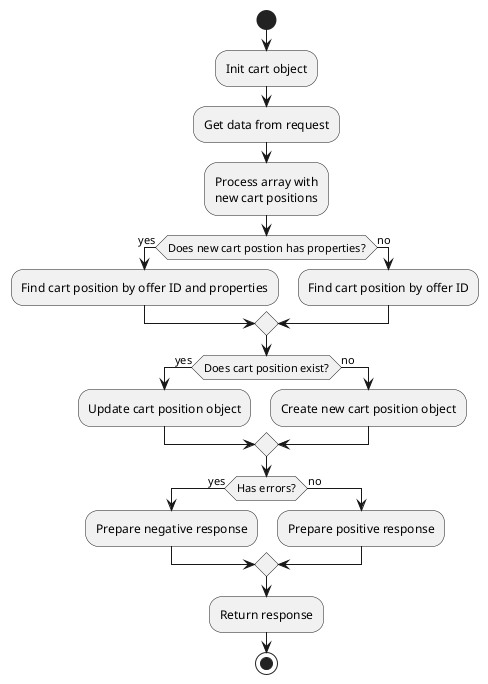
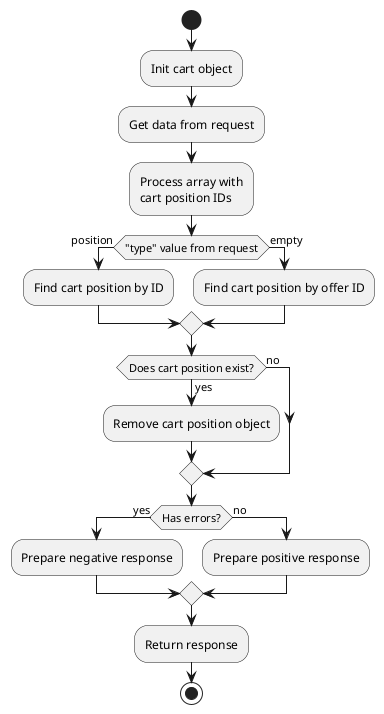
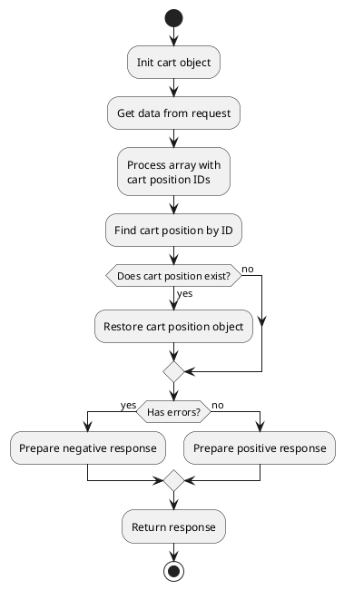
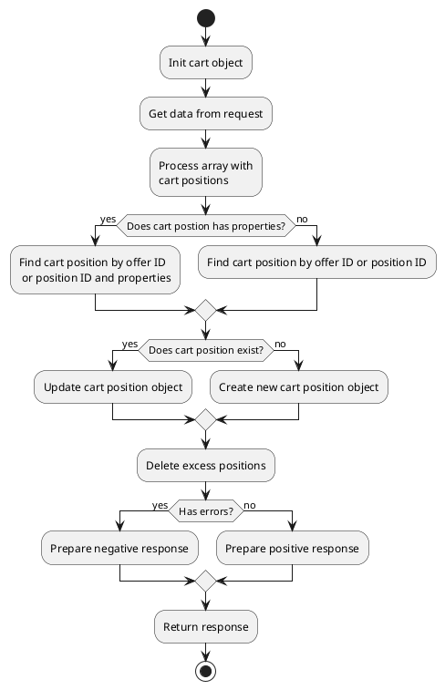
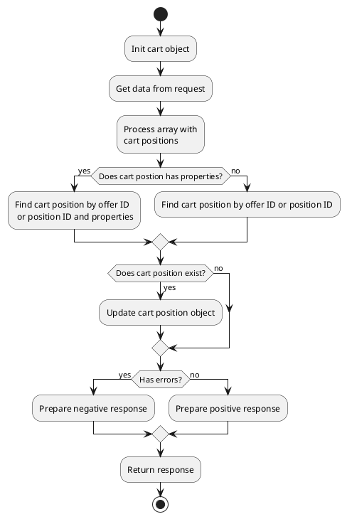





## Cart

* [get](#getobshippingtype-null-obpaymentmethoditem-null)
* [getActiveShippingTypeFromRequest](#getactiveshippingtypefromrequest)
* [getAppliedCampaignList](#getappliedcampaignlist)
* [getAppliedCouponList](#getappliedcouponlist)
* [getCurrency](#getcurrency)
* [getCurrencyCode](#getcurrencycode)
* [getTotalPrice](#gettotalprice)
* [getTotalPriceValue](#gettotalpricevalue)
* [getOldTotalPrice](#getoldtotalprice)
* [getOldTotalPriceValue](#getoldtotalpricevalue)
* [getDiscountTotalPrice](#getdiscounttotalprice)
* [getDiscountTotalPriceValue](#getdiscounttotalpricevalue)
* [getTotalPriceData](#gettotalpricedata)
* [onAdd](#onadd)
* [onAddCoupon](#onaddcoupon)
* [onClear](#onclear)
* [onClearCouponList](#onclearcouponlist)
* [onGetCartData](#ongetcartdata)
* [onGetData](#ongetdata)
* [onRemove](#onremove)
* [onRemoveCoupon](#onremovecoupon)
* [onRestore](#onrestore)
* [onSaveData](#onsavedata)
* [onSync](#onsync)
* [onUpdate](#onupdate)

### get(_[$obShippingType = null]_, _[$obPaymentMethodItem = null]_)

Method returns {{ get_collection('cart-position').link() }} class object.
{{ get_collection('cart-position').link() }} object will contain the position of the user's cart.
You can pass active sipping type object and active payment method object
to method to get total cost with shipping price and discounts applied.
You can uses method to render cart positions and blocks with positions total price.

### getActiveShippingTypeFromRequest()

Method gets from request "shipping_type_id" field and returns {{ get_item('shipping-type').link() }} class object.

### getAppliedCampaignList()

> Method {{ 'campaigns'|available_with|lcfirst }}

Method returns {{ get_collection('campaign').link() }} class object with active applied campaigns.

### getAppliedCouponList()

> Method {{ 'coupons'|available_with|lcfirst }}

Method gets applied coupons and returns array with {{ get_model('coupon').link() }} models.

### getCurrency()

Method returns active currency symbol. For example: **$**

### getCurrencyCode()

Method returns active currency code. For example: **USD**

### getTotalPrice()

Method returns formatted total price string (**"1 450,95"**).
Method returns total price of cart positions + price of active shipping price. 

### getTotalPriceValue()

Method returns float total price value (**1450.95**).
Method returns total price of cart positions + price of active shipping price.

### getOldTotalPrice()

Method returns formatted total price string without discounts (**"1 650,95"**).
Method returns total price without discounts of cart positions + price without discounts of active shipping price.

### getOldTotalPriceValue()

Method returns float total price value without discounts (**1650.95**).
Method returns total price without discounts of cart positions + price without discounts of active shipping price.

### getDiscountTotalPrice()

Method returns formatted discount price string (**"200,00"**).
Method returns total discount price of cart positions + discount price of active shipping price.

### getDiscountTotalPriceValue()

Method returns float discount price value (**200**).
Method returns total discount price of cart positions + discount price of active shipping price.

### getTotalPriceData()

Method returns [TotalPriceContainer](modules/price-container/home.md#TotalPriceContainer) class object.
Object contains all fields of total price. For example: price, old_price, tax_price, discount_price, etc.

{{ get_module('cart').example('partials/cart/total-price/total-price-1.htm')|raw }}

### onAdd()

Method adds offers to cart.
You can send ID of active shipping type in ajax request to get an object in response in which delivery cost will be added to total price.
You can send ID of the active payment method in an ajax request to apply promo mechanisms that depend on the payment method.

> Cart positions are searched by offer ID and by an array of properties. The same offer can be added several times to cart if different arrays of properties are in request.

#### How it works?



#### Example 1: Add offers to cart without properties

#### Request

{{ get_module('cart').example('js/add-cart/add-cart-1.js')|raw }}

#### Response

> Cart component returns a standard positive response and negative response

<details>
<summary>Click to see positive response example</summary>

{{ get_module('cart').example('json/response-1.json')|raw }}

</details>

<details>
<summary>Click to see negative response example</summary>

{{ get_module('cart').example('json/negative-response-1.json')|raw }}

</details>

### Example 2: Add offers to cart with properties

#### Request

{{ get_module('cart').example('js/add-cart/add-cart-2.js')|raw }}

#### Response

> Cart component returns a standard positive response and negative response

<details>
<summary>Click to see positive response example</summary>

{{ get_module('cart').example('json/response-1.json')|raw }}

</details>

<details>
<summary>Click to see negative response example</summary>

{{ get_module('cart').example('json/negative-response-1.json')|raw }}

</details>

### onAddCoupon()

> Method {{ 'coupons'|available_with|lcfirst }}

Method attach coupon to cart.
You can send ID of active shipping type in ajax request to get an object in response in which delivery cost will be added to total price.
You can send ID of the active payment method in an ajax request to apply promo mechanisms that depend on the payment method.

#### Request

{{ get_module('coupon').example('js/add-coupon/add-coupon-1.js')|raw }}

#### Response

> Cart component returns a standard positive response and negative response

<details>
<summary>Click to see positive response example</summary>

{{ get_module('cart').example('json/response-1.json')|raw }}

</details>

<details>
<summary>Click to see negative response example</summary>

{{ get_module('cart').example('json/negative-response-1.json')|raw }}

</details>

### onClear()

Method removes all positions from cart.

#### Request

{{ get_module('cart').example('js/clear-cart/clear-cart-1.js')|raw }}

### onClearCouponList()

> Method {{ 'coupons'|available_with|lcfirst }}

Method remove all attached coupons from cart.
You can send ID of active shipping type in ajax request to get an object in response in which delivery cost will be added to total price.
You can send ID of the active payment method in an ajax request to apply promo mechanisms that depend on the payment method.

#### Request

{{ get_module('coupon').example('js/clear-coupon/clear-coupon-1.js')|raw }}

#### Response

> Cart component returns a standard positive response and negative response

<details>
<summary>Click to see positive response example</summary>

{{ get_module('cart').example('json/response-1.json')|raw }}

</details>

<details>
<summary>Click to see negative response example</summary>

{{ get_module('cart').example('json/negative-response-1.json')|raw }}

</details>

### onGetCartData()

Method returns a standard positive response

<details>
<summary>Click to see positive response example</summary>

{{ get_module('cart').example('json/response-1.json')|raw }}

</details>

### onGetData()

Method returns a standard response with cart info

<details>
<summary>Click to see response example</summary>

{{ get_module('cart').example('json/response-2.json')|raw }}

</details>

### onRemove()

Method removes positions from cart by offer ID or cart position ID.
You can send ID of active shipping type in ajax request to get an object in response in which delivery cost will be added to total price.

#### How it works?



#### Example 1: Remove cart positions by offer ID

{{ get_module('cart').example('js/remove-cart/remove-cart-1.js')|raw }}

#### Response

> Cart component returns a standard positive response and negative response

<details>
<summary>Click to see positive response example</summary>

{{ get_module('cart').example('json/response-1.json')|raw }}

</details>

<details>
<summary>Click to see negative response example</summary>

{{ get_module('cart').example('json/negative-response-1.json')|raw }}

</details>

#### Example 2: Remove cart positions by position ID

{{ get_module('cart').example('js/remove-cart/remove-cart-2.js')|raw }}

#### Response

> Cart component returns a standard positive response and negative response

<details>
<summary>Click to see positive response example</summary>

{{ get_module('cart').example('json/response-1.json')|raw }}

</details>

<details>
<summary>Click to see negative response example</summary>

{{ get_module('cart').example('json/negative-response-1.json')|raw }}

</details>

### onRemoveCoupon()

> Method {{ 'coupons'|available_with|lcfirst }}

Method detach coupon from cart.
You can send ID of active shipping type in ajax request to get an object in response in which delivery cost will be added to total price.

{{ get_module('coupon').example('js/remove-coupon/remove-coupon-1.js')|raw }}

#### Response

> Cart component returns a standard positive response and negative response

<details>
<summary>Click to see positive response example</summary>

{{ get_module('cart').example('json/response-1.json')|raw }}

</details>

<details>
<summary>Click to see negative response example</summary>

{{ get_module('cart').example('json/negative-response-1.json')|raw }}

</details>

### onRestore()

Method restores cart positions by ID.
You can send ID of active shipping type in ajax request to get an object in response in which delivery cost will be added to total price.

> Cart positions are searched by offer ID and by an array of properties. The same offer can be added several times to cart if different arrays of properties are in request.

#### How it works?



{{ get_module('cart').example('js/restore-cart/restore-cart-1.js')|raw }}

#### Response

> Cart component returns a standard positive response and negative response

<details>
<summary>Click to see positive response example</summary>

{{ get_module('cart').example('json/response-1.json')|raw }}

</details>

<details>
<summary>Click to see negative response example</summary>

{{ get_module('cart').example('json/negative-response-1.json')|raw }}

</details>

### onSaveData()

Method save data in cart object. For example: checkout page, divided into steps.
Saved values ​​will be automatically saved in the order.

{{ get_module('cart').example('js/save-data/save-data-1.js')|raw }}

#### Response

<details>
<summary>Click to see positive response example</summary>

```json
{
"status": true,
"code": null,
"message": null,
"data": {}
}
```

</details>

<details>
<summary>Click to see negative response example</summary>

{{ get_module('cart').example('json/negative-response-1.json')|raw }}

</details>

### onSync()

Method sync cart positions.
You can send full state of cart positions in ajax request. The method will create new positions, update existing positions, delete excess positions.
You can send ID of active shipping type in ajax request to get an object in response in which delivery cost will be added to total price.
You can send ID of the active payment method in an ajax request to apply promo mechanisms that depend on the payment method.

> Cart positions are searched by offer ID and by an array of properties. The same offer can be added several times to cart if different arrays of properties are in request.

#### How it works?



#### Example 1: Sync cart positions without properties

{{ get_module('cart').example('js/sync-cart/sync-cart-1.js')|raw }}

#### Response

> Cart component returns a standard positive response and negative response

<details>
<summary>Click to see positive response example</summary>

{{ get_module('cart').example('json/response-1.json')|raw }}

</details>

<details>
<summary>Click to see negative response example</summary>

{{ get_module('cart').example('json/negative-response-1.json')|raw }}

</details>

#### Example 2: Sync cart positions with properties

{{ get_module('cart').example('js/sync-cart/sync-cart-2.js')|raw }}

#### Response

> Cart component returns a standard positive response and negative response

<details>
<summary>Click to see positive response example</summary>

{{ get_module('cart').example('json/response-1.json')|raw }}

</details>

<details>
<summary>Click to see negative response example</summary>

{{ get_module('cart').example('json/negative-response-1.json')|raw }}

</details>

### onUpdate()

Method updates quantity of offers in cart.
You can send ID of active shipping type in ajax request to get an object in response in which delivery cost will be added to total price.
You can send ID of the active payment method in an ajax request to apply promo mechanisms that depend on the payment method.

> Cart positions are searched by offer ID and by an array of properties. The same offer can be added several times to cart if different arrays of properties are in request.

#### How it works?



#### Example 1: Update offers in cart without properties

{{ get_module('cart').example('js/update-cart/update-cart-1.js')|raw }}

#### Response

> Cart component returns a standard positive response and negative response

<details>
<summary>Click to see positive response example</summary>

{{ get_module('cart').example('json/response-1.json')|raw }}

</details>

<details>
<summary>Click to see negative response example</summary>

{{ get_module('cart').example('json/negative-response-1.json')|raw }}

</details>

#### Example 2: Update offers in cart with properties

{{ get_module('cart').example('js/update-cart/update-cart-2.js')|raw }}

#### Response

> Cart component returns a standard positive response and negative response

<details>
<summary>Click to see positive response example</summary>

{{ get_module('cart').example('json/response-1.json')|raw }}

</details>

<details>
<summary>Click to see negative response example</summary>

{{ get_module('cart').example('json/negative-response-1.json')|raw }}

</details>

#### Example 3: Update cart positions by position ID without properties

{{ get_module('cart').example('js/update-cart/update-cart-3.js')|raw }}

#### Response

> Cart component returns a standard positive response and negative response

<details>
<summary>Click to see positive response example</summary>

{{ get_module('cart').example('json/response-1.json')|raw }}

</details>

<details>
<summary>Click to see negative response example</summary>

{{ get_module('cart').example('json/negative-response-1.json')|raw }}

</details>

#### Example 4: Update cart positions by position ID with properties

{{ get_module('cart').example('js/update-cart/update-cart-4.js')|raw }}

#### Response

> Cart component returns a standard positive response and negative response

<details>
<summary>Click to see positive response example</summary>

{{ get_module('cart').example('json/response-1.json')|raw }}

</details>

<details>
<summary>Click to see negative response example</summary>

{{ get_module('cart').example('json/negative-response-1.json')|raw }}

</details>

