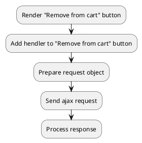

## Example {{ i }}: Remove cart positions by position ID

### {{ i }}.1 Task

Sending an ajax request to remove offers from the cart by cart position IDs.

### {{ i }}.2 How can i do it?

> Example uses {{ get_component('cart').link('cart') }} component.

### {{ i }}.3 Source code

{{ get_module('cart').example('js/remove-cart/remove-cart-2.js')|raw }}