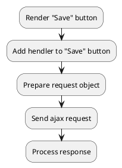

## Example {{ i }}: Saving cart data

### {{ i }}.1 Task

Sending an ajax request to save cart data.

### {{ i }}.2 How can i do it?

> Example uses {{ get_component('cart').link('cart') }} component.

### {{ i }}.3 Source code

{{ get_module('cart').example('js/save-data/save-data-1.js')|raw }}