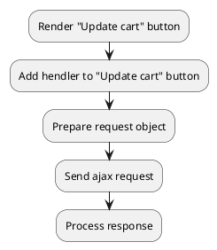

## Example {{ i }}: Sync cart positions with properties

### {{ i }}.1 Task

Sending an ajax request to sync cart positions in the cart.
The cart position must contain additional properties.

### {{ i }}.2 How can i do it?

> Example uses {{ get_component('cart').link('cart') }} component.

### {{ i }}.3 Source code

{{ get_module('cart').example('js/sync-cart/sync-cart-2.js')|raw }}