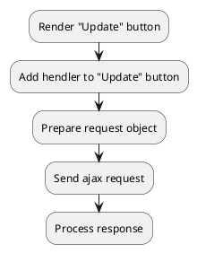

## Example {{ i }}: Update cart positions by position ID without properties

### {{ i }}.1 Task

Sending an ajax request to update offers in the cart.

### {{ i }}.2 How can i do it?

> Example uses {{ get_component('cart').link('cart') }} component.

### {{ i }}.3 Source code

{{ get_module('cart').example('js/update-cart/update-cart-3.js')|raw }}
