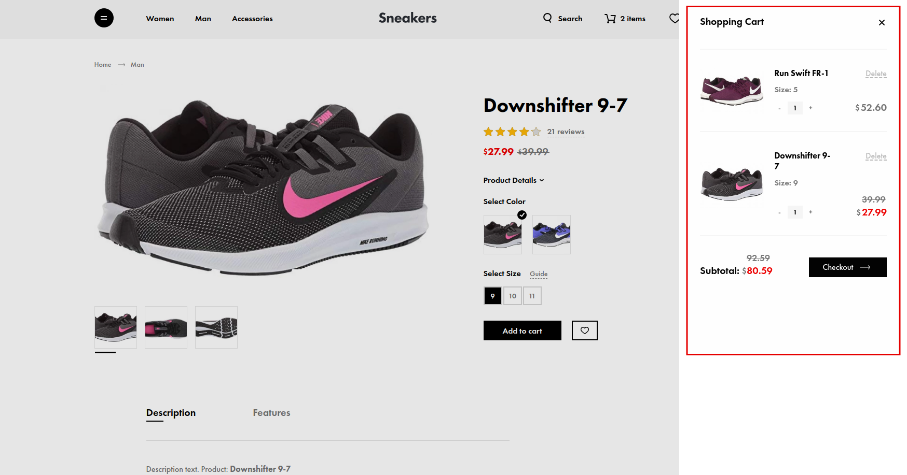
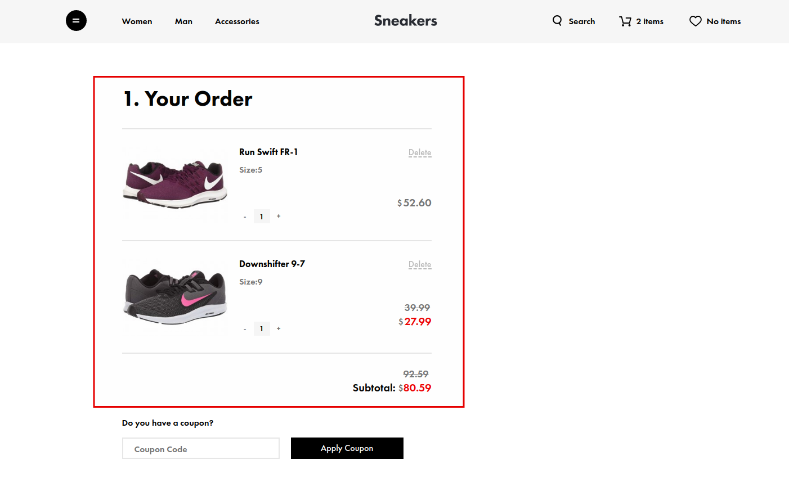
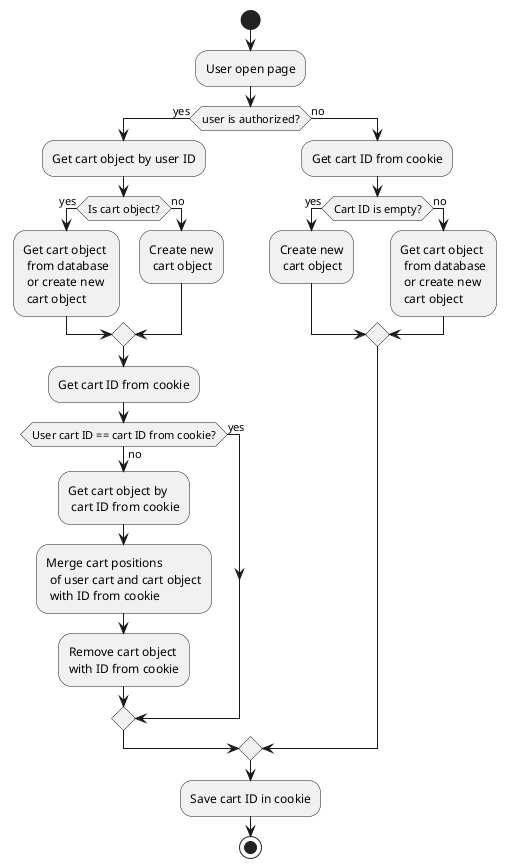




{{ parent() }}

Using this module you will be able to allow users to add product offers to cart,
display cart positions (for example: mini-cart),
change quantity and remove positions from cart.

## How it works?


