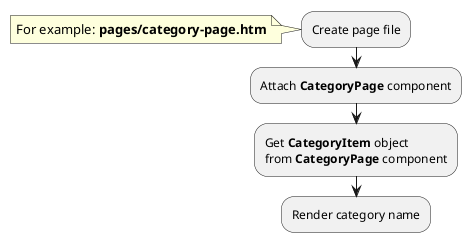
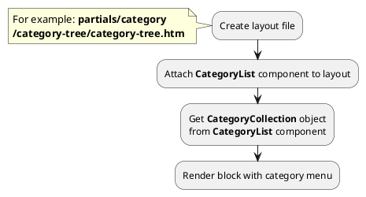
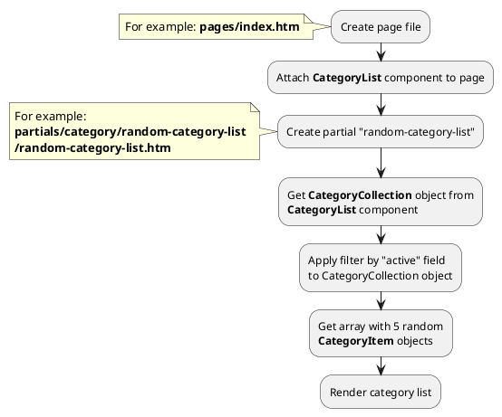




* [Example 1: Category page](#example-1-category-page)
* [Example 2: Category tree](#example-2-category-tree)
* [Example 3: Random categories](#example-3-random-categories)

## Example 1: Category page

### 1.1 Task

Create simple category page and render category name.

### 1.2 How can i do it?

> Example uses [CategoryPage](modules/category/component/component.md#categorypage) component.
Component method returns [CategoryItem](modules/category/item/item.md#categoryitem) class object.
All available fields and methods of **CategoryItem** class you can find in [section](modules/category/item/item.md#categoryitem)

### 1.3 Source code

!> {{ component.link('category-page') }} components must be attached on page so that child categories are higher than parent categories.

<!-- tabs:start -->

#### ** One level **

Simple example of category page (one level).

{{ get_module('category').example('pages/category-page-1.htm')|raw }}

#### ** Two levels **

Simple example of category page (two levels).

{{ get_module('category').example('pages/category-page-2.htm')|raw }}

#### ** Wildcard **

Catalog page with wildcard URL parameter.

{{ get_module('category').example('pages/category-page-3.htm')|raw }}
<!-- tabs:end -->

## Example 2: Category tree

### 2.1 Task

Create simple category tree (two levels).
Render block with category menu.

### 2.2 How can i do it?

> Example uses {{ component.link('category-list') }} component.
Component method returns {{ collection.link() }} class object.
All available methods of **{{ collection.class }}** class you can find in {{ collection.link('section') }}

### 2.3 Source code

{{ get_module('category').example('partials/category/category-tree/category-tree-1.htm')|raw }}

## Example 3: Random categories

### 3.1 Task

Create simple block with random 3 categories on index page.
Create simple category card and render category name, preview_image, preview_text fields.
Render link on category page.

### 3.2 How can i do it?

> Example uses {{ component.link('category-list') }} component.
Component method returns {{ collection.link() }} class object.
All available methods of **{{ collection.class }}** class you can find in {{ collection.link('section') }}

### 3.3 Source code

{{ get_module('category').example('pages/index-1.htm')|raw }}

{{ get_module('category').example('partials/category/random-category-list/random-category-list-1.htm')|raw }}

{{ get_module('category').example('partials/category/category-card/category-card-1.htm')|raw }}
