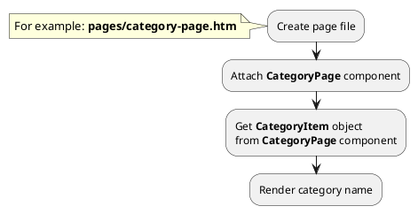

## Example {{ i }}: Category page

### {{ i }}.1 Task

Create simple category page and render category name.

### {{ i }}.2 How can i do it?

> Example uses {{ get_component('category').link('category-page') }} component.
Component method returns {{ get_item('category').link() }} class object.
All available fields and methods of **CategoryItem** class you can find in {{ get_item('category').link('section') }}.

### {{ i }}.3 Source code

!> {{ get_component('category').link('category-page') }} components must be attached on page so that child categories are higher than parent categories.

<!-- tabs:start -->

#### ** One level **

Simple example of category page (one level).

{{ get_module('category').example('pages/category-page-1.htm')|raw }}

#### ** Two levels **

Simple example of category page (two levels).

{{ get_module('category').example('pages/category-page-2.htm')|raw }}

#### ** Wildcard **

Catalog page with wildcard URL parameter.

{{ get_module('category').example('pages/category-page-3.htm')|raw }}
<!-- tabs:end -->
