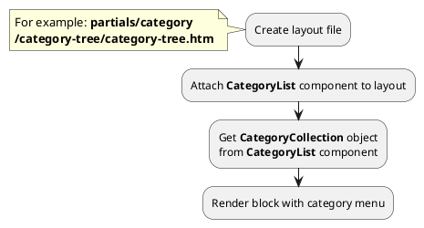

## Example {{ i }}: Category tree

### {{ i }}.1 Task

Create simple category tree (two levels).
Render block with category menu.

### {{ i }}.2 How can i do it?

> Example uses {{ component.link('category-list') }} component.
Component method returns {{ collection.link() }} class object.
All available methods of **{{ collection.class }}** class you can find in {{ collection.link('section') }}

### {{ i }}.3 Source code

{{ get_module('category').example('partials/category/category-tree/category-tree-1.htm')|raw }}
