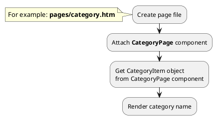
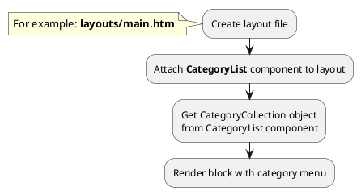

[Back to modules](modules/home.md)

[Home](modules/category/home.md)
• [Model](modules/category/model/model.md)
• [Item](modules/category/item/item.md)
• [Collection](modules/category/collection/collection.md)
• [Components](modules/category/component/component.md)
• [Events](modules/category/event/event.md)
• Examples
• [Extending](modules/category/extending/extending.md)

# Examples: Category {docsify-ignore-all}

!> **Attention!** We recommend that you read [Architecture](architecture/architecture), [ElementItem class](architecture/item-class/item-class.md),
[ElementCollection class](architecture/collection-class/collection-class.md) sections for complete understanding of  project architecture.

* [Example 1: Category page](#example-1-category-page)
* [Example 2: Category tree](#example-2-category-tree)
* [Example 3: Category card](#example-3-category-card)

## Example 1: Category page

### 1.1 Task

Create simple category page and render category name.

### 1.2 How can i do it?

> Example uses [CategoryPage](modules/category/component/component.md#categorypage) component.
Component method returns [CategoryItem](modules/category/item/item.md#categoryitem) class object.
All available fields and methods of **CategoryItem** class you can find in [section](modules/category/item/item.md#categoryitem)



### 1.3 Source code

!> [CategoryPage](modules/category/component/component.md#categorypage) components must be attached on page so that child categories are higher than parent categories.

<!-- tabs:start -->

#### ** One level **

Simple example of category page (one level).

File: **pages/category.htm**
```twig
title = "Category page"
url = "/catalog/:slug"
layout = "main"
is_hidden = 0

[CategoryPage]
slug = "{{ :slug }}"
slug_required = 1
smart_url_check = 1
has_wildcard = 0
skip_error = 0
==

{# Get category item #}


<div data-id="{{ obCategory.id }}" itemscope itemtype="http://schema.org/Category">
    <h1 itemprop="name">{{ obCategory.name }}</h1>
</div>
```
#### ** Two levels **

Simple example of category page (two levels).

> CategoryPage components must be attached on page so that child categories are higher than parent categories.

File: **pages/category.htm**
```twig
title = "Category page"
url = "/catalog/:main_category/:slug"
layout = "main"
is_hidden = 0

[CategoryPage]
slug = "{{ :slug }}"
slug_required = 1
smart_url_check = 1
has_wildcard = 0
skip_error = 0

[CategoryPage ParentCategoryPage]
slug = "{{ :main_category }}"
slug_required = 1
smart_url_check = 0
has_wildcard = 0
skip_error = 0
==

{# Get category item #}


<div data-id="{{ obCategory.id }}" itemscope itemtype="http://schema.org/Category">
    <h1 itemprop="name">{{ obCategory.name }}</h1>
</div>
```

#### ** Wildcard **

Catalog page with wildcard URL parameter.

File: **pages/catalog.htm**
```twig
title = "Catalog"
url = "/catalog/:category*/:slug?"
layout = "main"
is_hidden = 0

[CategoryPage MainCategoryPage]
slug = "{{ :category }}"
slug_required = 1
smart_url_check = 1
has_wildcard = 1
skip_error = 0

[CategoryPage]
slug = "{{ :slug }}"
slug_required = 0
smart_url_check = 1
has_wildcard = 0
skip_error = 1

[ProductPage]
slug = "{{ :slug }}"
slug_required = 0
smart_url_check = 1
skip_error = 1
==
function onInit() {
    $obProductItem = $this->ProductPage->get();
    $obCategoryItem = $this->CategoryPage->get();
    $obMainCategoryItem = $this->MainCategoryPage->get();
    if (!empty($this->param('slug')) && empty($obProductItem) && empty($obCategoryItem)) {
        return $this->ProductPage->getErrorResponse();
    }

    $obActiveCategoryItem = !empty($obCategoryItem) ? $obCategoryItem : $obMainCategoryItem;
    
    $this['obProduct'] = $obProductItem;
    $this['obActiveCategory'] = $obActiveCategoryItem;
}
==

    {# Render product page #}

    {# Render catalog page #}
    <div data-id="{{ obActiveCategory.id }}" itemscope itemtype="http://schema.org/Category">
        <h1 itemprop="name">{{ obActiveCategory.name }}</h1>
    </div>

```
<!-- tabs:end -->

## Example 2: Category tree

### 2.1 Task

Create simple category tree (two levels).
Render block with category menu.

### 2.2 How can i do it?

> Example uses [CategoryList](modules/category/component/component.md#categorylist) component.
Component method returns [CategoryCollection](modules/category/collection/collection.md#categorycollection) class object.
All available methods of **CategoryCollection** class you can find in [section](modules/category/collection/collection.md#categorycollection)



### 2.3 Source code

File: **partials/category/category-tree/category-tree.htm**
```twig
[CategoryList]
==



    <ul>
        
            <li data-id="{{ obCategory.id }}">
                {{ obCategory.name }}
                
                    <ul>
                        
                            <li>{{ obChildCategory.name }}</li>
                        
                    </ul>
                
            </li>
        
    </ul>

```

## Example 3: Category card

### 3.1 Task

Create simple category card and render category name, preview_image, preview_text fields.
Render link on category page.

> **"obCategory"** is object of [CategoryItem](modules/category/item/item.md#categoryitem) class.

### 3.2 Source code

Simple example of category card.

File: **partials/category/category-card/category-card.htm**
```twig
<a href="{{ obCategory.getPageUrl('category') }}">
    <div itemscope itemtype="http://schema.org/Category">
        
            
        
        <h3 itemprop="name">{{ obCategory.name }}</h3>
        
            <div itemprop="description">
                {{ obCategory.preview_text }}
            </div>
        
    </div>
</a>
```

[Home](modules/category/home.md)
• [Model](modules/category/model/model.md)
• [Item](modules/category/item/item.md)
• [Collection](modules/category/collection/collection.md)
• [Components](modules/category/component/component.md)
• [Events](modules/category/event/event.md)
• Examples
• [Extending](modules/category/extending/extending.md)

[Back to modules](modules/home.md)
