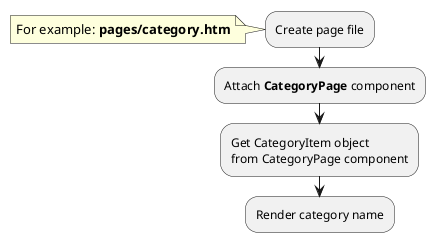
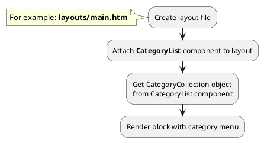

# Examples: Category

[Back to modules](modules/home.md)

!> **Attention!** We recommend that you read [Architecture](home.md#architecture), [ElementItem class](item-class/item-class.md),
[ElementCollection class](collection-class/collection-class.md) sections for complete understanding of  project architecture.

## Example 1: Category page

### Task

Create simple category page and render category name.

### How can i do it?



### Source code
<!-- tabs:start -->

#### ** Variant 1 **

Simple example of category page (one level).

File: **pages/category.htm**
```twig
title = "Category page"
url = "/catalog/:slug"
layout = "main"
is_hidden = 0

[CategoryPage]
slug = "{{ :slug }}"
slug_required = 1
smart_url_check = 1
==

{# Get category item #}


<div data-id="{{ obCategory.id }}" itemscope itemtype="http://schema.org/Category">
    <h1 itemprop="name">{{ obCategory.name }}</h1>
</div>
```
#### ** Variant 2 **

Simple example of category page (two levels).

File: **pages/category.htm**
```twig
title = "Category page"
url = "/catalog/:main_category/:slug"
layout = "main"
is_hidden = 0

[CategoryPage]
slug = "{{ :slug }}"
slug_required = 1
smart_url_check = 1

[CategoryPage ParentCategoryPage]
slug = "{{ :main_category }}"
slug_required = 1
smart_url_check = 0
==

{# Get category item #}


<div data-id="{{ obCategory.id }}" itemscope itemtype="http://schema.org/Category">
    <h1 itemprop="name">{{ obCategory.name }}</h1>
</div>
```
<!-- tabs:end -->

## Example 2: Category tree

### Task

Create simple category tree (two levels).
Render block with category menu.

### How can i do it?



### Source code

File: **partials/category/category-tree/category-tree.htm**
```twig


    <ul>
        
            <li data-id="{{ obCategory.id }}">
                {{ obCategory.name }}
                
                    <ul>
                        
                            <li>{{ obChildCategory.name }}</li>
                        
                    </ul>
                
            </li>
        
    </ul>

```

## Example 3: Category card

### Task

Create simple category card and render category name, preview_image, preview_text fields.
Render link on category page.

### Source code

Simple example of category card.

File: **partials/category/category-card/category-card.htm**
```twig
<a href="{{ obCategory.getPageUrl('category') }}">
    <div itemscope itemtype="http://schema.org/Category">
        
            
        
        <h3 itemprop="name">{{ obCategory.name }}</h3>
        
            <div itemprop="description">
                {{ obCategory.preview_text }}
            </div>
        
    </div>
</a>
```

[Back to modules](modules/home.md)