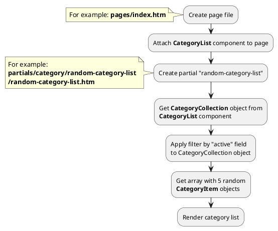

## Example {{ i }}: Random categories

### {{ i }}.1 Task

Create simple block with random 3 categories on index page.
Create simple category card and render category name, preview_image, preview_text fields.
Render link on category page.

### {{ i }}.2 How can i do it?

> Example uses {{ component.link('category-list') }} component.
Component method returns {{ get_collection('category').link() }} class object.
All available methods of **{{ get_collection('category').class }}** class you can find in {{ get_collection('category').link('section') }}

### {{ i }}.3 Source code

{{ get_module('category').example('pages/index-1.htm')|raw }}

{{ get_module('category').example('partials/category/random-category-list/random-category-list-1.htm')|raw }}

{{ get_module('category').example('partials/category/category-card/category-card-1.htm')|raw }}
