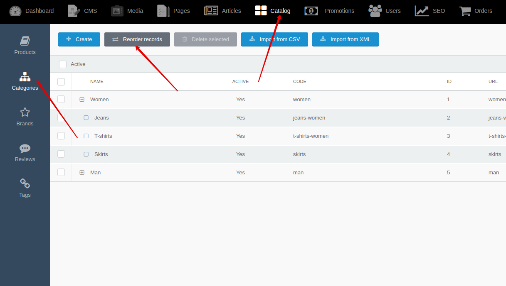
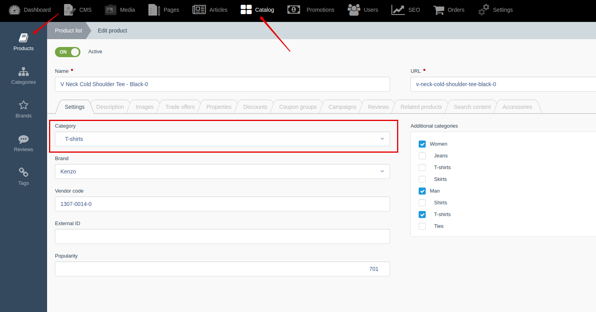
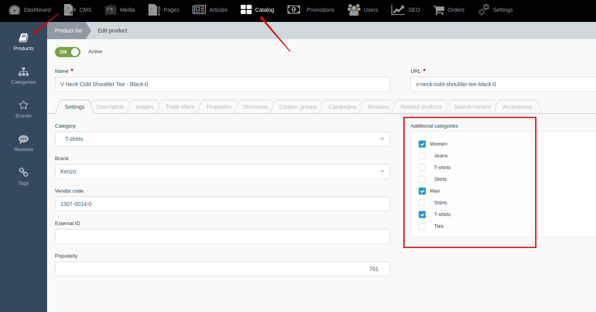
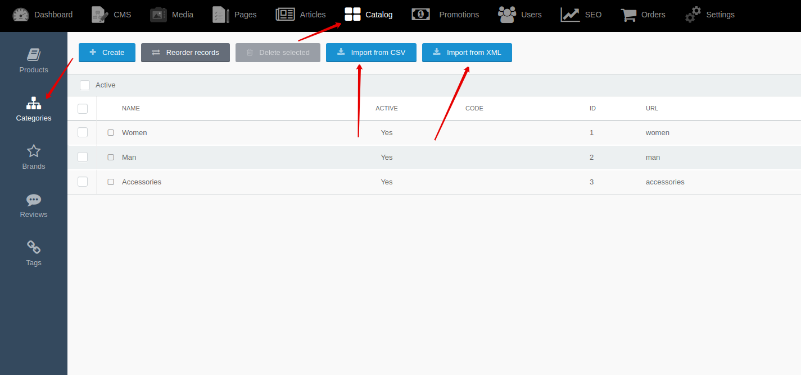




{{ parent() }}

The "Categories" module allows you to create a tree of product categories for your site.
You can display the category tree in the menu of your site or on the catalog page.
You can attach one main category to a product and several additional ones.
You can create category pages and display a list of products filtered by category.

## Backend

You can create and edit categories by going to **Backend -> Catalog -> Categories**

You can change tree of categories by going to **Backend -> Catalog -> Categories -> Reorder records**

You can attach one main category to product

You can attach several additional categories to product.

> Using "[category](modules/product/collection/collection.md#categoryicategoryid-bwithchildren-false)" method in {{ get_collection('product').link() }} class,
you can get all products in which category is attached as main or additional

## Import

You can import categories from XML and CSV files.
You can use [events](modules/category/event/event#event-list-category), that allows you to extend import data.
 
> You can learn more about importing from [XML](import/import-from-xml/home.md#import-from-xml) and [CSV](import/import-from-csv/home.md#import-from-csv) files in [section](import/import-from-xml/home.md#import-from-xml).


