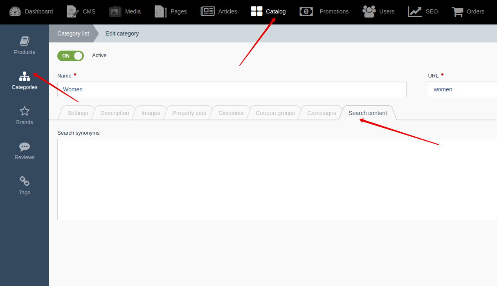

# Category model {docsify-ignore-all}

[Back to modules](modules/home.md)
/ [Home](modules/category/home.md)
/ Model
/ [Item](modules/category/item/item.md)
/ [Collection](modules/category/collection/collection.md)
/ [Components](modules/category/component/component.md)
/ [Events](modules/category/event/event.md)
/ [Examples](modules/category/examples/examples.md)
/ [Extending](modules/category/extending/extending.md)

!> **Attention!**  We recommend that you read [Architecture](home.md#architecture), [ElementItem class](item-class/item-class.md),
[ElementCollection class](collection-class/collection-class.md) sections for complete understanding of  project architecture.

## Field list

|  Name | Type | Description |
|-------|------|--------|
|id|int|
|active|bool|
|code|string|Unique element code that can be used in our custom plugins or theme templates|
|category_vk_id|int|Field available with [VK Goods for Shopaholic](/plugins/home.md#vk-goods-for-shopaholic)|
|created_at|\October\Rain\Argon\Argon|
|description|string|
|external_id|string|Unique ID of element in external system. Used to link an element in import scripts|
|inherit_property_set|bool|Field available with [Properties for Shopaholic](plugins/home.md#properties-for-shopaholic) plugin|
|name|string|
|nest_depth|int|Field required for [NestedTree](https://octobercms.com/docs/database/traits#nested-tree) trait|
|nest_left|int|Field required for [NestedTree](https://octobercms.com/docs/database/traits#nested-tree) trait|
|nest_right|int|Field required for [NestedTree](https://octobercms.com/docs/database/traits#nested-tree) trait|
|parent_id|int|Field required for [NestedTree](https://octobercms.com/docs/database/traits#nested-tree) trait|
|preview_text|string|
|search_content|string|Available with [Search for Shopaholic](plugins/home.md#search-for-shopaholic) or [Sphinx for Shopaholic](plugins/home.md#search-for-shopaholic) plugins|
|search_synonym|string|Available with [Search for Shopaholic](plugins/home.md#search-for-shopaholic) or [Sphinx for Shopaholic](plugins/home.md#search-for-shopaholic) plugins|
|slug|string|
|updated_at|\October\Rain\Argon\Argon|

## Images

> You can be found detailed information about file attachments in OctoberCMS [documentation](https://octobercms.com/docs/database/attachments).

Attach one: **preview_image**, attach many: **images**.

## Relations

|Name|Type|Model|Description|
|-----|-----|-----|-----|
|campaign|BelongsToMany|[Campaign](modules/campaign/model/model.md)|Available with [Campaigns for Shopaholic](plugins/home.md#campaigns-for-shopaholic) plugin|
|children|HasMany|[Category](modules/category/model/model.md)|
|coupon_group|BelongsToMany|[CouponGroup](modules/coupongroup/model/model.md)|Available with [Coupons for Shopaholic](plugins/home.md#coupons-for-shopaholic) plugin|
|discount|BelongsToMany|[Discount](modules/discount/model/model.md)|Available with [Discounts for Shopaholic](plugins/home.md#discounts-for-shopaholic) plugin|
|parent|BelongsTo|[Category](modules/category/model/model.md)|
|product|HasMany|[Product](modules/product/model/model.md)|
|product_link|BelongsToMany|[Product](modules/product/model/model.md)|Uses for "additional_category" relation in [Product](modules/product/model/model.md) model|
|property_set|BelongsToMany|[PropertySet](modules/propertyset/model/model.md)|Available with [Properties for Shopaholic](plugins/home.md#properties-for-shopaholic) plugin|

## Search fields

Search fields available with [Search for Shopaholic](plugins/home.md#search-for-shopaholic) or [Sphinx for Shopaholic](plugins/home.md#search-for-shopaholic) plugins.

**search_synonym** field is available in backend. **search_content** filed isn't available in backend. **search_content** field should be filled in automatically. 



## Extending

You can add dynamic methods and properties in model class with using [extending constructors](http://octobercms.com/docs/services/behaviors#constructor-extension).
It is default function of OctoberCMS.

```php
Category::extend(function ($obCategory) {
    /** @var Category $obCategory */
    $obCategory->fillable[] = 'my_field';
    
    $obCategory->addCachedField(['my_field']);
});
```

[Back to modules](modules/home.md)
/ [Home](modules/category/home.md)
/ Model
/ [Item](modules/category/item/item.md)
/ [Collection](modules/category/collection/collection.md)
/ [Components](modules/category/component/component.md)
/ [Events](modules/category/event/event.md)
/ [Examples](modules/category/examples/examples.md)
/ [Extending](modules/category/extending/extending.md)