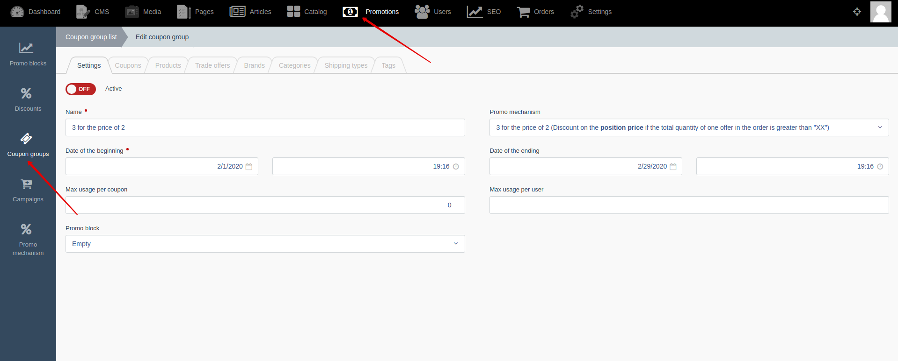




{{ parent() }}

"Coupon group" allows you to create a link between promo mechanisms, coupons and products.
If coupon group is not linked with any product, then the promo mechanism is applied to all products of the catalog.
If you linked products, offers, categories, brands or tags with coupon group, then the promo mechanism will be applied to a limited list of products and offers.

> You can find more information about promo mechanisms {{ get_module('promo-mechanism').link('here') }}

## Backend

You can create and edit coupon groups by going to **Backend -> Promotions -> Coupon groups**

You can link products, offers, categories, brands or tags with coupon group by going to **Backend -> Promotions -> Coupon groups**


