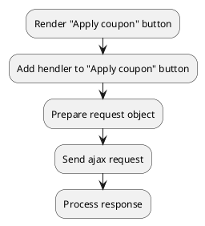

## Example {{ i }}: Add coupon to cart

### {{ i }}.1 Task

Sending an ajax request to add coupon to the cart.

### {{ i }}.2 How can i do it?

> Example uses {{ get_component('cart').link('cart') }} component.

### {{ i }}.3 Source code

{{ get_module('coupon').example('js/add-coupon/add-coupon-1.js')|raw }}