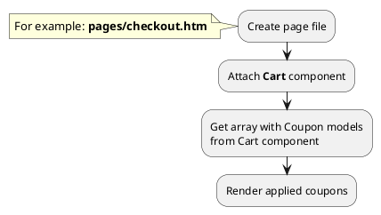

## Example {{ i }}: Render block with applied coupons on checkout page

### {{ i }}.1 Task

Render block with applied coupons on checkout page.

### {{ i }}.2 How can i do it?

> Example uses {{ get_component('cart').link('cart') }} component.
Component method returns array with {{ get_model('coupon').link() }} models.

### {{ i }}.3 Source code

{{ get_module('coupon').example('pages/checkout-1.htm')|raw }}

{{ get_module('coupon').example('partials/cart/checkout/checkout-1.htm')|raw }}