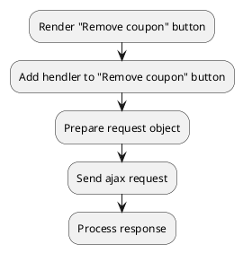

## Example {{ i }}: Remove coupon from cart

### {{ i }}.1 Task

Sending an ajax request to remove coupon from the cart.

### {{ i }}.2 How can i do it?

> Example uses {{ get_component('cart').link('cart') }} component.

### {{ i }}.3 Source code

{{ get_module('coupon').example('js/remove-coupon/remove-coupon-1.js')|raw }}