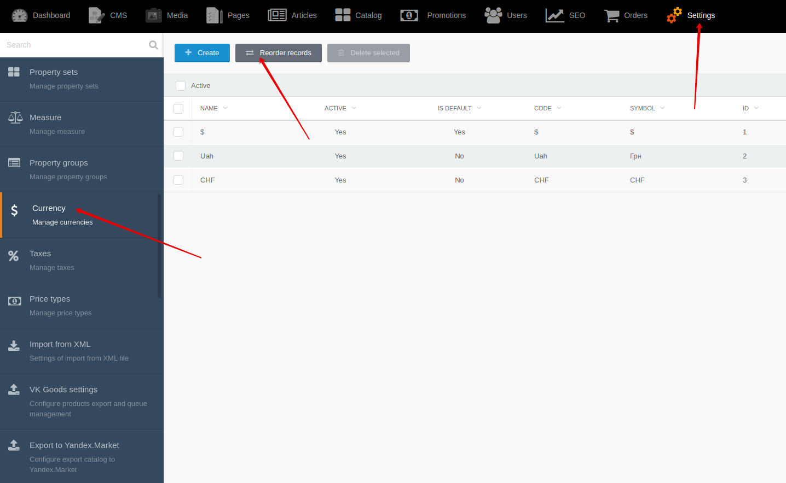

[Back to modules](modules/home.md)

[Home](modules/currency/home.md)
• [Model](modules/currency/model/model.md)
• [Item](modules/currency/item/item.md)
• Collection
• [Components](modules/currency/component/component.md)
• [Examples](modules/currency/examples/examples.md)
• [Extending](modules/currency/extending/extending.md)
• [Advanced usage](modules/currency/advanced-usage/home.md)

# CurrencyCollection {docsify-ignore-all}

!> **Attention!**  We recommend that you read [Architecture](home.md#architecture), [ElementItem class](item-class/item-class.md),
[ElementCollection class](collection-class/collection-class.md) sections for complete understanding of  project architecture.

!> **Attention!** **CurrencyCollection** extends [ElementCollection class](collection-class/collection-class.md).
All available methods of ElementCollection class you can find in [section](collection-class/collection-class.md#method-list) 

* [active](#active)
* [sort](#sort)

### active()

Method applies filter to field "active" = true  for elements of collection.

### sort()

Method sorts elements of collection by "sort_order" field. You can change sorting of currencies by going to **Backend -> Settings -> Currencies -> Reorder records**

[Home](modules/currency/home.md)
• [Model](modules/currency/model/model.md)
• [Item](modules/currency/item/item.md)
• Collection
• [Components](modules/currency/component/component.md)
• [Examples](modules/currency/examples/examples.md)
• [Extending](modules/currency/extending/extending.md)
• [Advanced usage](modules/currency/advanced-usage/home.md)

[Back to modules](modules/home.md)
