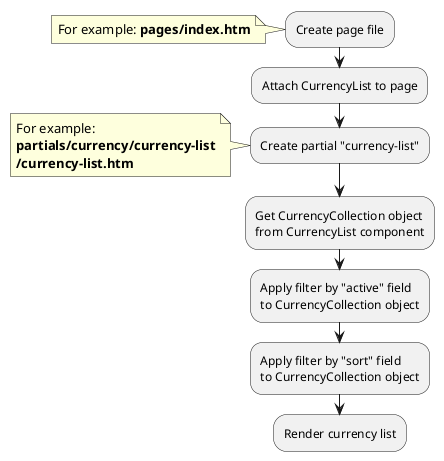




* [Example 1: Currency list](#example-1-currency-list)
* [Example 2: Switching active currency](#example-2-switching-active-currency)

## Example 1: Currency list

### 1.1 Task

Create simple block with currency list.

### 1.2 How can i do it?

> Example uses {{ component.link('currency-list') }} component.
Component method returns {{ collection.link() }} class object.
All available methods of **{{ collection.class }}** class you can find in {{ collection.link('section') }}



### 1.3 Source code

{{ get_module('currency').example('pages/index-1.htm')|raw }}

{{ get_module('currency').example('partials/currency/currency-list/currency-list-1.htm')|raw }}

## Example 2: Switching active currency

### 2.1 Task

Switch active currency.

### 2.2 How can i do it?

You need to send AJAX requests after user switches active currency on frontend.

### 2.3 Source code

<!-- tabs:start -->

#### ** javascript **

{{ get_module('currency').example('partials/currency/currency-list/currency-list-1.js')|raw }}

#### ** php **

You can find more information about CurrencyHelper class [here](modules/currency/advanced-usage/home.md) 

```php
use Lovata\Shopaholic\Classes\Helper\CurrencyHelper;

CurrencyHelper::instance()->switchActive('usd');
```

<!-- tabs:end -->

