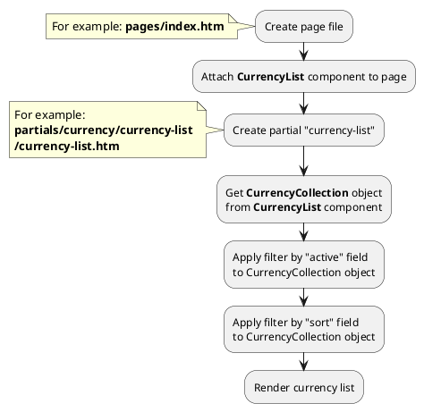

## Example {{ i }}: Currency list

### {{ i }}.1 Task

Create simple block with currency list.

### {{ i }}.2 How can i do it?

> Example uses {{ component.link('currency-list') }} component.
Component method returns {{ collection.link() }} class object.
All available methods of **{{ collection.class }}** class you can find in {{ collection.link('section') }}

### {{ i }}.3 Source code

{{ get_module('currency').example('pages/index-1.htm')|raw }}

{{ get_module('currency').example('partials/currency/currency-list/currency-list-1.htm')|raw }}
