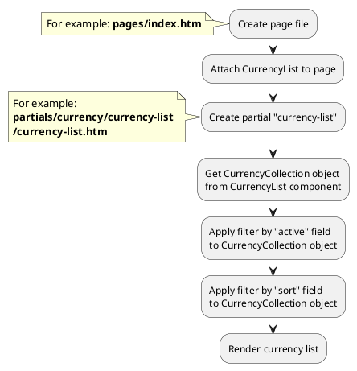

# Examples: Currency

[Back to modules](modules/home.md)
/ [Home](modules/currency/home.md)
/ [Model](modules/currency/model/model.md)
/ [Item](modules/currency/item/item.md)
/ [Collection](modules/currency/collection/collection.md)
/ [Components](modules/currency/component/component.md)
/ Examples
/ [Extending](modules/currency/extending/extending.md)

!> **Attention!** We recommend that you read [Architecture](home.md#architecture), [ElementItem class](item-class/item-class.md),
[ElementCollection class](collection-class/collection-class.md) sections for complete understanding of  project architecture.

* [Example 1: Currency list](#example-1-currency-list)
* [Example 2: Switching active currency](#example-2-switching-active-currency)

## Example 1: Currency list

### 1.1 Task

Create simple block with currency list.

### 1.2 How can i do it?

> Example uses [CurrencyList](modules/currency/component/component.md#currencylist) component.
Component method returns [CurrencyCollection](modules/currency/collection/collection.md#currencycollection) class object.
All available methods of **CurrencyCollection** class you can find in [section](modules/currency/collection/collection.md#currencycollection)



### 1.3 Source code

File: **pages/index.htm**
```twig
title = "Index"
url = "/"
layout = "main"
is_hidden = 0

[CurrencyList]
==
<div class="currency-wrapper">
    
</div>
```

File: **partials/currency/currency-list/currency-list.htm**
```twig
{# Get currency collection #}



    {# Render currency list #}
    <select>
        
            <option value="{{ obCurrency.code }}" selected="selected" >
                {{ obCurrency.symbol }}
            </option>
        
    </select>

```

## Example 2: Switching active currency

### 2.1 Task

Switch active currency.

### 2.2 How can i do it?

You need to send AJAX requests after user switches active currency on frontend.

### 2.3 Source code

```javascript
function swirchCurrency(sCurrencyCode) {
    $.request('CurrencyList::onSwitch', {
      data: {currency: sCurrencyCode}
    }); 
}
```

[Back to modules](modules/home.md)
/ [Home](modules/currency/home.md)
/ [Model](modules/currency/model/model.md)
/ [Item](modules/currency/item/item.md)
/ [Collection](modules/currency/collection/collection.md)
/ [Components](modules/currency/component/component.md)
/ Examples
/ [Extending](modules/currency/extending/extending.md)