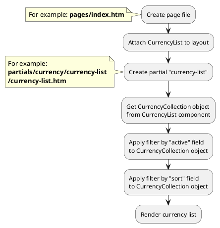

# Examples: Currency

[Back to modules](modules/home.md)

!> **Attention!** We recommend that you read [Architecture](home.md#architecture), [ElementItem class](item-class/item-class.md),
[ElementCollection class](collection-class/collection-class.md) sections for complete understanding of  project architecture.

## Example 1: Currency list

### Task

Create simple block with currency list.

### How can i do it?



### Source code

File: **pages/index.htm**
```twig
title = "Index"
url = "/"
layout = "main"
is_hidden = 0

[CurrencyList]
==
<div class="currency-wrapper">
    
</div>
```

File: **partials/currency/currency-list/currency-list.htm**
```twig
{# Get currency collection #}



    {# Render currency list #}
    <select>
        
            <option value="{{ obCurrency.code }}" selected="selected" >
                {{ obCurrency.symbol }}
            </option>
        
    </select>

```

[Back to modules](modules/home.md)