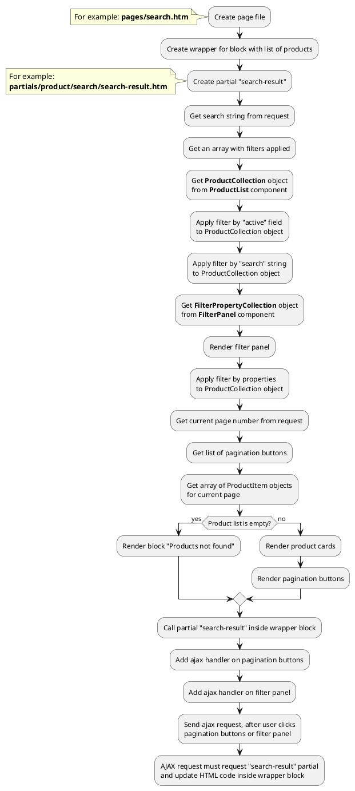

## Example {{ i }}: Render filter panel on search page

### {{ i }}.1 Task

Create search page and render product list.
Render filter panel by product and offer properties.
Get properties from {{ get_component('filter').link('filter-panel') }} component. 
Product list must have pagination block.

### {{ i }}.2 How can i do it?

!> Search method {{ ['search', 'sphinx']|available_with|lcfirst }} Filtration methods {{ ['filter']|available_with|lcfirst }} 

> Example uses {{ get_component('product').link('product-list') }} component.
Component method returns {{ get_collection('product').link() }} class object.
All available methods of **ProductCollection** class you can find in {{ get_collection('product').link('section') }}.
Block can be complicated (contain filtering, pagination)

### {{ i }}.3 Source code

{{ get_module('product').example('pages/search-1.htm')|raw }}

{{ get_module('filter').example('partials/product/search/search-result-1.htm')|raw }}

{{ get_module('filter').example('partials/product/filter-panel/filter-panel-1.htm')|raw }}

{{ get_module('product').example('partials/product/product-card/product-card-1.htm')|raw }}

{{ get_module('pagination').example('partials/pagination/pagination-1.htm')|raw }}