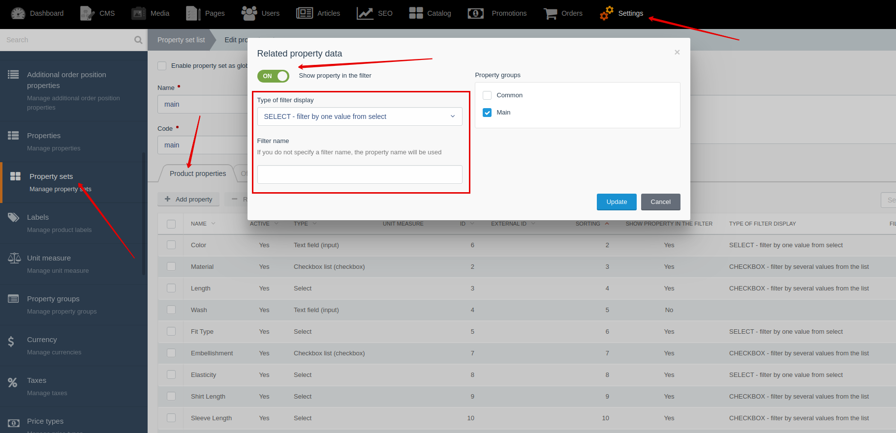




{{ parent() }}

The "Filter" module allows you to render the filtering panel on your site.
You can render the filter panel not only on the catalog page,
but also on any other page or block (for example: on the search page).
You can filter products by the properties of products or offers,
by brands, by products with discounts (old_price > 0),
by availability in store (quantity > 0).

## Backend

By creating relationships between property sets and product/offer 
properties, you can enable properties to display them in the filter panel.
Go to **Backend -> Settings-> Property sets -> Create/Edit -> "Product/Offer properties" tab**

