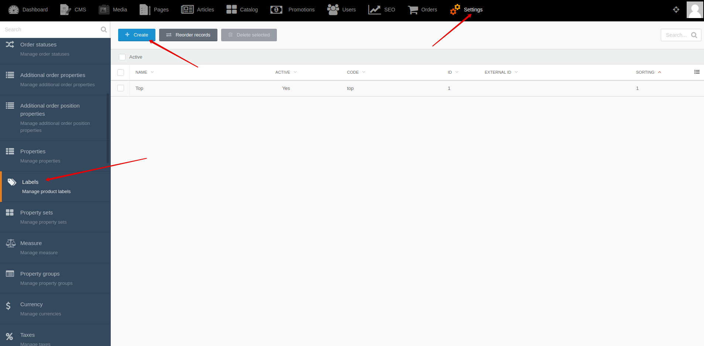
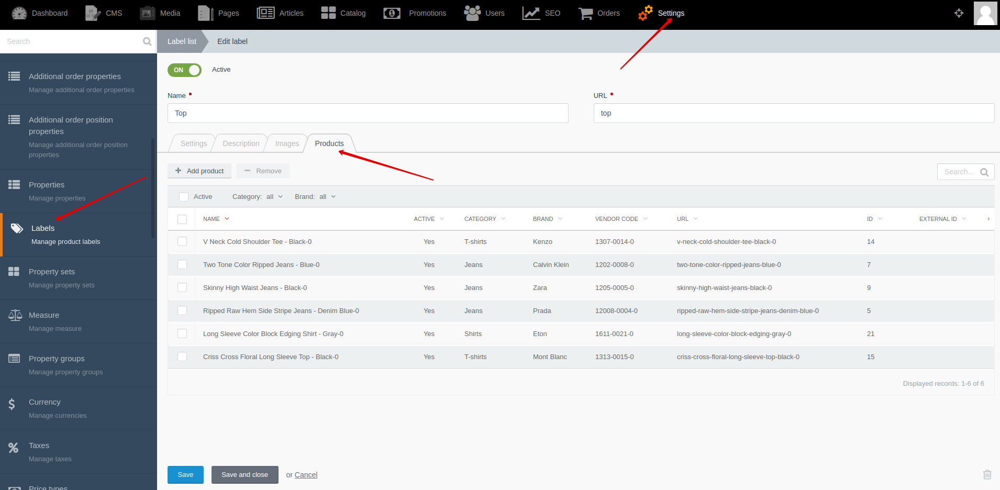




{{ parent() }}

“Labels” module allows you to mark products with such attributes as: “top”, “best seller”, “new”, etc.
You decide how the label will be named and what products it will be attached to.

## Backend

You can create and edit labels by going to **Backend -> Settings -> Labels**

You can change sorting of labels by going to **Backend -> Settings -> Labels -> Reorder records**

You can attach products to label by going to **Backend -> Settings -> Labels -> "Product" tab**


