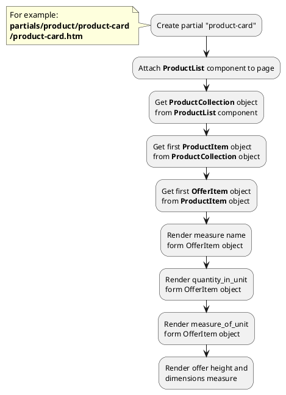




* [Example 1: Product card](#example-1-product-card)
* [Example 2: Switching active currency](#example-2-switching-active-currency)

## Example 1: Product card

### 1.1 Task

Create simple product card. Render unit measures of offer.

### 1.2 How can i do it?

> Example uses {{ get_component('product').link('product-list') }} component.
Component method returns {{ get_collection('product').link() }} class object.



### 1.3 Source code

{{ get_module('measure').example('partials/product/product-card/product-card-1.htm')|raw }}

Result:
```html
<div>
    <h3>My product name</h3>
    <span>10pcs per pack</span>
    <div>Height: 100 mm</div>
</div>
```

