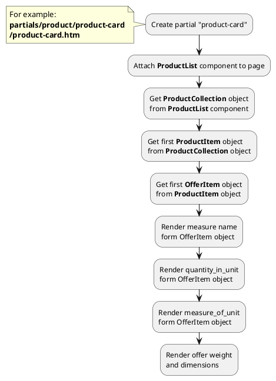

## Example {{ i }}: Unit measures and dimensions of offer

### {{ i }}.1 Task

Create simple product card. Render unit measures and dimensions of offer.

### {{ i }}.2 How can i do it?

> Example uses {{ get_component('product').link('product-list') }} component.
Component method returns {{ get_collection('product').link() }} class object.



### {{ i }}.3 Source code

{{ get_module('measure').example('partials/product/product-card/product-card-1.htm')|raw }}

Result:
```html
<div>
    <h3>My product name</h3>
    <span>10pcs per pack</span>
    <div>Height: 100 mm</div>
    <div>Length: 200 mm</div>
    <div>Width: 50 mm</div>
    <div>Weight: 500 g</div>
</div>
```
