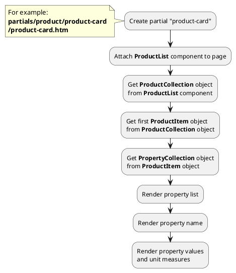

## Example {{ i }}: Unit measures of property values

### {{ i }}.1 Task

Create simple product card. Render unit measures of product property values.

### {{ i }}.2 How can i do it?

> Example uses {{ get_component('product').link('product-list') }} component.
Component method returns {{ get_collection('product').link() }} class object.

### {{ i }}.3 Source code

{{ get_module('measure').example('partials/product/product-card/product-card-2.htm')|raw }}