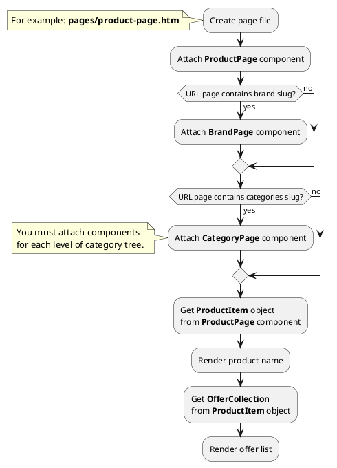




* [Example 1: Product page 1](#example-1-product-page-1)
* [Example 2: Product page 2](#example-1-product-page-2)

## Example 1: Product page 1

### 1.1 Task

Create simple product page and render select with offers. Render block with offer price and currency.

### 1.2 How can i do it?

### 1.3 Source code
<!-- tabs:start -->
#### ** Variant 1 **

Simple example of product page. Page URL does not contain category slug.

{{ get_module('offer').example('pages/product-page-1.htm')|raw }}

#### ** Variant 2 **

Simple example of product page. Page URL contains category slug (one level).

{{ get_module('offer').example('pages/product-page-2.htm')|raw }}

#### ** Variant 3 **

Simple example of product page. Page URL contains category slug (two levels).

> {{ get_component('category').link('category-page') }} components must be attached on page so that child categories are higher than parent categories.

{{ get_module('offer').example('pages/product-page-3.htm')|raw }}

#### ** Variant 4 **

Simple example of product page. Page URL contains categories (two levels) and brand slug.

> {{ get_component('category').link('category-page') }} components must be attached on page so that child categories are higher than parent categories.

{{ get_module('offer').example('pages/product-page-4.htm')|raw }}

#### ** Wildcard **

Catalog page with wildcard URL parameter.

{{ get_module('offer').example('pages/product-page-5.htm')|raw }}

<!-- tabs:end -->

## Example 2: Product page 2

### 2.1 Task

Create simple product page and render select with offers. Render block with offer price and currency.

### 2.2 How can i do it?

### 2.3 Source code
<!-- tabs:start -->
#### ** Variant 1 **

Simple example of product page. Page URL does not contain category slug.

{{ get_module('offer').example('pages/product-page-6.htm')|raw }}

#### ** Variant 2 **

Simple example of product page. Page URL contains category slug (one level).

{{ get_module('offer').example('pages/product-page-7.htm')|raw }}

#### ** Variant 3 **

Simple example of product page. Page URL contains category slug (two levels).

> {{ get_component('category').link('category-page') }} components must be attached on page so that child categories are higher than parent categories.

{{ get_module('offer').example('pages/product-page-8.htm')|raw }}

#### ** Variant 4 **

Simple example of product page. Page URL contains categories (two levels) and brand slug.

> {{ get_component('category').link('category-page') }} components must be attached on page so that child categories are higher than parent categories.

{{ get_module('offer').example('pages/product-page-9.htm')|raw }}

#### ** Wildcard **

Catalog page with wildcard URL parameter.

{{ get_module('offer').example('pages/product-page-10.htm')|raw }}

<!-- tabs:end -->